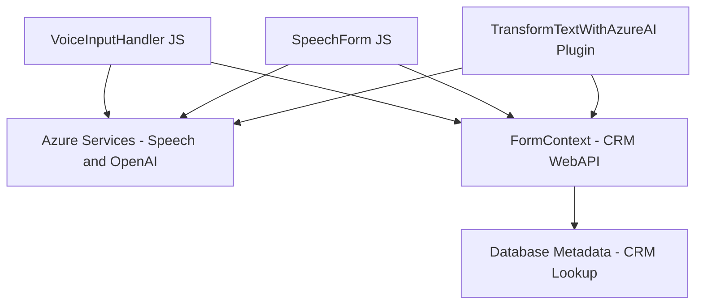

### Resumen técnico
El repositorio contiene tres archivos que implementan una solución tecnológica orientada a integrar funcionalidad avanzada de procesamiento y síntesis de voz con datos de formularios, en un entorno Dynamics CRM. Los archivos analizados forman parte de una solución basada en microservicios y plugins, que utiliza servicios en la nube como Azure Speech SDK y Azure OpenAI para añadir capacidades de interacción por voz y con inteligencia artificial.

---

### Descripción de arquitectura
La solución muestra características de una arquitectura **hexagonal (puertos y adaptadores)**, con integración de servicios externos como Azure Speech y OpenAI. Utiliza plugins de Dynamics CRM para extender su funcionalidad y habilitar procesamiento de texto avanzado.

**Componentes principales:**
- **Frontend:** Dos scripts de JavaScript (`readForm.js` y `speechForm.js`):
  - Facilitan entrada y salida de voz mediante SDKs de Azure.
  - Interaction directa con el contexto del formulario de Dynamics.
- **Backend:** Plugin en .NET (`TransformTextWithAzureAI.cs`):
  - Procesa el texto con reglas estructuradas utilizando Azure OpenAI.
  - Desacoplado de la capa frontend.

---

### Tecnologías usadas
1. **Frontend:**
   - **JavaScript ES6+:** Lógica de procesamiento de formularios y trabajo con promesas.
   - **Azure Speech SDK:** Para síntesis y reconocimiento de voz.
   - **API de Dynamics CRM:** Para contextos de formularios y datos CRUD.
   
2. **Backend:**
   - **C# (.NET):** Desarrollo de plugins para extensibilidad dentro de Dynamics.
   - **Azure OpenAI (GPT-4):** Procesamiento avanzado de texto.
   - **Newtonsoft.Json:** Manejo de datos JSON.
   
3. **Patrones:**
   - Hexagonal: Integración externa con SDKs y APIs, manteniendo capas internas independientes.
   - Callbacks y promesas: Para trabajar con SDKs asíncronos.
   - Plugin-Oriented: Extensión modular de funcionalidades CRM.

---

### Dependencias y componentes externos
- **Azure Speech SDK:** Para manejo de entrada y salida de voz.
- **Azure OpenAI API:** Procesamiento semántico de textos.
- **Microsoft Dynamics CRM Web API:** Elementos contextuales del formulario y gestión de datos.
- **Librerías C#:**
  - `System.Net.Http`: Para peticiones a servicios externos.
  - `Newtonsoft.Json`: Parsing avanzado de JSON.

---

### Diagrama Mermaid

---

### Conclusión final
La solución analiza características propias de aplicaciones modernas integradas con servicios en la nube. A partir de una arquitectura hexagonal, la funcionalidad de voz y procesamiento semántico operan en una integración para mejorar la experiencia de usuario de formularios en Dynamics CRM. La estructura modular garantiza extensibilidad y adaptabilidad frente a nuevas tecnologías.