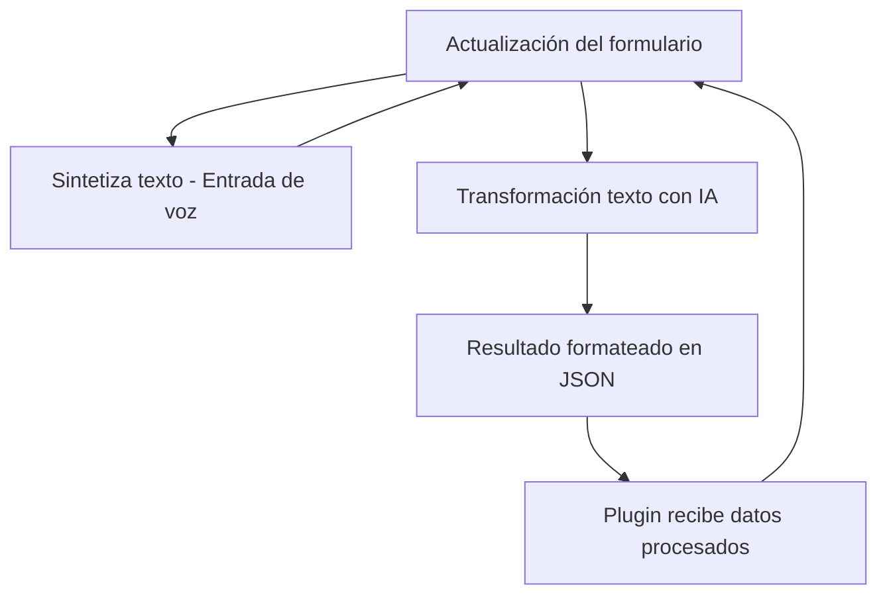

# Análisis técnico del repositorio

El repositorio presentado tiene una estructura y archivos que reflejan el desarrollo de una solución destinada a integrar funcionalidades de entrada/salida de voz, transformación de texto con IA y uso en formularios de Dynamics CRM. A continuación detallo los aspectos clave y el análisis general:

---

### **Breve resumen técnico**
1. **Tipo de solución:** 
   - El proyecto incluye funcionalidad para la entrada de voz, salida de síntesis de voz, procesamiento de texto con inteligencia artificial y uso de plugins en entornos de Dynamics CRM. Es una solución híbrida que combina un _frontend_ en JavaScript y un _backend_ extensible mediante plugins (.NET).

2. **Contexto funcional:**
   - El frontend está diseñado para interactuar con formularios y procesar datos mediante integración de APIs externas (Azure Speech SDK y Azure OpenAI).
   - El backend maneja lógica empresarial avanzada mediante plugins personalizados para Dynamics CRM.
   
---

### **Descripción de arquitectura**
La arquitectura general parece seguir una estructura de capas, con módulos bien definidos que separan responsabilidades:
1. **Frontend:**
   - Usa JavaScript para lógica de entrada y salida de voz (integración del Azure Speech SDK) y manipulación del DOM para formularios dinámicos.
   - Modularidad para tareas específicas: lectura de datos visibles, síntesis de voz, interacción con APIs externas y configuración dinámica.
  
2. **Backend:**
   - Implementa extensibilidad de Dynamics CRM mediante el patrón de **plugins**, siguiendo las reglas de Microsoft para manejar lógica cerrada en el lado servidor.
   - Uso de servicios externos (Azure OpenAI) para transformar y procesar texto.

**Arquitectura predominante:** Sistema **n capas**, ya que identifica claramente:
   - Capa de presentación: interacción de la UI con formularios (Frontend/JS).
   - Capa de lógica de negocio: basada en extensibilidad de Dynamics CRM (Plugins).
   - Integración con APIs externas: comunicación con Azure Speech SDK y Azure OpenAI para extender funcionalidad.

---

### **Tecnologías, frameworks y patrones**
1. **Frontend:**
   - **Azure Speech SDK:** Para síntesis y transcripción de voz. Clases utilizadas incluyen `SpeechConfig` y `SpeechSynthesizer`.
   - **DOM API:** Manipulación directa del DOM.
   - **ES6+ JavaScript:** Programación basada en módulos, definición clara de funciones y nombres descriptivos.
   - **Servicios externos:** Azure para IA y Speech SDK.
   - Patrón de diseño:
     - Modularidad: Cada función realiza tareas muy específicas y desacopla dependencias, facilitando reutilización.
     - Delegación: Lógica dividida en funciones colaborativas.
  
2. **Backend:**
   - **Microsoft.Xrm.Sdk:** Framework oficial para extensibilidad de Dynamics CRM.
   - **Azure OpenAI API:** Procesamiento avanzado de texto mediante GPT.
   - **Patrones:**
     - Plugin Pattern: Desarrollos integrados a Dynamics para manejar procesos en un flujo cerrado.
     - Comunicación con APIs externas: Manejo de solicitudes HTTP y serialización JSON.

---

### **Dependencias o componentes externos**
- **Azure Speech SDK:** Necesario para síntesis y transcripción de voz.
- **Azure OpenAI API:** Utilizada para transformar texto en estructura avanzada (Formato JSON).
- **Xrm.WebApi:** Usado para operaciones en el entorno de Dynamics CRM.
- **Dynamics CRM SDK:** Para la integración del plugin.
- **System.Net.Http, System.Text.Json:** Librerías nativas de .NET para manejar solicitudes y JSON.
- **Newtonsoft.Json:** API externa usada para administración de JSON.
  
---

### **Diagrama Mermaid**
A continuación se presenta un diagrama Mermaid que ilustra la interacción entre los componentes del sistema y su flujo.

---

### **Conclusión final**
El repositorio representa una solución bien estructurada con una clara separación de responsabilidades entre frontend y backend. Es una arquitectura híbrida que implementa características de una solución **n-capas** incluyendo integración con servicios de Azure, procesamiento de APIs externas, extensibilidad de Dynamics CRM, y modularidad en la lógica de negocio. 

Se recomienda verificar las dependencias externas en entornos de producción, especialmente las bibliotecas externas y claves de acceso a servicios como Azure. La solución es extensible y bien enfocada en tareas específicas, siendo adecuada para sistemas que requieran interacción dinámica con formularios y apoyo de inteligencia artificial.