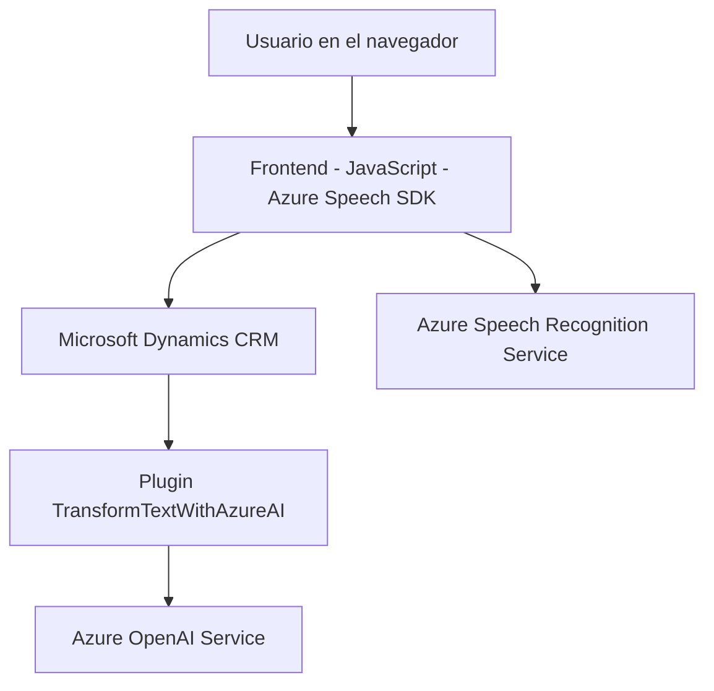

### Breve resumen técnico
La solución presentada integra funcionalidades de frontend dinámico con servicios de procesamiento de voz y un backend basado en Microsoft Dynamics CRM y Azure OpenAI. Combina captura de entrada de voz, síntesis de voz, actualización de formularios y procesamiento de texto basado en inteligencia artificial.

---

### Descripción de arquitectura
La arquitectura está compuesta de tres elementos principales:
1. **Frontend** (JavaScript files):
   - Actúa como el cliente para usuarios finales, facilitando la entrada de voz dinámica, la lectura de formularios y el procesamiento de datos recogidos usando el **SDK de Azure Speech**.
   - Gestión modular de funciones con separación por responsabilidad: lectura de formularios y síntesis/transcripción de voz.

2. **Backend plugin** (C#):
   - Reside en la infraestructura de **Microsoft Dynamics CRM**. Implementa la interfaz **IPlugin** para extender el comportamiento del CRM.
   - Utiliza la API de OpenAI, un servicio externo alojado en **Microsoft Azure**, para transformar texto en estructuras JSON adaptadas a reglas específicas.

3. **Arquitectura General**:
   - La implementación corresponde a una **arquitectura basada en capas** con integración de servicios externos. Los componentes (Frontend y Backend) están acoplados entre sí mediante APIs provenientes de Azure y del CRM, lo que permite una separación lógica entre la interfaz de usuario y el procesamiento de datos.

---

### Tecnologías usadas
1. **Frontend**:
   - **Azure Speech SDK**: Para reconocimiento y síntesis de voz.
   - **DOM API**: Manipulación de estructuras HTML y carga dinámica de SDK.
2. **Backend (C# plugin)**:
   - **Microsoft Dynamics CRM SDK**: Para comunicación entre backend y plataforma Dynamics 365.
   - **Azure OpenAI API**: Servicios de transformación de texto inteligente usando modelos de lenguaje, como GPT.
   - **System.Net.Http**: Para realizar llamadas HTTP al servicio OpenAI.
   - **System.Text.Json**: Para procesamiento de JSON.
3. **Patrones arquitectónicos y de diseño**:
   - **Event-Driven Design** (basado en eventos asíncronos y callbacks).
   - **Integración de APIs** (Azure Speech y OpenAI).
   - **Single Responsibility Principle** (en funciones y métodos respectivos).
   - **Modularidad**: Separación de responsabilidades por funciones específicas.
   - **Capas**: Permite su papel en una arquitectura de n capas, manteniendo independencia entre frontend y backend.

---

### Posibles dependencias externas
- Azure Speech SDK.
- Microsoft Dynamics CRM SDK.
- Azure OpenAI Service.
- Bibliotecas estándar .NET Framework/Core como `System.Text.Json` y `System.Net.Http`.
- API externa (posiblemente HTML o servicios REST) de Dynamics CRM para comunicación (e.g., `Xrm.WebApi`).

---

### Diagrama Mermaid

---

### Conclusión Final
La solución presentada combina un frontend integrado con un servicio avanzado de voz y un backend conectado a Microsoft Dynamics CRM. Aprovecha la modularidad de las funciones, la separación entre capas y el uso de servicios avanzados como Azure para procesamiento de voz y transformación de texto con OpenAI. Su diseño está orientado a eventos e integración API, permitiendo adaptabilidad y escalabilidad en entornos empresariales.