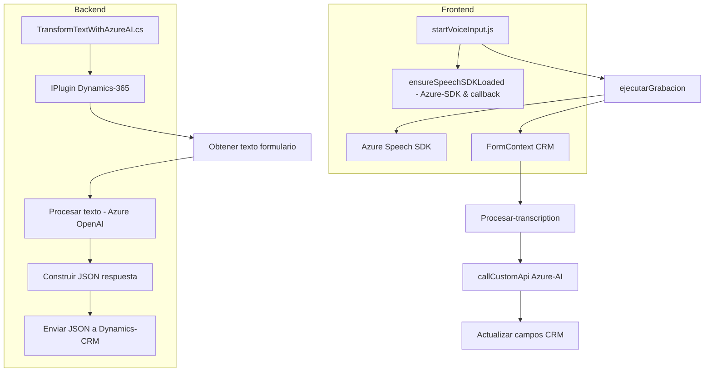

### Breve resumen técnico:
El repositorio parece estar diseñado para proporcionar funcionalidades avanzadas de voz y procesamiento basado en inteligencia artificial para un sistema CRM, utilizando herramientas como el Azure Speech SDK y Azure OpenAI. Combina interacción con formularios CRM (Dynamics 365) y servicios externos para lograr un entorno más eficiente y dinámico.

---

### Descripción de arquitectura:
La solución adopta una arquitectura híbrida basada en **n capas**. Es modular, separando claramente la parte de interacción de la API externa (Azure Speech SDK y Azure AI), la lógica del cliente en el frontend (JavaScript) y los plugins en el backend (Dynamics CRM). Cada archivo tiene una función específica y está estructurado para fomentar la reutilización y separación de responsabilidades. También integra patrones de **event-driven programming** para el uso de callbacks y promesas.

---

### Tecnologías usadas:
1. **Frontend (JavaScript)**
   - **Frameworks y SDK:** Azure Speech SDK.
   - **CRM Dynamics Interacción:** Uso de APIs web (`Xrm.WebApi`) para formularios y manipulación del DOM.
   - **Desarrollo asíncrono:** Promesas (`Promise`) y callbacks.

2. **Backend (C# Plugin)**
   - **Microsoft Dynamics 365 SDK:** `Microsoft.Xrm.Sdk`.
   - **Azure OpenAI API**: Utilización de modelos AI como **GPT** para transformar datos en json estructurado.
   - **Serialización:** `Newtonsoft.Json` y `System.Text.Json` para procesar JSON.
   - **Manejo de HTTP:** `System.Net.Http` para conectar al servicio Azure.

---

### Diagrama Mermaid válido para GitHub:

---

### Conclusión final:

La solución utiliza una arquitectura de **n capas**, separando frontend y backend para realizar tareas específicas como reconocimiento y síntesis de voz (frontend) y procesamiento con IA para transformar texto (backend). La dependencia principal en el frontend es el **Azure Speech SDK**, mientras que el backend se basa en **Microsoft Dynamics SDK** y **Azure OpenAI**.

El diseño general favorece la **modularidad**, con funciones específicas y separadas que se integran con APIs externas. La implementación es eficaz para un contexto CRM dinámico donde la interacción fluida y eficiente con datos es clave. La solución propuesta es escalable y reutilizable, excelente para entornos empresariales que buscan integrar capacidades de IA y voz.