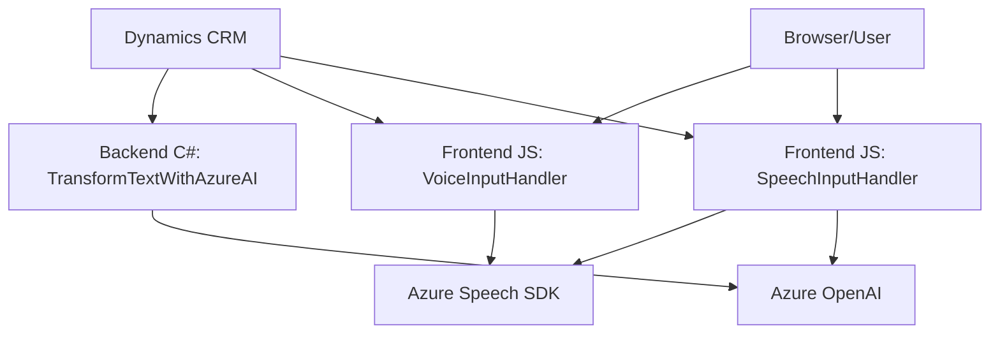

### Breve Resumen Técnico
El proyecto presenta varios componentes interconectados que implementan soluciones para la interacción de voz, procesamiento de texto, y manejo de datos en formularios dentro de Dynamics CRM. Utiliza tecnologías de Microsoft Azure como Speech SDK y OpenAI para conversión y transformación de datos. La arquitectura combina patrones de consumo de API externas y lógica de negocio modular integrados en sistemas empresariales.

---

### Descripción de Arquitectura
El repositorio tiene al menos tres módulos principales:
1. **Frontend**: El manejo de entrada y salida de voz (VoiceInputHandler.js, SpeechInputHandler.js). Aquí se procesan datos de formularios en Dynamics CRM y se genera texto, que puede ser leído o transcrito en voz utilizando Azure Speech SDK.
2. **Backend Plugin**: TransformTextWithAzureAI.cs define un plugin que se ejecuta en Dynamics CRM para interactuar con Azure OpenAI. Este módulo transforma el contenido de texto en formato JSON con base en normas específicas.
3. **Integración**: Ambas capas (frontend y backend) están conectadas mediante Dynamics CRM y servicios en la nube (Azure Speech y Azure OpenAI).

La arquitectura general combina **n capas y microservicios**:
- **N capas**: Separación de responsabilidades en frontend para formularios y backend para plugins.
- **Microservicios**: Delegación de procesamiento intensivo a servicios en la nube (Azure Speech, OpenAI), lo que fomenta escalabilidad y desacoplo.

---

### Tecnologías Usadas
1. **Lenguajes:**
   - JavaScript: Frontend para integración de formularios.
   - C#: Backend plugin para interacción con Dynamics CRM y solicitud a servicios de Azure OpenAI.
2. **Frameworks y SDKs:**
   - Azure Speech SDK: Para reconocimiento de voz y síntesis de texto a voz.
   - Dynamics XRM SDK: Para manejo del contexto de CRM y operaciones de datos.
3. **Servicios en la nube:**
   - Azure OpenAI: Procesamiento avanzado de texto.
   - Azure Speech: Captura y reproducción de voz.
4. **Librerías complementarias:**
   - Newtonsoft.Json: Manejo de JSON en plugins backend.
   - System.Net.Http: Envío de solicitudes HTTP a servicios externos.

---

### Representación Gráfica con Diagrama Mermaid
El diagrama representa la interacción principal entre módulos, SDKs y servicios externos:

---

### Conclusión Final
La solución presentada responde a necesidades empresariales avanzadas para captura, transformación y reproducción de datos, operando sobre formularios de Dynamics CRM con integración directa a servicios en la nube (Azure Speech y OpenAI). La arquitectura es híbrida (n capas + microservicios), permitiendo escalabilidad, modularidad y extensibilidad. Aunque la estructura actual está bien diseñada, podría optimizarse aún más refactorizando el frontend mediante patrones como MVC o similar y externalizando algunos métodos hacia servicios dedicados de backend.