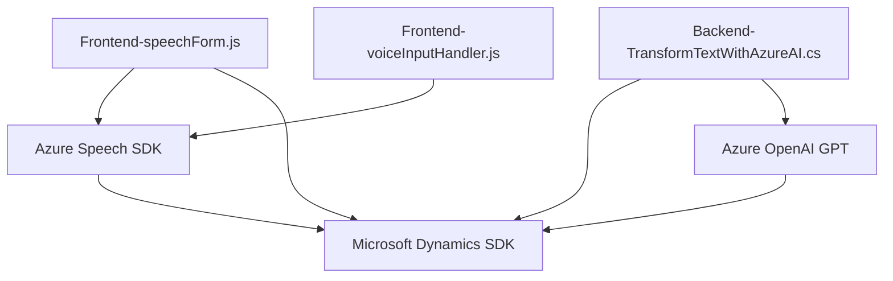

### Breve Resumen Técnico
El repositorio tiene componentes diseñados para una solución híbrida que integra frontend **JavaScript** y plugins de **Microsoft Dynamics CRM**. Usa tecnologías de voz y procesamiento de inteligencia artificial integradas con Azure, especialmente **Azure Speech SDK** y **Azure OpenAI**.

---

### Descripción de Arquitectura
La arquitectura combina **n capas** (frontend y backend con plugins) y **microservicios** (para delegar lógicas avanzadas a Azure AI). El **frontend** interactúa con formularios mediante manipulación dinámica del DOM, reconocimiento de voz, y conversión texto-a-voz. En el **backend**, los métodos del plugin manejan transformación del texto con OpenAI GPT, lo que sugiere un enfoque centrado en servicios externos para operaciones específicas.

La solución también exhibe **patrones observables** mediante eventos asíncronos y carga dinámica del SDK de Azure Speech, lo que mejora la modularidad.

---

### Tecnologías Usadas
1. **Frontend (JavaScript)**:
   - **Azure Speech SDK** para funcionalidades de texto-a-voz y reconocimiento de voz.
   - **DOM Manipulación** para interacción directa con formularios.
   - **Microsoft Dynamics SDK** para obtener información del formulario.
   
2. **Backend (C#)**:
   - Plugins basados en **Microsoft.Xrm.Sdk** para Dynamics CRM.
   - **Azure OpenAI GPT** mediante API pública para procesamiento avanzado de texto.
   - Librerías **Newtonsoft.Json** y **System.Net.Http**.

3. **Patrones de Diseño**:
   - Modularidad: Funciones independientes para tareas específicas.
   - Observer: Uso de eventos asíncronos (`recognizeOnceAsync`).
   - Repository Pattern: Implementación en el plugin para acceso y manipulación de datos CRM.
   - Microservicios: Uso intensivo de Azure AI como servicio externo.

---

### Diagrama **Mermaid**

---

### Conclusión Final
La solución es un **híbrido entre un n-capas y arquitectura de microservicios**, donde el frontend interactúa directamente con usuarios mediante voz y texto, mientras que el backend delega las tareas de procesamiento avanzado al servicio externo Azure OpenAI. Ambos desarrollos (JavaScript y C#) están optimizados para trabajar con Dynamics CRM. El uso generalizado de **Azure Speech SDK** y **OpenAI GPT** asegura una buena accesibilidad, automatización, y escalabilidad.