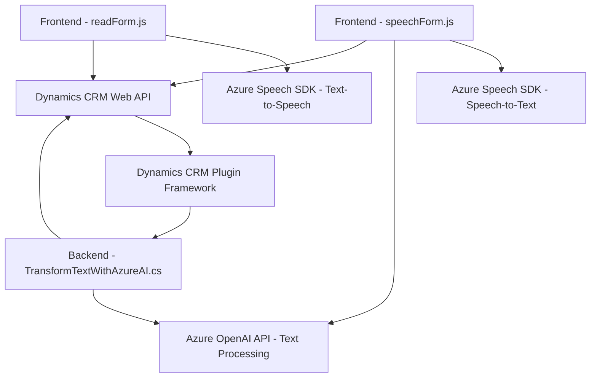

### Breve resumen técnico
Este repositorio contiene múltiples componentes, principalmente orientados a interfaces de usuario y plugins personalizados en Dynamics CRM. Los módulos se centran en la interacción con servicios de Azure (Speech SDK y OpenAI), habilitando funcionalidades avanzadas como reconocimiento de voz, síntesis de texto a voz y transformación de datos mediante IA. La arquitectura adopta estructuras modulares y una integración cliente-servidor con APIs externas para soporte de inteligencia artificial y procesamiento de voz.

---

### Descripción de arquitectura

1. **Tipo de solución:**
   - Una **aplicación web** que utiliza servicios de terceros (Azure Speech SDK y Azure OpenAI) para habilitar interacción avanzada con formularios dentro de Dynamics CRM. Está dividida entre:
     - Frontend interactivo gestionado en JavaScript.
     - Backend basado en plugins para Dynamics CRM con lógica avanzada.
   - Integra directamente APIs de Microsoft y servicios de inteligencia artificial para reconocimiento y síntesis de voz.

2. **Patrones y tecnologías:**
   - **Frontend:**
     - Modularidad: Cada archivo de JavaScript está dividido por responsabilidad específica: `readForm.js` para síntesis de voz y `speechForm.js` para reconocimiento de voz.
     - Carga dinámica: Uso de `ensureSpeechSDKLoaded` para verificar la disponibilidad del SDK en tiempo de ejecución y cargarlo cuando sea necesario.
     - Integración API: Llamadas a Azure Speech SDK desde el cliente.
   - **Backend:**
     - Plugins de Dynamics CRM: El archivo `TransformTextWithAzureAI.cs` aplica lógica personalizada en eventos del sistema CRM.
     - API REST: Comunicación con Azure OpenAI para procesamiento avanzado.
     - JSON Manipulation: Uso de `Newtonsoft.Json` para estructuración de respuesta.
   - **Otros patrones:**
     - Event-driven: Funciones en el frontend y backend reaccionan a eventos específicos (e.g., entrada de voz, manipulación de datos de formulario).
     - Separación de responsabilidades: Cada función y clase tiene un propósito claro y definido.
     - Cliente-Servidor: El frontend se comunica con backends como el API de Dynamics y servicios externos de Azure.

3. **Arquitectura:**
   - **Distribuida con microservicios externos** 
     - Para lógica de inteligencia artificial: interacción con Azure OpenAI.
     - Para reconocimiento y síntesis de voz: interacción con Azure Speech SDK.
   - **n Capas:** En el backend, se establece una arquitectura de plugin dentro de Dynamics CRM que actúa como capa de negocio, transformando texto desde eventos del sistema.
   - **Modular:** En el frontend, se utiliza una estructura de funciones interdependientes que permite la ejecución de tareas aisladas.
   
4. **Tecnologías usadas:**
   - Frontend:
     - **JavaScript** para la lógica del cliente.
     - **Azure Speech SDK** para reconocimiento y síntesis de voz.
     - **Dynamics Web API** para integración en formularios CRM.
   - Backend:
     - **C#** para la implementación de plugins dentro de Dynamics CRM.
     - **Azure OpenAI API** para procesamiento de texto mediante inteligencia artificial.
     - Librerías como `Newtonsoft.Json` para manejar JSON.
   - Sistema base:
     - Microsoft Dynamics CRM como plataforma principal para formularios, eventos y datos internos.

5. **Dependencias o componentes externos:**
   - Azure Speech SDK (`window.SpeechSDK`): Este SDK facilita la síntesis automatizada de voz en el frontend y el reconocimiento de voz.
   - Azure OpenAI API: Usada en el backend para transformar texto en una salida JSON estructurada.
   - Servicios internos de Dynamics CRM: Web APIs internas de `Xrm.WebApi` y manipulación de campos (e.g., `data.entity.attributes`) en formularios del CRM.
   - Microsoft libraries: `Newtonsoft.Json.Linq` para procesamiento JSON, `System.Net.Http` para peticiones a APIs externas, y `Microsoft.Xrm.Sdk` para el contexto CRM.

---

### Tecnologías usadas

**Lenguajes y frameworks:**
- **JavaScript** para el frontend.
- **C#** para plugins en Dynamics CRM.
- **Newtonsoft.Json** para procesamiento y serialización JSON.

**Librerías y SDKs:**
- **Azure Speech SDK** y **Azure OpenAI API** para reconocimiento de voz y procesamiento de texto.
- **Dynamics Web API (Xrm.WebApi)** para manipulación de datos y formularios.

**Servicios externos:**
- Azure Cloud (Speech y OpenAI).

---

### Diagrama Mermaid

---

### Conclusión final

Este sistema combina una sofisticada integración entre cliente (frontend en JavaScript), servidor (plugins en C#) y servicios externos (Azure Speech y OpenAI). Su arquitectura modular y de capas, junto con el uso de APIs de Dynamics y Azure, muestra un enfoque moderno orientado a la automatización y la usabilidad avanzada en interfaces controladas por voz. Aunque la solución es funcional y bien estructurada, podría beneficiarse de mejoras en la separación de configuración y un tratamiento más robusto para las credenciales de API.