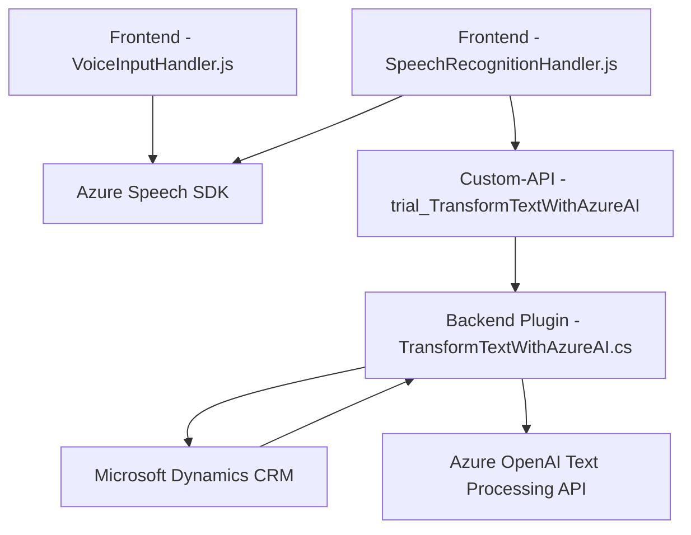

# Análisis y Descripción de la Solución

## Breve Resumen Técnico
El repositorio presenta una solución que combina frontend con JavaScript y un backend de Dynamics CRM mediante plugins y una integración con servicios externos de Azure. La funcionalidad principal es habilitar la interacción mediante la voz con formularios de Dynamics CRM y transformar textos con ayuda de inteligencia artificial, específicamente Azure OpenAI.

---

## Descripción de Arquitectura
1. **Tipo de Solución:**
   - La solución es principalmente **un ecosistema que incluye frontend, plugins y una Custom API**, diseñado para integrarse con Dynamics CRM.
   - La parte frontend habilita la interacción por voz, mientras que el plugin de backend ejecuta la lógica avanzada de inteligencia artificial para procesar el texto y retornarlo en un formato estructurado.

2. **Arquitectura:**
   - La solución utiliza una arquitectura híbrida de **n-capas distribuidas**:
     - La capa frontend diseña la interacción con el usuario en el navegador, donde se inicia el reconocimiento de voz y la síntesis audio mediante el **Azure Speech SDK**.
     - La capa backend, en forma de un plugin incrustado en Dynamics CRM, se conecta al servicio de **Azure OpenAI API** para realizar el procesamiento del texto.
   - El plugin actúa como un microservicio aislado dentro del ecosistema Dynamics CRM.

---

## Tecnologías, Frameworks y Patrones Usados
- **Frontend (JavaScript)**:
  - Azure Speech SDK: Para reconocimiento de voz y síntesis de texto a voz.
  - Asynchronous JavaScript (Promesas y callbacks): Manejo eficiente de operaciones asíncronas con integración a servicios externos.
  - Modularidad Funcional: División en funciones pequeñas y reutilizables basadas en el principio de responsabilidad única.
- **Backend (Dynamics CRM Plugin)**:
  - *.NET Framework* o *.NET Core* (dependiendo de la plataforma de Dynamics 365 CRM).
  - Interacciones con Microsoft Dynamics CRM (`Microsoft.Xrm.Sdk`).
  - Integración con Azure OpenAI API utilizando **System.Net.Http** para peticiones HTTP REST y **System.Text.Json** para manejar datos JSON.
  - Plugin Architecture: Punto de entrada del flujo de operaciones en un contexto de ejecución de Dynamics CRM. 
- **Primeros indicios de "Patrón Comando":**
  - Es visible en la manera como los diferentes métodos en los plugins encapsulan operaciones específicas (e.g., reconocimiento de voz, transformación de texto). Sin embargo, la implementación es directa y limitada.

---

## Dependencias o Componentes Externos
1. **Frontend**:
   - **Azure Speech SDK**: Cargado dinámicamente desde un CDN para entrada y síntesis de voz.
   - Posibles dependencias del navegador para APIs de voz y audio.
2. **Backend**:
   - **Microsoft Dynamics CRM API**: Para recuperar datos y ejecutar acciones en formularios.
   - **Azure OpenAI API**: Para llamar a la funcionalidad de inteligencia artificial y realizar transformaciones avanzadas de texto.
   - **System.Net.Http y System.Text.Json** paquetes para operaciones HTTP y manejo de JSON en el plugin.
   - Configuración externa (idealmente Azure Key Vault) para gestionar claves API y conexión a la región de Azure.

---

## Diagrama Mermaid

---

## Conclusión Final
La solución está diseñada para habilitar una experiencia avanzada y optimizada de interacción por voz con formularios de Dynamics CRM y para proporcionar procesamiento avanzado de texto mediante inteligencia artificial. La arquitectura combina un frontend orientado a servicios con un backend que aprovecha herramientas como Dynamics CRM y Azure OpenAI.

### Ventajas:
1. Habilita integración avanzada con IA y servicios de voz.
2. Modularidad funcional que permite extensibilidad.

### Desventajas:
1. **Problemas de seguridad**:
   - Hardcoding de claves en el backend es una vulnerabilidad crítica.
2. **Mantenimiento**:
   - El diseño es amplio pero requiere una supervisión cuidadosa en la integración de componentes.
3. Reducción potencial de performance por múltiples dependencias con APIs externas.

Se recomienda una revisión de seguridad para mejorar el manejo de las API Keys y considerar el uso de un patrón de arquitectura como **Hexagonal** para desacoplar la lógica core de la interfaz y servicios externos.