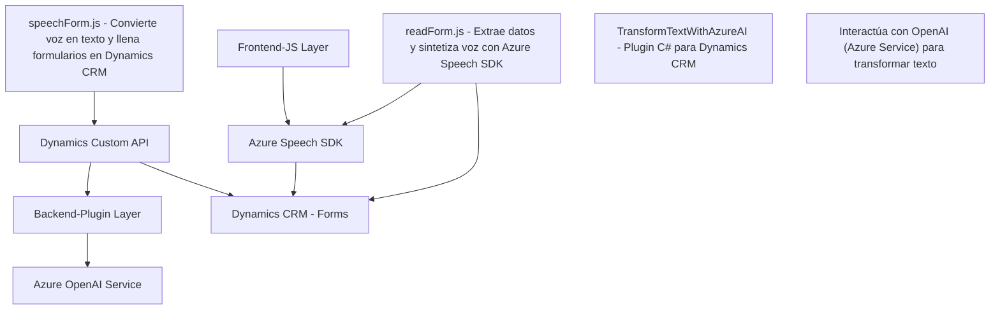

# Resumen técnico
El repositorio parece estar diseñado para extender funcionalidades de Microsoft Dynamics CRM mediante el uso de servicios cognitivos (como Azure Speech SDK y OpenAI). Incluye tres módulos:
1. **`readForm.js`**: Extrae datos de campos visibles en un formulario y utiliza Azure Speech SDK para convertirlos a voz.
2. **`speechForm.js`**: Convierte voz en texto y utiliza APIs externas, como las de Azure y Dynamics CRM, para mapear y asignar datos al formulario.
3. **`TransformTextWithAzureAI.cs`**: Plugin de Dynamics CRM que se conecta al servicio de Azure OpenAI para procesar texto y devolver un formato estructurado en JSON.

---

# Descripción de arquitectura
La solución se encuentra dividida en tres partes principales:
1. **Frontend**: Encapsula la interacción con SDKs de reconocimiento de voz y síntesis de voz, utilizando diferentes funciones que operan sobre el contexto de formularios de Dynamics CRM. Aquí se observa un enfoque modular basado en distintos métodos para la responsabilidad única (`SRP`).
2. **Backend (Dynamics Plugin)**: Un componente que extiende Dynamics CRM mediante la integración con el servicio de inteligencia artificial de Azure OpenAI para la estructuración de datos. Sigue el patrón de plugin y utiliza la arquitectura orientada a microservicios al delegar tareas específicas al servicio de Azure.

La solución combina conceptos de arquitectura por capas (frontend y backend claramente separados), con integración de servicios externos que reflejan un enfoque estilo microservicios.

---

# Tecnologías usadas
## Frontend:
1. **JavaScript**:
   - Funciones modulares organizadas por responsabilidades.
2. **Azure Speech SDK**:
   - Para síntesis de voz y reconocimiento de voz.
3. **Dynamics CRM API (`Xrm.WebApi`)**:
   - Para llamadas al backend y manipulación de datos del formulario.

## Backend:
1. **C#**:
   - Implementación de plugin y lógica empresarial.
2. **Microsoft Dynamics CRM SDK**:
   - Para interacción con el framework de CRM.
3. **Azure OpenAI Service**:
   - Utilizado para transformar texto con reglas inteligentes.
4. **HTTP Client / JSON Serializer**:
   - Facilita la conexión y procesar respuestas de servicios externos (output JSON).

### Patrones de diseño identificados:
1. **Modularidad**: Organización de funciones por responsabilidades individuales (SRP).
2. **Facade**: Métodos simplificados que abstraen lógica compleja en el frontend y backend.
3. **Microservicio**: Uso de servicios independientes, como Azure Speech SDK y Azure OpenAI.

---

# Diagrama Mermaid (válido para GitHub Markdown)

---

# Conclusión final
La solución representa una arquitectura híbrida orientada a servicios, que combina elementos de aplicaciones por capas (Frontend y Backend) con integración de microservicios en la nube. El diseño de los módulos refleja buenas prácticas de diseño, como la modularidad, integración API, pattern de fachada y carga dinámica. El uso de servicios externos como Azure Speech SDK y Azure OpenAI permite incorporar capacidades avanzadas sin complejidad adicional. Potencialmente, el sistema podría manejar múltiples extensiones de Dynamics CRM relacionadas con interacción por voz y AI.