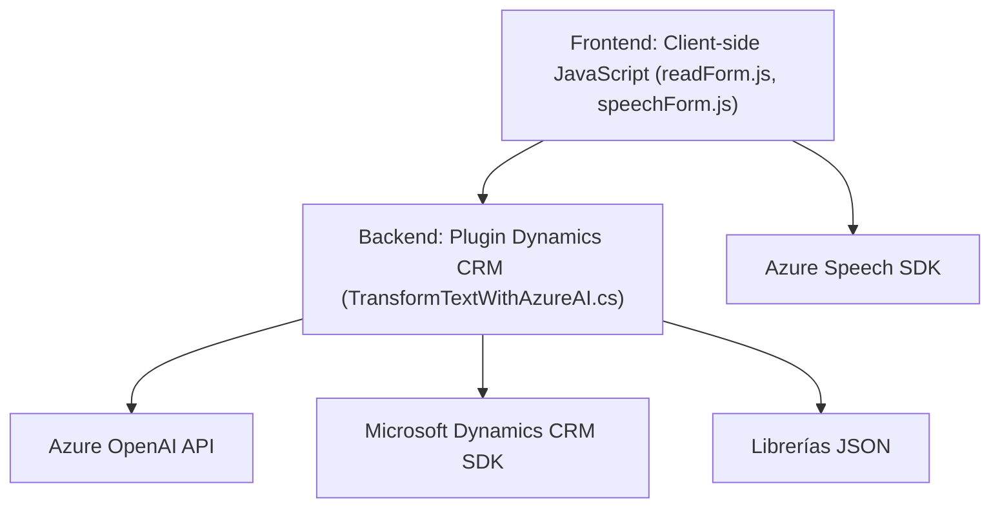

### Análisis de la solución

---

#### **1. Tipo de solución**
La solución presentada abarca tres componentes principales:
- **Frontend**: Archivos JavaScript (`readForm.js`, `speechForm.js`) que gestionan la interfaz, accesibilidad y entrada/salida de datos mediante Text-to-Speech y Speech-to-Text.
- **Plugin Backend**: Implementado en `TransformTextWithAzureAI.cs`, extiende la funcionalidad de Dynamics CRM para interactuar con Azure OpenAI GPT y realizar transformaciones textuales.
- **Microservicio basado en APIs externas**: Hay una fuerte dependencia en servicios en la nube de Azure (Speech SDK y OpenAI API) para el procesamiento de voz y de texto.

En conjunto, la solución puede categorizarse como una **arquitectura híbrida** (Frontend y Backend con integración de servicios externos), enfocada en accesibilidad y transformación de datos en un entorno CRM.

---

#### **2. Tecnologías, frameworks y patrones presentes**

1. **Frontend**:
   - **Tecnología base**: JavaScript (Vanilla JS), sin evidencia de frameworks adicionales.
   - **Integración con SDKs externos**: Se utiliza dinámicamente el Azure Speech SDK para síntesis de voz y reconocimiento.
   - **Patrones usados**:
     - *Modularidad*: Separación clara de responsabilidades en funciones; cada tarea tiene su función propia.
     - *Dependencia dinámica*: SDKs cargados en tiempo de ejecución para optimizar recursos.
     - *Encapsulación*: Manipulación de datos del formulario (visibilidad, mapeo) está delegada en funciones independientes.

2. **Plugin Backend**:
   - **Tecnologías utilizadas**: 
     - Microsoft Dynamics CRM API (`Microsoft.Xrm.Sdk`) para extender la funcionalidad y acceder a datos.
     - Azure OpenAI API (acceso mediante HTTP-client).
     - Librerías JSON:
       - **System.Text.Json**
       - **Newtonsoft.Json.Linq** (para estructuración más flexible de datos).
   - **Patrones usados**:
     - *Plugin basado en eventos*: Sigue el estándar de extensibilidad de Dynamics CRM.
     - *Integración con microservicios*: Comunicación SDK → servicio Azure OpenAI → CRM mediante HTTP y JSON como puente.
     - *Manejo de errores*: Validación de entrada y respuestas de servicios externos.
     - *Desacoplamiento*: Lógica transformadora (Azure OpenAI) está abstraída en métodos estáticos.

---

#### **3. Tipo de arquitectura**
La solución presenta características de una arquitectura **mixta**:
- **Frontend de cliente**:
  - Enfoques funcionales para accesibilidad y entrada/salida de datos en un modelo de separación de tareas (no hay suficiente evidencia para categorizarlo como arquitectura multicapa).
- **Plugin Backend**:
  - Arquitectura monolítica extensible dentro de Dynamics CRM, con lógica personalizada como un bloque ejecutable (plugin).
- **Microservicios**:
  - Uso de servicios externos (Azure Speech y OpenAI APIs) que funcionan como componentes desacoplados. Esto indica un diseño incremental hacia una arquitectura orientada a servicios (SOA) o microservicios.

---

#### **4. Dependencias o componentes externos presentes**
1. **Azure Speech SDK**:
   - Utilizado para Text-to-Speech y Speech-to-Text en el frontend.
   - Carga dinámica con manejo de fallos.

2. **Microsoft Dynamics CRM SDK**:
   - En el backend, para manipulación de datos y uso de eventos definidos.

3. **Azure OpenAI API**:
   - Usada en el backend para transformación avanzada de texto con salida JSON.

4. **Librerías JSON**:
   - `System.Text.Json`: Serialización/deserialización básica de JSON.
   - `Newtonsoft.Json.Linq`: Manipulación sofisticada y modelado flexible de datos JSON.

5. **HTTP Client**:
   - Utilizado en el backend para consumir APIs externas.

---

#### **5. Diagrama Mermaid para GitHub Markdown**

---

### Conclusión Final

La solución es un ejemplo de integración de tecnologías modernas para ofrecer accesibilidad verbal y transformación avanzada textual en un entorno CRM. Su diseño es modular y extensible, con una arquitectura **mixta** que combina lógica monolítica para el plugin y servicios desacoplados mediante APIs externas. Es técnicamente robusta y se apoya en SDKs avanzados como Azure Speech y OpenAI para ofrecer características únicas como síntesis de voz, entrada de voz y transformación textual con IA. Este diseño es adecuado para entornos corporativos que requieren personalización sobre plataformas existentes (Dynamics CRM).