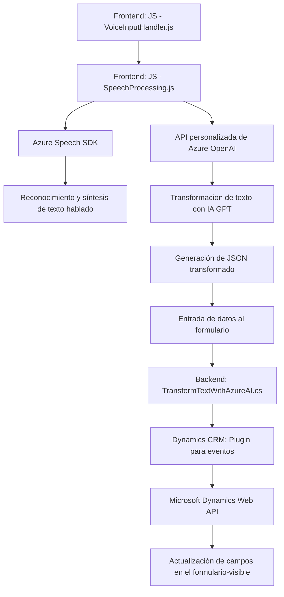

### Resumen técnico
El repositorio implementa una solución donde componentes de **frontend** y **backend** trabajan en conjunto para procesar datos con Azure AI, integrándose a sistemas CRM como Dynamics. La arquitectura articula procesamiento de voz (reconociendo y sintetizando texto), y transforma datos mediante una API de Azure OpenAI. Está diseñado como una capa de integración para formularios en aplicaciones empresariales.

---

### Descripción de arquitectura
1. **Arquitectura principal**:  
   La solución aplica arquitectura **n capas**, donde se organiza funcionalmente en:
   - **Frontend:**
     - Procesamiento en el navegador mediante **JavaScript**.
     - Usa SDK de Azure Speech para funciones de entrada/salida de voz.
   - **Backend:**
     - Liberación de un **plugin de Dynamics CRM** que interactúa con Azure OpenAI Service mediante HTTP.
     - Procesa texto y lo transforma según reglas predefinidas.
   - Integración con **almacenamiento transitorio de datos** en Dynamics CRM que traduce directamente la lógica generada por IA.

2. **Patrones empleados**:
   - **Modularidad extensible**: Los archivos JS están diseñados para reutilización en múltiples formularios.
   - **Delegación**: Uso de *callbacks* en el SDK de Azure Speech y estructura plugin-centralizada para Dynamics CRM.
   - **Stateless Architecture**: Tanto los procesos de frontend como el plugin trabajan sobre parámetros externos (formContext) y no cachean estados persistentes.

---

### Tecnologías usadas
- **Frontend**:  
  - **JavaScript** como lenguaje base.  
  - **Azure Speech SDK** para síntesis y reconocimiento de voz.  
  - Integración con objetos API del CRM (Xrm.WebApi).  

- **Backend**:  
  - **C# .NET Framework** para desarrollo del plugin.  
  - **Microsoft Dynamics SDK**: Manejo de **IPluginExecutionContext** para eventos dentro del sistema CRM.  
  - **Azure OpenAI API**: Acceso a modelos GPT mediante HTTP.  
  - **Newtonsoft.Json**: Manejo y serialización/deserialización de JSON.  
  - **System.Text.Json**: Alternativa moderna para trabajar con JSON.

---

### Dependencias o componentes externos
1. **Azure Speech SDK**:  
   - Proporciona servicios de síntesis y transcripción de voz.  
   - Integrado dinámicamente desde la URL de Azure.
   
2. **Azure OpenAI Service**:  
   - Utilizado por el plugin (TransformTextWithAzureAI.cs) para transformar datos con GPT-4.

3. **Microsoft Dynamics CRM SDK**:  
   - Dependencia principal del plugin, utilizada para conectar las capas de presentación y lógica empresarial.

4. **JavaScript CRM Grid API**:  
   - Gestión avanzada de formularios en el CRM.

5. **APIs internas**:  
   - Métodos personalizados dentro de Dynamics que aplican valores y realizan búsquedas en atributos.

---

### Diagrama Mermaid

---

### Conclusión final
La solución es una integración avanzada diseñada para mejorar la experiencia de usuario en formularios dentro de un sistema CRM. Usa **Azure AI** para potenciar funciones cognitivas como síntesis y reconocimiento de voz, y procesamiento de texto con OpenAI GPT. Aunque esta arquitectura no es materializada como microservicios, utiliza técnicas de **modularización** y separación de capas para tener bajo acoplamiento y alta cohesión. Es una solución ideal para entornos empresariales centrados en la automatización de entradas y salidas en CRM.