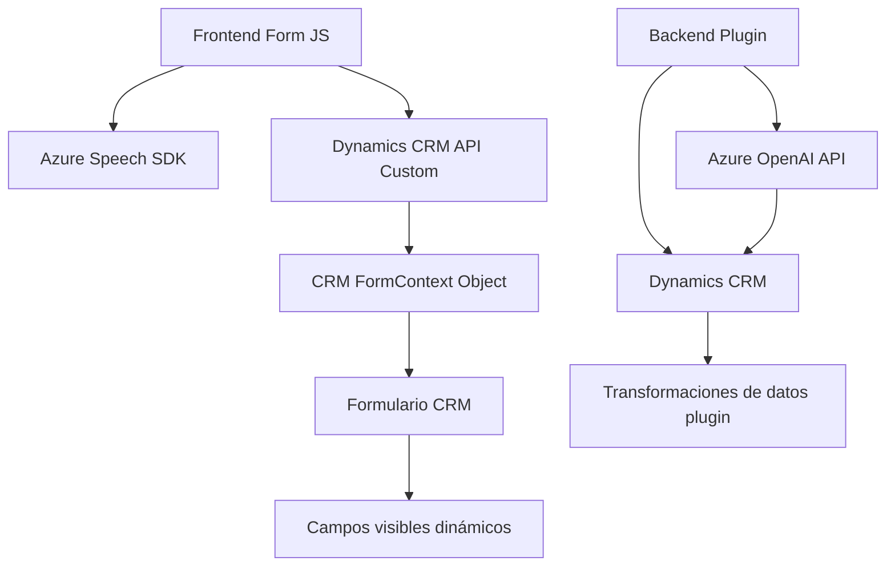

### Análisis técnico del repositorio

#### **Breve resumen técnico**
El repositorio contiene componentes para la integración de servicios de inteligencia artificial y procesamiento de voz mediante Azure Speech SDK y Azure OpenAI en un entorno Dynamics CRM. Los archivos refieren a funciones JavaScript utilizadas para formularios frontend y plugins C# orientados a transformación de texto con OpenAI.

---

#### **Descripción de arquitectura**
1. **Tipo de solución**:
   - La solución parece ser una combinación de **frontend interactivo** (JavaScript) y **backend como plugin** (C#) para un sistema ya existente: Dynamics CRM.
   - Los archivos de JavaScript (`readForm.js`, `speechForm.js`) están diseñados para proporcionar una experiencia de usuario enriquecida al interactuar con formularios mediante reconocimiento de voz y síntesis.
   - El archivo en C# (`TransformTextWithAzureAI.cs`) está orientado a **procesamiento de datos backend vinculado a Dynamics CRM**.

2. **Patrones observados**:
   - Modularización: Las funciones se dividen claramente para reducir la acopladura y aumentar la mantenibilidad.
   - Adapter pattern: El componente en C# actúa como un adaptador entre Dynamics CRM y Azure OpenAI Service.
   - Event-driven architecture: La funcionalidad del SDK de Azure Speech y los plugins se disparan según eventos definidos.
   - Service-Oriented Architecture (SOA): Uso de servicios externos para la integración de reconocimiento de voz, IA y APIs personalizadas con Dynamics CRM.

3. **Arquitectura**:
   - Arquitectura **n-capas**, porque hay una separación entre la lógica del front, servicios externos (Azure), gestión de datos y procesamiento backend conectado a Dynamics CRM.

---

#### **Tecnologías usadas**
1. **Frontend**:
   - JavaScript para interacción en formularios.
   - Azure Speech SDK: Usado para reconocimiento de voz y síntesis de audio desde texto (`https://aka.ms/csspeech/jsbrowserpackageraw`).
   - Dynamics CRM `formContext` APIs.
2. **Backend (Plugins)**:
   - Microsoft Dynamics 365 SDK (C#).
   - Azure OpenAI (para transformación de texto mediante IA indistintamente del plugin).
   - Librerías de .NET como `System.Net.Http` y `System.Text.Json`.

---

#### **Dependencias externas**
- Azure Speech SDK: Proporciona reconocimiento de voz y síntesis de speech, cargado dinámicamente en el frontend.
- Azure OpenAI API: Consume servicios para transformación inteligente del texto, comunicándose con un modelo previamente configurado.
- Microsoft Dynamics CRM SDK: Herramienta fundamental para interacción en plugins y operaciones con datos del sistema.
- API personalizada integrada en los archivos frontend para manipulación dinámica de datos del CRM.

---

#### **Diagrama Mermaid**
A continuación, se representa cómo las dependencias se relacionan entre sí y los componentes del sistema mencionados:

---

#### **Conclusión final**
La solución implementada está claramente diseñada para enriquecer la funcionalidad de un sistema Dynamics CRM mediante integración de inteligencia artificial y servicios avanzados de interacción por voz. Utiliza una arquitectura n-capas con principios de modularidad y desacoplamiento, haciendo uso de Azure Speech SDK para funcionalidades frontend y Azure OpenAI para procesamiento backend en plugins. La estructura es escalable y muy apropiada para entornos empresariales que buscan combinar automatización y AI en sus procesos operativos. Sin embargo, podría optimizarse la carga de servicios externos para minimizar retardos y hacer más eficiente el sistema frente a posibles fallas de red.