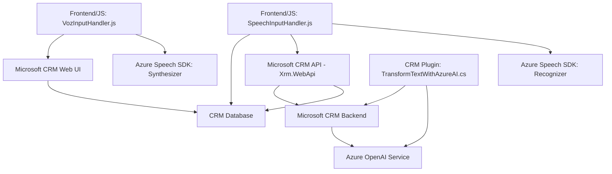

### Breve resumen técnico
El repositorio implementa una solución que mezcla reconocimiento y síntesis de voz con servicios externos (Azure Speech SDK y Azure OpenAI), integrados en una plataforma CRM (Microsoft Dynamics Dynamics 365). Los módulos principales describen interacciones entre frontends y plugins para procesar datos en formularios, transformar texto y generar transcripciones automatizadas.

---

### Descripción de arquitectura
La arquitectura se organiza en **n capas** con componentes distribuidos entre la capa de presentación (Frontend, gestionando el procesamiento de voz) y la capa de negocios (Plugins que interactúan con el servicio Azure OpenAI). Utiliza integración de SDK externos para diferentes funcionalidades:

1. **Capa de presentación**: Maneja la interacción con los usuarios a través de reconocimiento de voz y muestra resultados en formularios.
2. **Capa de negocio**: Implementa lógica para transformar texto mediante servicios de IA y realiza interacciones con el backend del CRM.
3. **Capa de datos**: Realiza consultas, actualizaciones, y obtiene entidades específicas relacionadas con el formulario.

---

### Tecnologías usadas
1. **JavaScript**: Para manejar reconocimiento y síntesis de voz en los archivos frontend.
2. **Azure Speech SDK**: Para interacción con servicios de voz, tanto en entrada como en salida (lectura en voz alta, transcripción).
3. **Microsoft Dynamics CRM Plugin Framework**: Para implementar lógica customizada en el servidor y extensión del CRM.
4. **Azure OpenAI Service**: Para procesamiento de texto/captura estructurada con inteligencia artificial.
5. **.NET Framework**: Para desarrollar el plugin del lado servidor en `TransformTextWithAzureAI.cs`.

---

### Diagrama Mermaid para GitHub Markdown

---

### Conclusión final
El repositorio implementa una solución distribuida basada en una arquitectura **n capas**, con dos componentes principales: la capa frontend, que utiliza Azure Speech SDK para interacción vocal, y la capa de negocio, extendida por un plugin de Dynamics CRM que integra Azure OpenAI para transformar texto. Los módulos están bien organizados y reutilizan servicios externos (Speech SDK, OpenAI), adaptándose a escenarios que requieren manejo de voz y datos estructurados desde formularios CRM.