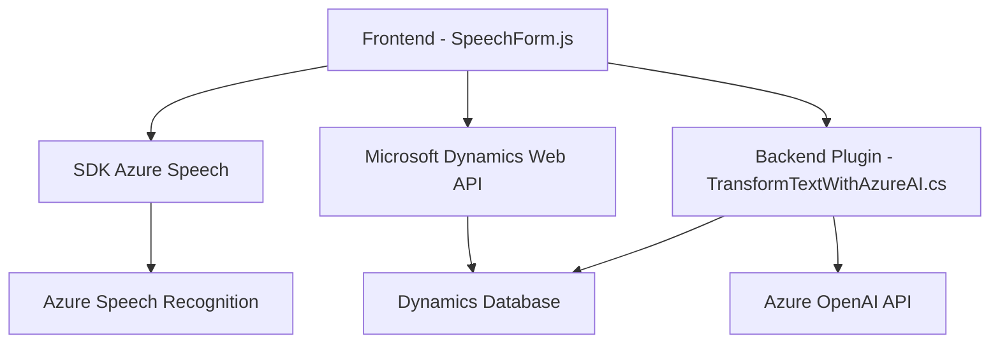

### **Breve resumen técnico**
El repositorio parece formar parte de un sistema integrado usado en el contexto de Microsoft Dynamics 365 CRM. Sus funcionalidades se centran en la interacción con los datos de los formularios del CRM y su enriquecimiento mediante tecnologías de Azure AI. En términos generales, el sistema habilita interacción de voz mediante el SDK de Azure Speech y procesa datos con Azure OpenAI para realizar tareas como inscripción de formularios o transformación de texto en datos estructurados.

---

### **Descripción de arquitectura**
La arquitectura general del sistema parece estructurarse en:
1. **Modularización:** Gracias a la separación lógica entre reconocimiento de voz y síntesis de texto (en el frontend), junto con un backend separado implementado como un plugin en Dynamics CRM.
2. **Interoperabilidad:** El flujo muestra integración entre un frontend basado en JavaScript (normalmente ejecutado en el navegador) y servicios de Azure Cognitive Services como el Azure Speech SDK para entrada y salida de voz.
3. **Plugin-Based Architecture:** El procesamiento intensivo y las reglas de negocio están delegadas a un plugin implementado en el backend de Dynamics CRM.
4. **Cloud-Powered Services:** Utilización de APIs externas como el **Azure Speech SDK** para la parte de voz y **Azure OpenAI** para procesar y transformar el texto hablado.
5. **Event-Driven Programming:** El plugin `TransformTextWithAzureAI.cs` sigue el esquema de eventos definido por Dynamics CRM (por ejemplo, el contexto de ejecución asociado a la operación del usuario).
6. **Integration Architecture:** Se observa la creación de flujos "cliente-servidor" donde el frontend se comunica con el backend y ambos interactúan dinámicamente con servicios en la nube.

---

### **Tecnologías usadas**
#### Principal:
1. **Frontend:**
   - **JavaScript** como lenguaje de desarrollo.
   - **Azure Speech SDK** para síntesis de voz y reconocimiento de voz.
   - Web APIs de Dynamics 365 (`Xrm.WebApi`) para manipular datos en el frontend.

2. **Backend:**
   - **Microsoft Dynamics CRM SDK** para implementar plugins específicos.
   - **Azure OpenAI** para transformar texto en datos estructurados mediante IA.

#### Auxiliares:
- **Librerías para integración HTTP y JSON:**
  - `System.Net.Http`
  - `System.Text.Json`
  - `Newtonsoft.Json`

---

### **Diagrama Mermaid**
Refleja los componentes principales en el flujo de interacción entre el frontend, backend y las APIs externas.

---

### **Conclusión final**
El repositorio describe un sistema híbrido compuesto por un frontend (en JavaScript) y un backend como plugin en Microsoft Dynamics CRM. La arquitectura es una combinación de cliente-servidor con integraciones avanzadas hacia servicios externos en la nube (Azure Speech y OpenAI). En términos generales, este diseño aprovecha la modularidad y escalabilidad de los servicios cloud, brindando soporte para casos de uso como reconocimiento de voz, síntesis de texto y procesamiento de datos en tiempo real. 