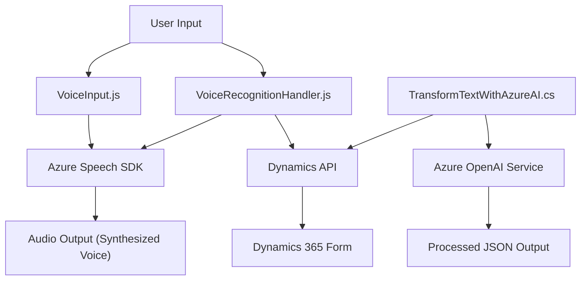

### Breve resumen técnico

El repositorio presenta una solución orientada al manejo de datos de formularios en Microsoft Dynamics 365 mediante el uso de reconocimiento y síntesis de voz. Se compone de tres tipos de archivos:
1. **Frontend JavaScript:** Implementa lógica en el cliente para integración y consumo de APIs (Azure Speech SDK y Dynamics API).
2. **Backend C# Plugin:** Define dinámicas extendidas mediante un plugin conectado al entorno CRM que interactúa con Azure OpenAI Service para procesamiento inteligente.

---

### Descripción de arquitectura

La arquitectura es una solución cliente-servidor integrada sobre Dynamics CRM utilizando patrones de múltiples capas:
1. **Frontend:** A nivel del cliente, los archivos JavaScript proporcionan modularidad mediante funciones que interactúan con APIs externas (Azure Speech SDK).
2. **Backend:** Un plugin en C# para Dynamics CRM, basado en la arquitectura de plugins, añade funcionalidad personalizada. Este realiza integración con servicios externos como Azure OpenAI para realizar transformaciones avanzadas de texto.
3. **Integración externa:** Se utilizan servicios de Azure (Speech SDK y OpenAI) mediante patrones RESTful y SDK, permitiendo conectividad asincrónica confiable y enriqueciendo capacidades del sistema.

La solución podría clasificarse como:
- **De arquitectura de capas** (frontend-backend-API).
- Integrada con elementos **externos en la nube** como Azure Speech y OpenAI.

---

### Tecnologías usadas

1. **Frontend**:
   - **Lenguaje:** JavaScript.
   - **Frameworks y servicios:** Azure Speech SDK, Dynamics API.
   - **Patrones:** Modularidad en funciones.
   - **Manejo de asincronía:** Promesas y callbacks.

2. **Backend**:
   - **Lenguaje:** C#.
   - **Frameworks:** Microsoft Dynamics SDK.
   - **Servicios externos:** Azure OpenAI.
   - **Patrones:** Plugin-based Architecture, REST API Integration.

3. **Externo**:
   - Azure Speech SDK para síntesis y reconocimiento de voz.
   - Azure OpenAI Service para transformación avanzada de texto.

---

### Diagram Mermaid válido para GitHub

---

### Conclusión final

La solución representa un sistema diseñado para facilitar la accesibilidad mediante voz y mejorar la interacción con formularios de Dynamics 365. La combinación de frontend modular, plugins backend personalizados y servicios externos en la nube (Azure) optimizan la experiencia del usuario, cumpliendo estándares de accesibilidad y funcionalidad avanzada. Aunque está bien estructurada, cuidado debe ser tomado en proteger las configuraciones externas como claves API, que actualmente están incrustadas en el código.