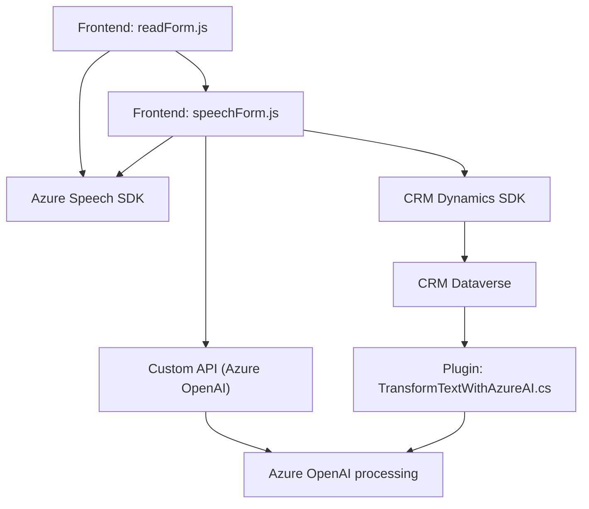

## Breve Resumen Técnico

El repositorio contiene tres principales componentes que interactúan entre sí para implementar una funcionalidad basada en reconocimiento y síntesis de voz, transformaciones mediante IA en una API externa (Azure OpenAI) y la gestión de datos en Dynamic/Dataverse CRM. Estas tres piezas trabajan juntas para ofrecer una solución de integración avanzada:

1. `readForm.js`: Extrae datos visibles de un formulario, los convierte en texto y utiliza Azure Speech SDK para sintetizarlo en voz. Lo destaca el uso de modularización, eventos y servicios externos.
2. `speechForm.js`: Reconoce el habla mediante Azure Speech SDK, generando transcripciones que se asignan a campos del formulario o procesan mediante una API personalizada (Azura OpenAI) para tareas inteligentes.
3. `TransformTextWithAzureAI.cs`: Implementa un plugin para Dynamics CRM utilizando Azure OpenAI para transformar texto en un JSON estructurado basándose en reglas.

---

## Descripción de arquitectura

La solución utiliza una **arquitectura híbrida de n capas y servicios distribuidos**. El _frontend JavaScript_ actúa como un cliente que interactúa con el usuario y vincula múltiples servicios externos, como Azure Speech SDK para reconocimiento y síntesis de voz y una API a medida para procesamiento de texto con IA. En el backend, el plugin en .NET (.cs file) sigue un patrón basado en plugins específico para Dynamics CRM y API-first para interactuar con Azure OpenAI.

Las capas observadas son:
1. **Capa de presentación (Frontend)**: Archivos JavaScript que manejan la interacción del usuario y la lógica de negocio asociada al formulario dinámico en Dynamics CRM.
2. **Capa de servicios externos**:
   - **Speech Service SDK**: Reconocimiento y síntesis de voz.
   - **Azure OpenAI**: Procesamiento avanzado de texto (transformación).
3. **Capa de negocio (Backend)**:
   - Plugin en .NET para extender capacidades del CRM mediante integración con los servicios de Microsoft Azure y procesamiento personalizado.

---

## Tecnologías y patrones usados
1. **Lenguaje y frameworks**:
   - **JavaScript en el frontend**: Modularización de lógica funcional, manejo de eventos, consumo de APIs.
   - **C#/.NET en el backend**: Desarrollo de plugins para CRM Dynamics/Dataverse.
2. **Servicios externos**:
   - **Azure Speech SDK**: Para interactuar con servicios de síntesis y reconocimiento de voz.
   - **Azure OpenAI**: Para procesamiento de lenguaje natural.
3. **Patrones de diseño**:
   - **Modularización funcional**: Descomposición en funciones independientes en JavaScript.
   - **Plugin pattern**: Aplicado en la extensión de Dynamics CRM/Dataverse.
   - **Integración externa explícita**: Manejo claro de dependencias remotas (SDK/endpoint de API).
   - **Event-driven architecture**: Uso de eventos para disparar interacciones en el frontend.

---

## Dependencias o componentes externos presentes
1. **Azure Speech SDK**:
   - URL: `https://aka.ms/csspeech/jsbrowserpackageraw`.
   - Usado para la síntesis y reconocimiento de voz.
2. **Azure OpenAI**:
   - Procesamiento de texto avanzado mediante Inteligencia Artificial.
   - Customización basada en reglas para obtener JSON estructurado.
3. **Dynamics CRM SDK**:
   - Para integración con datos en formularios del sistema CRM.
4. **Librerías .NET**:
   - `Microsoft.Xrm.Sdk`: CRM Dynamics y Dataverse.
   - `System.Net.Http`, `System.Text.Json`, y `Newtonsoft.Json` para procesar peticiones HTTP y manipulación JSON.

---

## Diagrama Mermaid (estructura válida para GitHub Markdown)

---

## Conclusión final
La solución propuesta representa una arquitectura **híbrida distribuida** que integra los asistentes de voz y un CRM a través de servicios externos avanzados de Microsoft Azure SDK y OpenAI. Este enfoque utiliza el **patrón de arquitectura n-capas**, donde las responsabilidades están claramente segmentadas entre presentación (frontend), lógica (form processing), y servicios especializados. Adicionalmente, los elementos del sistema utilizan **patrones de modularización y evento** para garantizar un flujo eficiente, mientras que la extensión del CRM se maneja mediante un plugin conectado a servicios externos, destacándose por su acoplamiento claro y flexible. Es ideal para interfaces dinámicas de entrada de datos, combinando accesibilidad (sistemas de voz), procesamiento inteligente (Azure OpenAI) y funciones específicas de CRM.