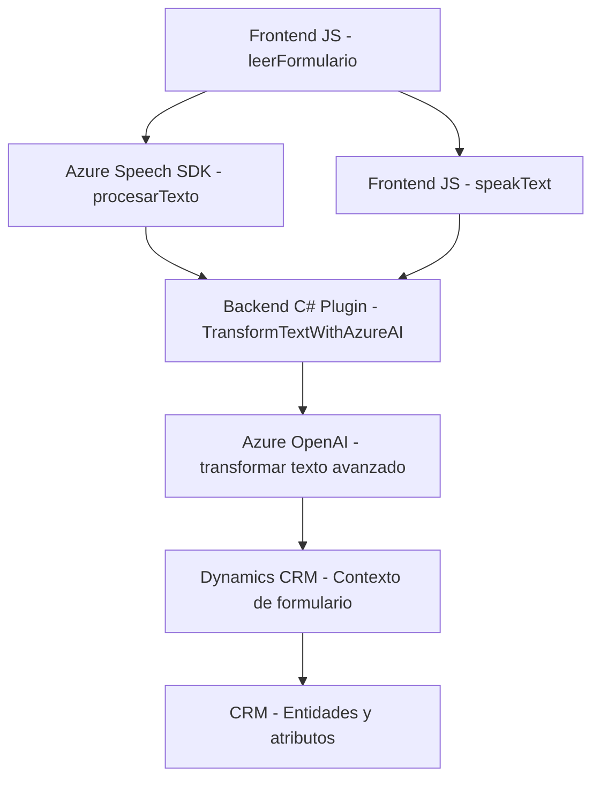

### Análisis técnico exhaustivo del repositorio

#### Resumen técnico:
Este repositorio contiene una solución que combina una aplicación frontend (JavaScript) y un plugin backend desarrollado para la plataforma Dynamics CRM. El enfoque principal es integrar funcionalidades avanzadas de voz y texto utilizando servicios de Azure, específicamente **Azure Speech SDK** y **Azure OpenAI Service**, para interactuar con formularios y datos en Dynamics CRM.

---

### **Descripción de arquitectura:**
1. **Tipo de solución:**
   - Esta es una solución híbrida, que incluye:
     - Una **frontend web** basada en **JavaScript** y orientada al soporte de Dynamics CRM.
     - Un backend implementado como un plugin para Dynamics CRM utilizando **C#**, ejecutado al desencadenarse eventos específicos del sistema CRM.
   - Las funcionalidades se centran en:
     - Entrada de voz y transcripción a texto.
     - Comunicación con servicios externos de nube (Azure Speech SDK).
     - Manipulación y actualización de datos en formularios de Dynamics CRM.
     - Integración con **Azure OpenAI** para procesamiento avanzado de texto.

2. **Arquitectura:**
   - **N capas con una arquitectura plugin de Dynamics CRM**: 
     En el backend, se sigue la arquitectura basada en capas típicas de aplicaciones empresariales:
     - Capa de presentación (CRM UI Forms)
     - Capa de negocio (Custom Plugins)
     - Capa de datos (Dynamics CRM Entities/Attributes)

   - El frontend emplea una estructura modular para la interacción directa con el usuario y el procesamiento de datos del formulario, mientras delega funciones más complejas al backend y servicios externos, como el reconocimiento de voz y las transformaciones semánticas con IA.

---

### **Tecnologías usadas:**
1. **Frontend:**
   - **JavaScript** (ES6): Para la lógica de interacción con formularios y funcionalidades de síntesis/reconocimiento de voz.
   - **Azure Speech SDK**: Para conversión de voz a texto y viceversa.

2. **Backend:**
   - **C# (.NET Framework)**: Desarrollo de plugins para Dynamics CRM.
   - **Dynamics CRM SDK**: Para manipulación de servicios y contextos de CRM.
   - **Azure OpenAI Service**: Consumo de API externa de procesamiento de lenguaje natural.

3. **Frameworks/Librerías usadas:**
   - **Newtonsoft.Json / System.Text.Json**: Para trabajar con datos en formato JSON (en el plugin de C#).
   - **System.Net.Http**: Para realizar peticiones HTTP al servicio de Azure OpenAI.
   - **Vanilla JavaScript APIs**: Para la manipulación DOM dinámica y eventos (en el frontend).

4. **Dependencias externas:**
   - **Azure Key Vault (recomendación)**: No aparece directamente, pero sería ideal para gestionar adecuadamente las credenciales necesarias para Azure Speech/OpenAI APIs.

---

#### **Diagrama Mermaid**

##### **Explicación del diagrama:**
- El diagrama muestra el flujo general de la solución:
  1. El frontend maneja la interacción inicial con el usuario.
  2. Utiliza **Azure Speech SDK** para la transcripción de voz y síntesis de texto a voz.
  3. El backend interactúa con **Azure OpenAI** para procesamientos avanzados de texto o transcripciones.
  4. Finalmente, los datos procesados son actualizados en los formularios de CRM mediante las entidades y atributos configurados.

---

### **Conclusión final:**
Este repositorio implementa una solución híbrida que combina frontend avanzado basado en JavaScript con integración de servicios en la nube y un backend basado en Dynamics CRM mediante un plugin de C#. Utiliza varias tecnologías de Microsoft Azure (Speech SDK y OpenAI Service) y emplea una arquitectura de n-capas adecuada para aplicaciones empresariales basadas en CRM, con una separación clara de responsabilidades en cada componente. 

El diseño es modular y extensible, pero podría beneficiarse de mejores prácticas como:
1. **Estrategias de gestión segura de credenciales** (ej.: Azure Key Vault).
2. Uso de patrones como **Dependency Injection** en el frontend y **Retry patterns** en el consumo de servicios externos para robustez.