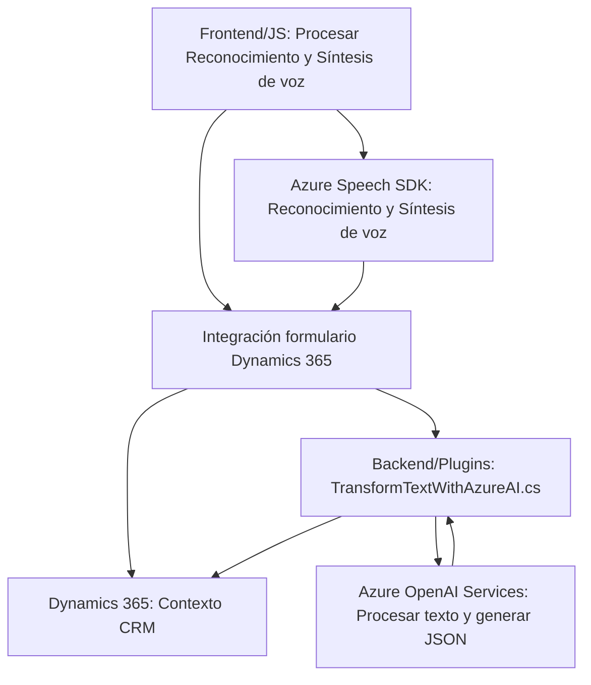

### Breve resumen técnico
Analizamos un repositorio enfocado en habilitar capacidades de integración con Azure Speech SDK y Azure OpenAI Services dentro de entornos como Dynamics 365. Esto incluye interacción por voz, transformación de texto, y asignación de datos a formularios empresariales.

### Descripción de arquitectura
- **Frontend (JavaScript):** Procesamiento de reconocimiento y síntesis de voz, que usa Azure Speech SDK para interacción asincrónica. Con enfoque modular, permite asignar valores a campos en formularios dinámicos de Dynamics 365.
- **Backend Plugin (C#):** Un plugin de Dynamics CRM basado en la interfaz `IPlugin`, que utiliza el servicio de Azure OpenAI para transformar texto en objetos JSON para procesamiento empresarial.

El sistema sigue una arquitectura **orientada a servicios (SOA)**. Cada módulo interactúa con APIs externas (Azure Speech SDK, Azure OpenAI Services). Las partes del sistema están separadas por capas: una capa de frontend que procesa voz y datos para su uso empresarial y un backend basado en plugins que realiza tareas transformativas y consume IA en tiempo real.

### Tecnologías usadas
1. **JavaScript:** Para interacción en el frontend (en clientes Dynamics 365).
2. **Azure Speech SDK:** Implementa reconocimiento y síntesis de voz.
3. **Azure OpenAI Services:** Procesa texto y métricas definidas como JSON estructurados.
4. **Dynamics 365:** Integración con formularios empresariales.
5. **Microsoft.Xrm.Sdk:** Para la construcción de plugins backend.
6. **.NET Framework / C#:** Implementación del plugin de Dynamics CRM y manejo de respuesta JSON.
7. **Newtonsoft.Json y System.Text.Json:** Para serialización/deserialización de datos JSON.
8. **HTTP APIs:** Comunicación con servicios externos de Azure OpenAI y Speech SDK.

### Dependencias o componentes externos
- **Azure Speech SDK:** Para reconocimiento y síntesis de voz.
- **Azure OpenAI Services:** Consume las capacidades de GPT para transformar texto en objetos JSON útiles para una aplicación empresarial.
- **Dynamics 365 Web API:** Para acceso a datos del formulario y ejecución de lógica personalizada.
- **Newtonsoft.Json:** Manejo de JSON complejo, especialmente en el backend.
- **HTTP Client:** Comunicación API mediante solicitudes HTTP.

### Diagrama Mermaid válido para GitHub

### Conclusión final:
- **Tipo de solución:** 
  Este sistema implementa capacidades de *voz a texto* y procesamiento de datos mejorado mediante *IA generativa de Azure OpenAI* integrado con formularios de Dynamics 365.
  
- **Arquitectura:** 
  Sigue un modelo de **SOA**, donde el frontend habilita capacidades de voz y el backend maneja la automatización del texto en datos estructurados mediante un plugin especializado. La separación de responsabilidades es clara: frontend maneja interacción directa y backend realiza transformaciones empresariales.

- **Ventajas:**
  La solución es modular, altamente escalable, y adaptable gracias a su dependencia en APIs y SDK externos. También integra capacidades modernas de IA para mejorar la captura y asignación de datos relevantes.

Este diseño es eficiente para entornos empresariales que requieren interacción avanzada con voz y transformación de datos utilizando IA sofisticada.