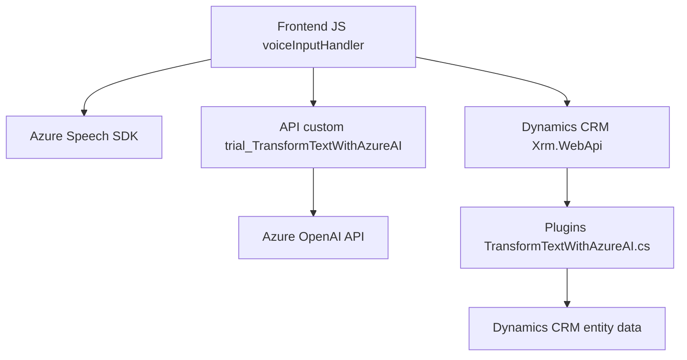

### Breve resumen técnico:
El repositorio describe una solución que combina una interfaz frontend, un backend en forma de plugin para Microsoft Dynamics CRM y dependencias externas como el `Azure Speech SDK` y el servicio `Azure OpenAI`. Esta solución involucra la entrada de datos por voz, su procesamiento dinámico mediante inteligencia artificial y la manipulación de datos en un formulario web de una aplicación integrada con Dynamics CRM.

---

### Descripción de la arquitectura:
La arquitectura está organizada en tres capas principales:
1. **Frontend (Interacción de usuario):** Archivos JavaScript que gestionan la interacción con el usuario mediante voz, el procesamiento de formularios dinámicos y la comunicación con APIs externas.
   - La capa requiere el SDK de Azure Speech para reconocimiento y síntesis de voz.
2. **API personalizada:** Existe una API que interactúa con el servicio `Azure OpenAI`. Esta API es llamada desde el frontend para realizar transformaciones del texto ingresado por voz.
3. **Plugin backend (Microsoft Dynamics CRM):** Permite integrar funcionalidades avanzadas que transforman datos usando inteligencia artificial (Azure OpenAI). Este plugin interactúa directamente con el contexto CRM y ajusta valores de atributos en entidades definidas.

La arquitectura combina patrones:
- **Arquitectura de servicios conectados:** En el frontend se observa la integración con el SDK de Azure, mientras en el backend se implementa un plugin que interactúa con Azure OpenAI. Esto permite que distintas piezas colaboren.
- **Enfoque modular funcional:** Las funciones JavaScript son independientes, siguen el principio de responsabilidad única y están diseñadas para ser ejecutadas y testeadas por separado.
- **Integración RESTful:** Uso de llamadas a servicios externos vía HTTP para transformar datos y realizar acciones específicas.
- **N Capas:** La solución mantiene capas independientes dando soporte a cada funcionalidad, separando la lógica de presentación de la lógica de negocio y la integración de servicios externos.
- Posible **Plugin Architecture**, muy común en Dynamics CRM.

---

### Tecnologías usadas:
#### Frontend:
- **JavaScript:** Lenguaje de scripting para la implementación de funciones.
- **Azure Speech SDK:** SDK para manejar síntesis y reconocimiento de voz.
- **Promises & async/await:** Para procesos asíncronos como el reconocimiento de voz y llamadas a APIs externas.
- **Microsoft Dynamics CRM API (Xrm.WebApi):** Para gestionar actualizaciones en formularios dinámicos y entidades de la base de datos.

#### Backend:
- **Microsoft Dynamics Plugin:** Implementación de un plugin con la interfaz `IPlugin`.
- **C#:** Lenguaje de programación utilizado para construir el plugin de Dynamics CRM.
- **System.Text.Json:** Gestión de serialización y deserialización JSON.
- **System.Net.Http:** Envío de solicitudes HTTP al servicio Azure OpenAI.
- **Azure OpenAI Service:** Para realizar transformaciones de texto y obtener respuestas.

---

### Diagrama Mermaid válido para GitHub:

---

### Conclusión final:
Esta solución tiene como objetivo mejorar la interacción entre usuarios y formularios dinámicos en una aplicación empresarial integrada con Dynamics CRM, mediante tecnologías de reconocimiento de voz, procesamiento con IA y manipulación de datos en servicios CRM. Su arquitectura modular permite separar claramente las responsabilidades entre la interfaz frontend, la API externa y los plugins backend de Dynamics. Sin embargo, hay consideraciones importantes como la gestión segura de credenciales (especialmente en la API y el plugin) y la optimización de las llamadas a servicios externos para evitar latencias.