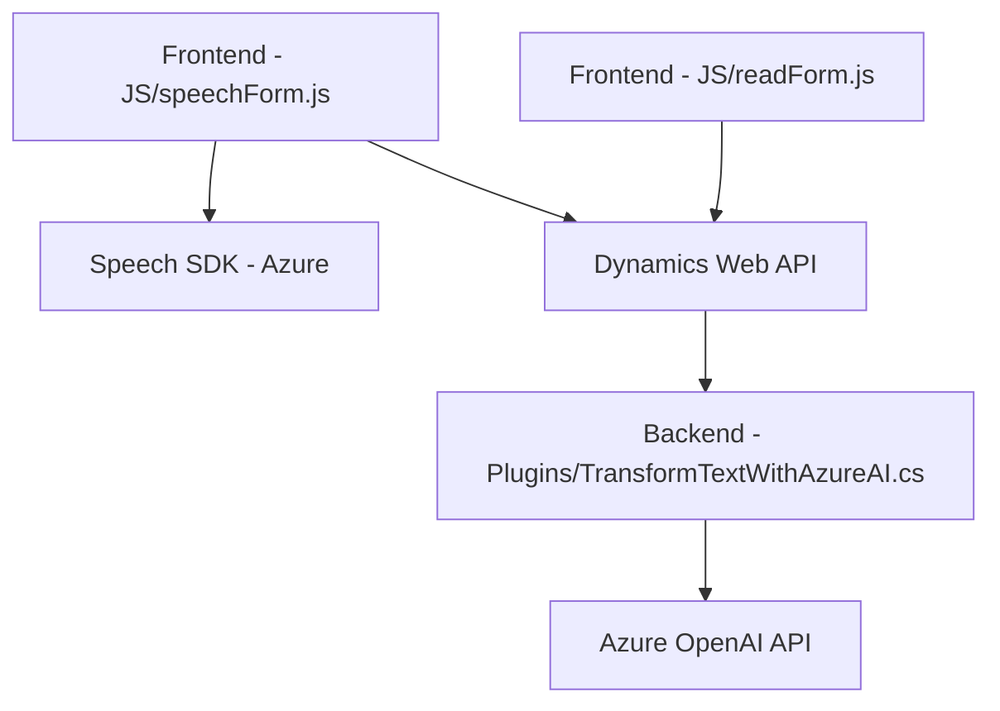

### Breve resumen técnico:
Los archivos proporcionados (`readForm.js`, `speechForm.js`, `TransformTextWithAzureAI.cs`) implementan un sistema que conecta formularios de Dynamics CRM con servicios de Microsoft Azure Speech SDK y Azure OpenAI. El objetivo de esta integración es permitir la traducción de datos en formularios a texto sintetizado, entrada por voz, y texto transformado por IA.

### Descripción de arquitectura:
1. **Tipo de solución**:  
   - La solución está compuesta principalmente de tres elementos:
     - **Frontend modular** basado en JavaScript (`readForm.js`, `speechForm.js`).
     - **API o servicios internos** de integración con CRM (Dynamics Web API).
     - Un **plugin backend** (`TransformTextWithAzureAI.cs`) que sirve como middleware entre Dynamics CRM y el servicio externo de Azure OpenAI.

2. **Patrones de arquitectura**:  
   - **Capa de presentación**: Archivos JavaScript en `FRONTEND/JS` (interacción con el usuario vía la interfaz del formulario).
   - **Capa de servicios**: Plugin `TransformTextWithAzureAI.cs` usando `Dynamics CRM SDK` e integrando terceros.
   - **Modularidad**: Segmentación de la lógica por funciones para mejorar mantenibilidad y claridad.
   - **Patrón SDK Wrapper**: Funciones JavaScript adaptan las capacidades de Azure Speech SDK y Dynamics Web API.
   - **API Gateway Pattern**: `TransformTextWithAzureAI.cs` actúa como intermediario entre Dynamics CRM y Azure OpenAI.  
   - **Delegate Pattern**: Uso de `callback` y promesas para la ejecución de tareas asincrónicas.

3. **Arquitectura técnica**:  
   - **N Capas** (Lógica de frontend, backend y API externa).  
   - **Integración híbrida**:
     - Frontend con SDKs externamente cargados (Azure Speech SDK).
     - Backend (Dynamics CRM plugins) integrando con REST APIs externas (Azure OpenAI).
   - **Alto acoplamiento con Dynamics CRM**, que limita su uso fuera del ecosistema.

### Tecnologías usadas:
- **Frontend**:
  - JavaScript modular.
  - Azure Speech SDK (usado para reconocimiento y síntesis de voz).
  - Dynamics Web API (interacción entre frontend y CRM).
- **Backend**:
  - Dynamics CRM SDK (`Microsoft.Xrm.Sdk`) en .NET.
  - Azure OpenAI API (`chat/completions`) para procesamiento de texto.
  - SDKs para manejo de JSON (`Newtonsoft.Json`, `System.Text.Json`).
- **Servicios externos**:
  - Microsoft Azure (Speech SDK y OpenAI).

### Dependencias/componentes externos:
1. **Microsoft Azure Speech SDK**:
   - Necesario para síntesis y reconocimiento de voz en frontend.
2. **Dynamics CRM SDK**:
   - Requerido para mantener lógica del plugin backend.
3. **Azure OpenAI API**:
   - Endpoint de procesamiento de texto en backend.
4. **Microsoft Dynamics Web API**:
   - Permite interacción entre la UI y el ecosistema CRM.
5. **Framework .NET**:
   - Compatible con `TransformTextWithAzureAI.cs`.

---

### Diagrama Mermaid (válido para GitHub Markdown):

---

### Conclusión final:
Este sistema adapta tecnologías modernas como Azure Speech SDK y Azure OpenAI para enriquecer las capacidades del Dynamics CRM, brindando una experiencia más interactiva y automatizada en el procesamiento de formularios. La arquitectura está basada en **N capas**, con una integración híbrida entre frontend y backend. La modularidad de las funciones en el frontend y el plugin backend con APIs externas demuestra buen diseño y escalabilidad, aunque depende fuertemente del ecosistema Dynamics CRM.