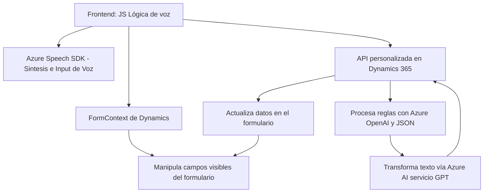

### Breve resumen técnico
El repositorio presenta una solución orientada a implementar una interacción entre usuarios y formularios de la plataforma Dynamics 365 mediante entrada y salida de voz, así como procesamiento de texto basado en Azure Speech SDK y Azure OpenAI. Se compone de tres partes principales:
- **Frontend JavaScript:** Implementa lógica para entrada de texto mediante voz (reconocimiento y síntesis) y procesos basados en reactivos propios del contexto de Dynamics.
- **Plugin .NET:** Un plugin para Dynamics 365 que integra un servicio de transformación de texto mediante Azure OpenAI, retornando resultados procesados y estructurados en JSON.

---

### Descripción de arquitectura
La solución utiliza una arquitectura **híbrida de microservicios y n capas**, combinando elementos locales del cliente (interacción con los formularios) con la integración de servicios externos. Se apoya en las siguientes capas:
1. **Presentación:** Código JavaScript que interactúa directamente con formularios del frontend.
2. **Lógica:** Plugins de Dynamics CRM y servicios personalizados que manejan la mayoría de las reglas de negocio.
3. **Integración externa:** APIs de Azure Speech SDK y Azure OpenAI se utilizan para reconocimiento y síntesis de voz, así como transformación de entrada textual.

Adicionalmente, la interacción con Dynamics 365 utiliza principios del **modelo de dominio** para manejar estructuras internas como `formContext`, atributos y entidades del sistema.

---

### Tecnologías usadas
1. **Frontend:**
   - **JavaScript:** Para lógica de entrada/salida basada en voz.
   - **Azure Speech SDK:** Integra funcionalidad avanzada de reconocimiento y síntesis.
   - **Promesas y asincronía:** Manejo de callbacks y procesos async/await.
   - **Dynamics Web API:** Interacción con Dynamics 365 para manipulación de datos en formularios.

2. **Backend (Plugins):**
   - **C#/.NET:** Implementación del plugin en Dynamics CRM.
   - **Microsoft XRM SDK:** Framework para desarrollo en Dynamics 365.
   - **Azure OpenAI:** Para procesamiento contextual de texto.

3. **Patrones:**
   - **Plugin Pattern:** Estándar en Dynamics CRM para ejecutar lógica de negocio personalizada.
   - **Helper Pattern:** Uso de funciones auxiliares para separar la lógica y simplificar el diseño.
   - **Integración con servicios externos:** Redirige lógica pesada a APIs especializadas.
   - **El patrón de estrategia:** Elegir entre operaciones estándar o IA basándose en las reglas proporcionadas.

---

### Diagrama Mermaid

---

### Conclusión final
El sistema presentado es una solución centrada en la integración entre formularios frontend en Dynamics 365 y funcionalidades avanzadas de voz e inteligencia artificial mediante servicios de Azure. Está estructurado en capas que maximizan modularidad y la separación de responsabilidades. Su arquitectura refuerza la combinación de principios de microservicios para recursos especializados (Azure Speech, OpenAI) y el modelo de dominio de Dynamics CRM. Esto lo hace adecuado para entornos empresariales que buscan extender capacidades nativas con recursos inteligentes y una interfaz accesible mediante voz.