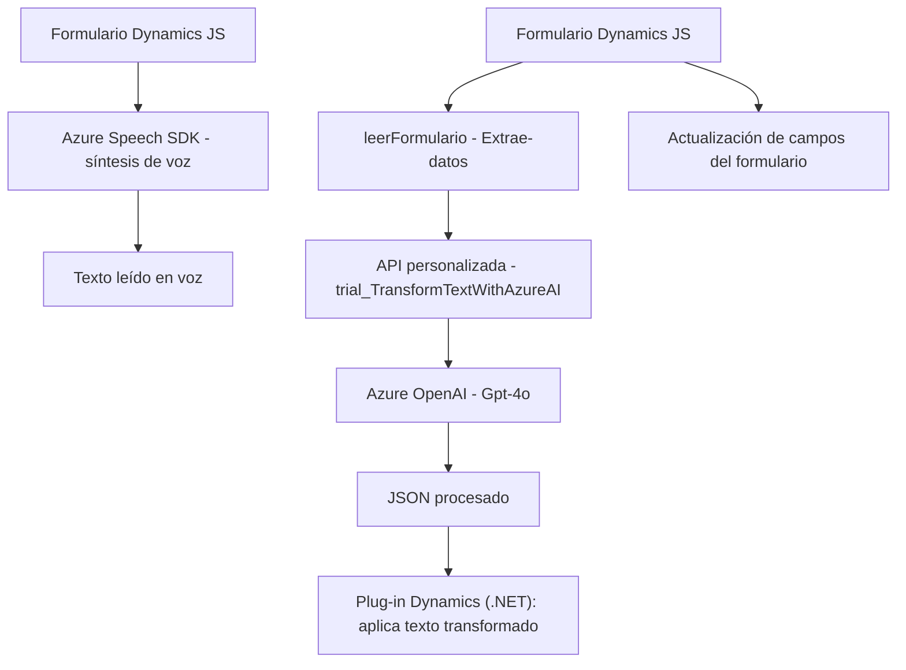

## Breve resumen técnico
El repositorio contiene módulos orientados a la integración con servicios como Azure Speech SDK y Azure OpenAI. Los archivos están diseñados para interactuar con formularios de Dynamics 365, proporcionando capacidades de entrada/salida por voz, transformación de texto mediante IA, y actualización dinámica de campos del sistema.

---

## Descripción de arquitectura
La solución tiene características de una arquitectura distribuida con módulos independientes que interactúan entre ellos y con servicios externos. Se observa:
1. **Front-End para Dynamics 365:** Archivos JS que manejan la manipulación de formularios y servicios de voz.
2. **Plug-in (Back-End):** Código .NET que se ejecuta como complemento en Dynamics CRM. Sirve como intermediario entre Dynamics y Azure OpenAI.
3. **Servicios Externos:** Azure OpenAI y Azure Speech SDK, usados para transformación de texto y síntesis de voz.

### Arquitectura detectada:
- **N capas** aplicada en el diseño general:
  - **Capa presentación:** JS que interactúan con los formularios.
  - **Capa aplicación:** Lógica en el plug-in para la transformación de datos.  
  - **Servicios externos:** Azure SDK y OpenAI como dependencias.
- Además, se observa un enfoque hacia **architecture hexagonal**, dado el uso de adaptadores para interactuar con servicios como Azure Speech y OpenAI API.

---

## Tecnologías usadas
### Front-End:
- **JavaScript:** Funciones para manipulación de formularios Dynamics y uso de APIs externas.
- **Azure Speech SDK:** Synthesis y reconocimiento de voz.
### Back-End:
- **.NET Framework (C#):** Plug-in de Dynamics CRM para transformación de datos. 
- **Azure OpenAI API:** Gpt-4o para interpretación de texto.
### Dependencias generales:
- **Dynamics Web APIs:** Para manejo de datos en la capa de presentación.
- **Newtonsoft Json**, **HttpClient**: Manejo de solicitudes y formato JSON.

---

## Diagrama Mermaid válido para GitHub

---

## Conclusión final
La solución implementa una arquitectura que aprovecha servicios externos como Azure Speech y OpenAI para extender las capacidades de Dynamics 365. La separación lógica entre Front-End, Back-End y servicios sigue buenas prácticas de modularidad. Además, se destacan patrones como **Callbacks**, el uso de **Adaptadores** para servicios externos, y la lógica orientada al contexto.

Integrar inteligencia artificial y síntesis de voz en sistemas CRM como Dynamics crea una solución avanzada para manipular y transformar flujos en tiempo real, mejorando la interacción del usuario y la automatización.