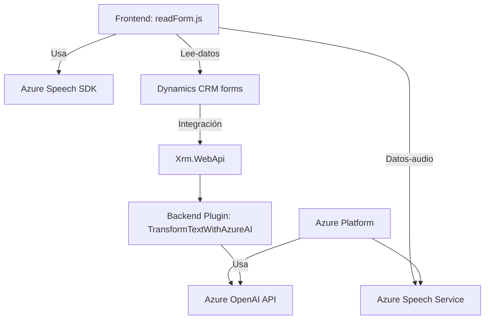

# Análisis detallado del repositorio

### Breve resumen técnico
Este repositorio implementa una solución que integra funcionalidad de **reconocimiento de voz** y **síntesis de texto a voz (Text-to-Speech)** usando **Azure Speech SDK** junto con capacidades de transformación de texto en JSON mediante **Azure OpenAI**. La solución está estructurada en tres niveles principales: frontend (JavaScript para UI en Dynamics 365), integración intermedia con funcionalidades backend y un plugin que actúa como mediador entre Dynamics CRM y el servicio Azure OpenAI.

---

## Descripción de arquitectura
La arquitectura es un diseño híbrido basado en **n-capas** con funcionalidades distribuidas en tres capas principales:
1. **Presentación** (frontend): Control de instrucciones de entrada y salida relacionadas con voz y datos del formulario en el sistema CRM. Están ubicadas en el directorio `FRONTEND/JS/`.
2. **Capa de aplicación** (middleware): Funcionalidades específicas del sistema CRM utilizando servicios de un SDK, como procesamiento de datos desde formularios y adaptación a servicios externos en línea (Azure Speech API y Azure OpenAI).
3. **Capa de negocio** (backend): Suministra lógica de transformación avanzada y conexión directa al servicio Azure OpenAI a través de un **endpoint REST** e implementación del patrón de plugin de Dynamics CRM.

---

### Tecnologías, frameworks y patrones observados
1. **Tecnologías utilizadas**:
   - **Frontend**:
     - **JavaScript**: Interacción y manipulación de formularios CRM y procesamiento de datos con las APIs externas.
     - **Azure Speech SDK**: Para reconocimiento de voz y generación de audio mediante la síntesis de texto.
   - **Backend**:
     - **C# (.NET Framework)**: Desarrollo de un plugin CRM que extiende las funcionalidades del sistema y gestiona la interacción con Azure OpenAI.
     - **Azure OpenAI Service (GPT)**: Herramienta para procesamiento avanzado de transformación de texto en JSON estructurado.
   - **Integración**:
     - **Microsoft Dynamics CRM SDK**: Provee APIs y clases para comunicación con los datos y eventos del sistema CRM.
     - **REST APIs**: Arquitectura de comunicación con servicios de Azure a través de solicitudes HTTP.
     - **JSON Processing Libraries**:
       - `Newtonsoft.Json` para fácil manipulación de JSON.
       - `System.Text.Json` para serialización y deserialización.
   - **Azure Cloud Services**:
     - Azure Speech: Servicios de sintetización de voz y reconocimiento de texto.
     - Azure OpenAI: Transformación avanzada de texto utilizando modelos GPT como gpt-3 o gpt-4.

2. **Patrones observados**:
   - **Plugin Design Pattern**: Uso del plugin `TransformTextWithAzureAI` para extender las funcionalidades de Dynamics CRM.
   - **Layered Architecture (N-capas)**: Separación de preocupaciones (frontend, aplicación CRM y backend OpenAI).
   - **Event-driven architecture**: Acciones de voz y transformación de texto que dependen de eventos en el flujo del formulario.
   - **Modularidad y encapsulación**: Cada operación está segregada en funciones especializadas independientes, listas para ejecución o reutilización.

---

## Dependencias y componentes externos presentes
1. **Azure Speech SDK**: Carga dinámica desde un endpoint (`https://aka.ms/csspeech/jsbrowserpackageraw`) para reconocimiento y síntesis de voz.
2. **Azure Speech Service**: Servicio integrado en la nube que ofrece el procesamiento de Texto-a-Voz.
3. **Azure OpenAI Service**: Utilizado en el plugin `TransformTextWithAzureAI` para aplicar un modelo GPT que transforma texto en JSON estructurado.
4. **Dynamics CRM SDK**: Comandos y funciones específicas de Microsoft Dynamics, como `Xrm.WebApi` y manipulación de formularios.
5. **JSON Libraries (e.g. Newtonsoft.Json)** para el manejo de datos JSON.
6. **System.Net.Http**: Para realizar llamadas HTTP hacia los servicios de Azure OpenAI.

---

### Diagrama Mermaid
A continuación, se presenta un diagrama compatible con GitHub Markdown, estructurando el flujo de la solución financiada.

---

## Conclusión final
La solución presenta una integración inteligente entre un sistema CRM (Microsoft Dynamics 365) y servicios alojados en Azure. Al manejar tanto la entrada/salida por voz como la transformación de texto con inteligencia artificial a través de plugins y eventos del CRM, permite una experiencia enriquecida para el usuario final. Además, usa una estructura modular y basada en n-capas, tanto en frontend como en backend, asegurando extensibilidad y mantenimiento. Sin embargo, se debe tener en cuenta la dependencia de servicios de Azure, lo que implica ajustar esta solución según la disponibilidad y costos del proveedor.