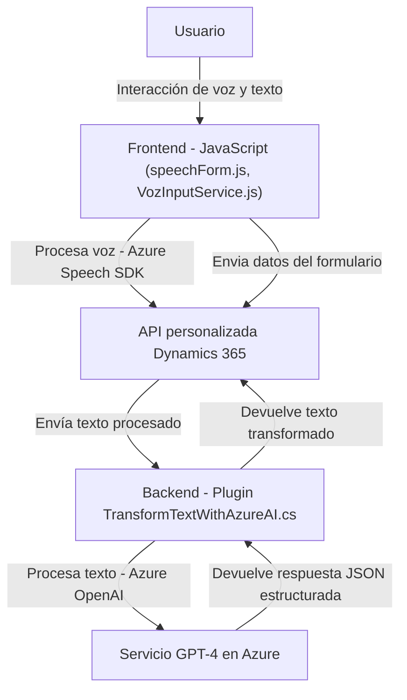

### Breve resumen técnico:
Este repositorio es un proyecto combinado que integra múltiples tecnologías para habilitar la interacción entre voz, texto y formularios en **Microsoft Dynamics 365**, utilizando **Azure Speech SDK** y **Azure OpenAI**. Sus componentes incluyen un frontend basado en JavaScript para la recogida y procesamiento de voz y un backend en C# que actúa como un plugin para transformar texto con inteligencia artificial.

---

### Descripción de arquitectura:
El sistema tiene una arquitectura modular con las siguientes características principales:
1. **Frontend**: Manejo de voz y texto a nivel del cliente, con integración de SDKs externos como **Azure Speech SDK**.
2. **Backend/plugin**: Extensión para Dynamics 365 que transforma texto usando **Azure OpenAI** mediante solicitudes HTTP.
3. **Patrones usados**:
   - Modularización: Separación de responsabilidades mediante funciones específicas en el frontend.
   - Integración de servicios externos: Uso del SDK de Azure Speech para voz y el servicio GPT-4 desde OpenAI para inteligencia artificial en el backend.
   - Plugin Architecture: Cumple con el patrón de extensibilidad de Dynamics 365, lo que permite la ejecución en eventos de la plataforma.

---

### Tecnologías usadas:
1. **Frontend**:
   - **JavaScript** como lenguaje principal.
   - **Azure Speech SDK** para la conversión de texto a voz y viceversa.
   - Dependencia directa de APIs de Dynamics 365 para la interacción con formularios y datos.
   
2. **Backend/plugin**:
   - **C#** como lenguaje principal.
   - **Microsoft Dynamics 365 SDK** para la integración con CRM.
   - **Azure OpenAI (GPT-4)** para procesamiento de texto avanzado.
   - **System.Net.Http** para solicitudes HTTP.
   - **Newtonsoft.Json** y **System.Text.Json** para manejo de datos JSON.

---

### Diagrama Mermaid válido para GitHub:

---

### Conclusión final:
Este repositorio combina una solución **multicapa** que integra directamente **frontend** basado en JavaScript y un **backend/plugin** extendiendo la API de Dynamics 365. Su enfoque modular y desacoplado facilita la integración de funcionalidades, como el manejo de voz y texto mediante el **Azure Speech SDK** y el procesamiento avanzado con **Azure OpenAI**. La arquitectura es ideal para entornos empresariales que requieren interacción avanzada con el usuario (voz y texto) y aprovechamiento de la inteligencia artificial.