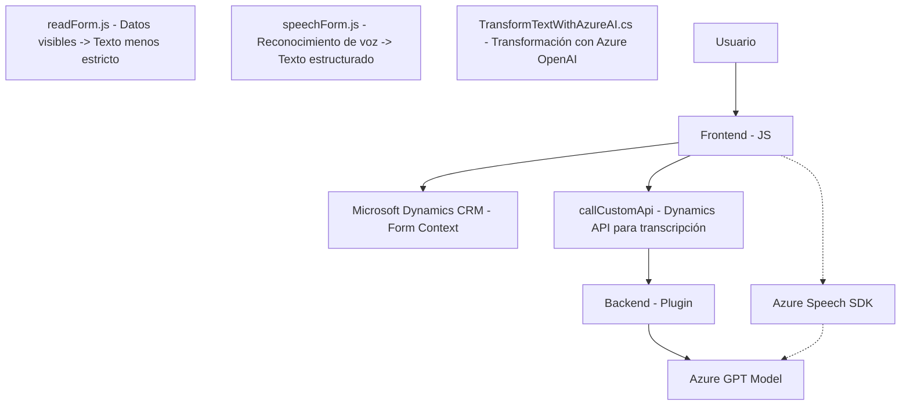

# Análisis y explicación técnica

## Breve resumen técnico
El repositorio parece implementar una solución híbrida que integra un frontend con capacidades avanzadas de reconocimiento y síntesis de voz y un backend en Microsoft Dynamics CRM mediante plugins y servicios de Azure. Su funcionalidad principal gira en torno al procesamiento de datos a partir de formularios interactivos con soporte de voz, utilizando Azure Speech SDK y Azure OpenAI.

---

## Descripción de arquitectura
La arquitectura es modular y se encuentra dividida en las siguientes capas principales:
1. **Frontend JavaScript (readForm.js, speechForm.js)**
   - Ofrece interacción con el usuario a través de interfaces basadas en formulario (Microsoft Dynamics).
   - Implementa lógica de negocio local y consume recursos de Azure Speech SDK.
   - Integración directa con APIs de Microsoft Dynamics y Azure AI mediante llamadas HTTP.
2. **Backend CRM Plugin (TransformTextWithAzureAI.cs)**
   - Implementa lógica del lado del servidor en Dynamics CRM como un **plugin**.
   - Extiende la funcionalidad de CRM con transformación de texto a través de Azure OpenAI (con los modelos GPT).

La arquitectura sigue un enfoque **n-capas** y combina prácticas de integración modular entre el frontend y el plugin (backend). Se pueden ver principios del diseño **hexagonal** en el uso de APIs externas para extender las capacidades del sistema.

---

## Tecnologías, frameworks y patrones usados
### Tecnologías:
1. **Frontend:**
   - JavaScript (DOM, ES6+).
   - Azure Speech SDK.
   - Integración con Microsoft Dynamics CRM.

2. **Backend:**
   - Microsoft Dynamics CRM SDK.
   - .NET Framework/C#.
   - Azure OpenAI Service.
   - JSON manipulaciones (`Newtonsoft.Json.Linq`, `System.Text.Json`).

### Patrones de diseño:
1. **Modularización funcional:** Funciones bien específicas con separación de responsabilidades.
2. **Carga dinámica:** El SDK de Azure Speech se carga condicionalmente en el frontend.
3. **Proximidad a MVC:** Aunque no sigue estrictamente la separación MVC, cada parte del código hace referencia a una capa con responsabilidades específicas.
4. **Desacoplamiento mediante dependencias externas:** El uso de servicios como Azure Speech y OpenAI externaliza la lógica respecto al sistema principal.
5. **API Integration:** Uso de HTTP Client desde plugins y métodos JavaScript para interactuar con servicios externos.

---

## Dependencias y componentes externos

1. **Externos:**
   - Azure Speech SDK (reconocimiento de habla y síntesis de voz).
   - Azure OpenAI Service (GPT, usado para transformar datos).
   - Microsoft Dynamics CRM (modelo de datos y contexto de ejecución del plugin).
   - Microsoft APIs (form context, Xrm SDK).

2. **Internos:**
   - Plugins personalizados en Dynamics CRM (`TransformTextWithAzureAI.cs`).
   - API personalizada para integración de datos entre frontend y backend (`callCustomApi`).

---

## Generación de Diagrama Mermaid

---

## Conclusión final

Este proyecto es una solución híbrida diseñada alrededor de la plataforma Microsoft Dynamics CRM que extiende sus capacidades mediante la integración de Azure Speech SDK para síntesis y reconocimiento de voz, y Azure OpenAI Service para transformar texto. La separación modular entre frontend y backend sigue patrones de arquitectura n-capas con integración de APIs. Además, el uso de dependencias externas como Azure GPT lo hace una solución avanzada y adaptable para trabajar con datos altamente interactivos. El enfoque general es escalable, pero optimizaciones relacionadas con el manejo de configuraciones podrían fortalecer su sostenibilidad.