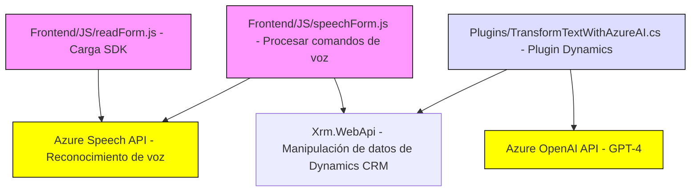

### Análisis técnico y descripción del repositorio

#### 1. **Tipo de solución**
El repositorio parece ser una solución híbrida que contiene tres componentes:
- **Frontend**: Archivos `readForm.js` y `speechForm.js` son parte de un frontend para la interacción con formularios y el reconocimiento de voz.
- **Plugin Backend para Dynamics CRM**: Archivo `Plugins/TransformTextWithAzureAI.cs` que representa un plugin integrado con Microsoft Dynamics CRM y la API Azure OpenAI.
- Esto indica que la solución está diseñada para operar como un módulo integrado que utiliza una **API externa** (Azure OpenAI API) y una interfaz orientada al usuario para mejorar la productividad y la accesibilidad de formularios.

---

#### 2. **Tecnologías, frameworks y patrones**
**Tecnologías**
- **Frontend**:
  - JavaScript usado en los dos archivos de la carpeta `FRONTEND`.
  - **Azure Speech SDK**: Usado para procesamiento de voz, síntesis, y reconocimiento de comandos de voz.
  - Web APIs (`Xrm.WebApi`): Utilizadas para manejar la interacción con Microsoft Dynamics.

- **Backend**
  - **C#**: Lenguaje utilizado para el desarrollo del plugin.
  - **Microsoft.Xrm.Sdk**: Usado para integrarse con Microsoft Dynamics CRM.
  - **Azure OpenAI API**: Para procesamiento inteligente de texto mediante IA (GPT-4).
  - `System.Net.Http` y `Newtonsoft.Json`: Para realizar solicitudes HTTP y manejar datos JSON.

**Patrones**
- **Modularización**: Separación clara de funcionalidades en funciones independientes.
- **Dynamic import**: El frontend carga dinámicamente el SDK solo cuando es necesario (`ensureSpeechSDKLoaded`).
- **Integración API externa**: Tanto en el frontend como en el backend, se utiliza Azure API para proporcionar tareas de reconocimiento de voz y procesamiento inteligente de texto.
- **Plugin-based Architecture**: Uso de plugins en Dynamics CRM que sobrescriben eventos del CRM mediante la implementación de la interfaz `IPlugin`.
- **Service-Oriented Architecture (SoA)**: La solución interactúa con servicios externos (Azure Speech y Azure OpenAI) para tareas específicas de procesamiento.

---

#### 3. **Tipo de arquitectura**
La arquitectura se puede clasificar como **n-capas con integración a servicios externos**, donde se identifican tres capas principales:
1. **Frontend**: Procesamiento y comunicación con los servicios de voz y formularios.
2. **Plugin Backend**: Procesamiento en Dynamics CRM y comunicación con Azure OpenAI.
3. **Servicios Externos de Azure**: Proveen APIs para reconocimiento de voz y transformación inteligente de texto.

---

#### 4. **Dependencias y componentes externos**
Los componentes y dependencias externas identificadas incluyen:
- **Microsoft.Xrm.Sdk**: Integración base con Dynamics CRM para manejar los eventos y manipular datos.
- **Azure Speech SDK**: Provee la funcionalidad para reconocimiento y síntesis de voz.
- **Azure OpenAI API**: Utiliza el modelo GPT-4 para procesamiento avanzado de texto.
- **Xrm.WebApi**: Comunicación con el módulo back-end de Dynamics CRM desde el frontend.
- **Newtonsoft.Json y System.Text.Json**: Para el manejo de datos en formato JSON.
- **System.Net.Http**: Para la comunicación HTTP basada en solicitudes REST a la APIs externas.
- **Azure Key Vault (potencialmente recomendado)**: Para una gestión segura de claves API.

---

#### 5. **Diagrama Mermaid**
El siguiente diagrama de flujo muestra cómo interactúan las capas de la solución y los componentes externos:

---

#### Conclusión final
Este repositorio define una solución basada en **tecnología Microsoft** que integra la gestión y actualización dinámica de formularios en la plataforma **Dynamics CRM**, aprovechando reconocimiento de voz (con el SDK de Azure Speech) y capacidades de procesamiento por inteligencia artificial (Azure OpenAI). La estructura modular y la integración con servicios externos otorgan flexibilidad, escalabilidad y potencian la generación de interfaces accesibles para usuarios finales. Sin embargo, el diseño podría beneficiarse de prácticas adicionales para la gestión segura de credenciales y una mayor centralización de la lógica para extensibilidad.