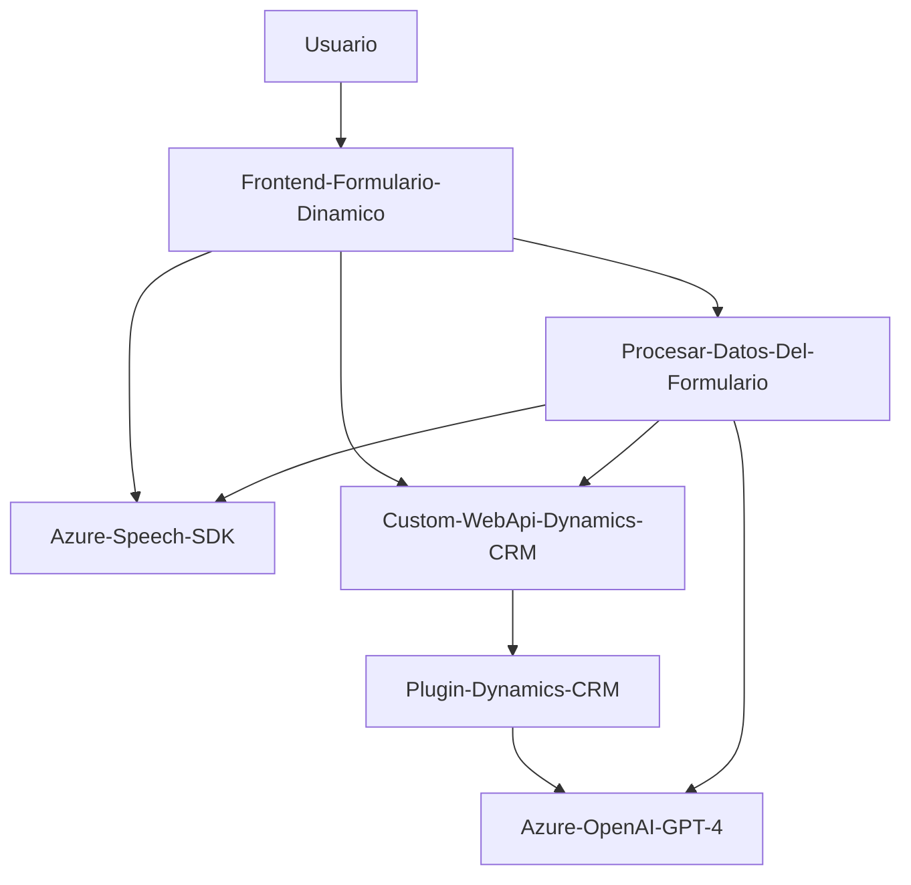

### Breve resumen técnico:
Los archivos analizados corresponden a una solución integrada que implementa funcionalidades avanzadas relacionadas con el reconocimiento de voz, procesamiento de texto y manipulación dinámica de datos en formularios. La arquitectura integra el uso de tecnologías cloud (Azure Speech y Azure OpenAI) junto con Dynamics CRM. Organiza la lógica en módulos frontend, servicios/SDK externos y plugins para personalizar una plataforma CRM.

---

### Descripción de arquitectura:
La solución tiene una arquitectura **multicapa orientada a servicios (SOA)**:
1. **Capa frontend:** Implementada principalmente mediante archivos JavaScript, que proporcionan interfaces y lógica cliente para la interacción con el sistema, entrada de voz y manipulación de formularios.
2. **Servicios externos:** Uso de **Azure Speech SDK** para la síntesis y reconocimiento de voz; y **Azure OpenAI** para el procesamiento semántico del texto.
3. **Plugin server-side:** Desarrollo de una clase de integración en Dynamics CRM mediante un módulo que ejecuta lógica avanzada y coordina peticiones al servicio de Azure OpenAI.

El diseño muestra integración de SDKs en frontend y dependencias hacia servicios en la nube, con una fuerte conexión a la interfaz Dynamics CRM. Además, utiliza programación basada en eventos (callbacks) y modularización en el frontend, diferenciando componentes y responsabilidades.

---

### Tecnologías usadas:
1. **Frontend:**
   - **JavaScript y ECMAScript:** Para implementar lógica y procesamiento del formulario.
   - **Azure Speech SDK:** Para la síntesis y reconocimiento de voz.
   - **Dynamics CRM Web API (`Xrm.WebApi`)**: Para llamadas relacionadas con entidades y sincronización con formularios.

2. **Backend (Plugin):**
   - **C# (.NET Framework):** Desarrollo del plugin asociado.
   - **Dynamics CRM SDK:** Para la ejecución y manipulación de datos.
   - **Azure OpenAI API:** Para el procesamiento avanzado de texto (GPT-4).
   - **Newtonsoft.Json:** Manejo de procesamiento para estructuras JSON.

3. **Otros patrones relevantes:**
   - Programación orientada a eventos (JavaScript).
   - Modularización: Separación clara de funciones por ámbito en frontend y backend.
   - SOA: Integración de API externas con lógica interna.

---

### Dependencias o componentes externos:
1. **SDK y APIs de terceros:**
   - **Azure Speech SDK:** Reconocimiento y síntesis de voz.
   - **Azure OpenAI API:** Procesamiento de texto con GPT-4.
   - **Dynamics CRM Web API (`Xrm.WebApi`).**

2. **Librerías backend:**
   - **Newtonsoft.Json (Json.NET):** Para la manipulación de datos JSON en C#.
   - **HttpClient:** Para solicitudes HTTPS al servicio de Azure OpenAI.

3. **Claves y configuraciones externas:**
   - Claves API para Azure (Azure Speech y OpenAI).
   - Configuración de región.

---

### Diagrama Mermaid válido para GitHub:

---

### Conclusión final:
La arquitectura del proyecto es una integración de frontend, servicios en la nube y un plugin en el backend para trabajar en un entorno Dynamics CRM. El sistema permite capturar datos dinámicos de un formulario mediante la entrada de voz y transforma texto con soporte de modelos GPT-4 de Azure OpenAI.

Los puntos fuertes incluyen:
1. Modularización en el frontend.
2. Uso de servicios cloud para tareas computacionalmente costosas.
3. Aprovechamiento de SDKs y librerías adecuadas para el caso.

Sin embargo, el sistema depende de configuraciones externas (claves de API), lo que debe ser manejado con cuidado para evitar riesgos de seguridad o errores por pérdida de conexión. Una buena práctica sería encapsular estas configuraciones en recursos seguros o variables de entorno.