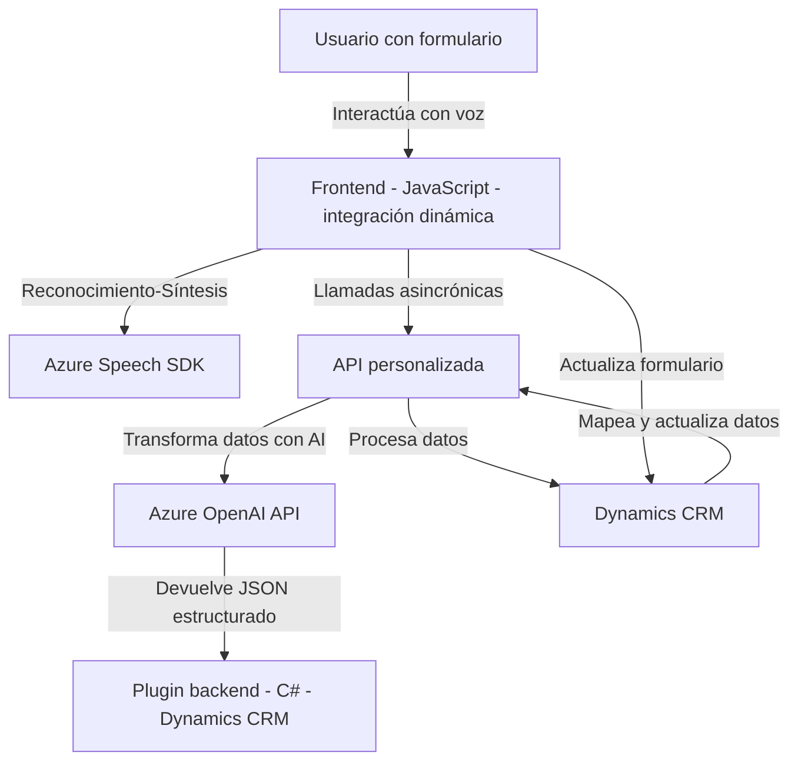

### Breve resumen técnico:
Este repositorio está diseñado para una solución que integra funcionalidades de reconocimiento de voz, síntesis de voz y manejo avanzado de datos a través de servicios en la nube como Azure Speech SDK y Azure OpenAI. La solución proporciona dos sistemas principales: un frontend basado en JavaScript que interactúa con formularios y un backend en .NET para procesamiento avanzado con integración directa a Dynamics CRM.

---

### Descripción de arquitectura:

1. **Tipo de solución:**  
   - Este repositorio corresponde a una solución híbrida que incluye:  
     - **Frontend:** Con JavaScript, enfocado en la comunicación entre el usuario y los formularios de Dynamics 365 usando reconocimiento y síntesis de voz.  
     - **Backend plugin:** Implementado en C#, utilizado para transformar texto ingresado y expandir capacidades usando inteligencia artificial (Azure OpenAI).  

2. **Tipo de arquitectura:**  
   - **Frontend:** Arquitectura modular, orientada al cliente y con capacidades de integración directa por funciones específicas (n-capas).
   - **Backend:** Plugin que sigue la **arquitectura de microservicio en Dynamics CRM**, con comunicación basada en servicios REST y dependencias externas gestionadas vía HTTP.

---

### Tecnologías y patrones usados:
1. **Frontend:**
   - Lenguaje: JavaScript.
   - SDK externo: **Azure Speech SDK**.
   - Frameworks y tecnologías relacionadas:  
     - Dinámicas del SDK de Dynamics 365 (presumibles en funciones como `formContext`, `controls.get()` y `Xrm.WebApi`).

   - Patrones observados:  
     - **Callback/event driven programming:** Las funciones se ejecutan en respuesta a eventos y con lógica de carga asíncrona de dependencias externas.  
     - **Modularización:** Funciones específicas que permiten dividir las responsabilidades de entrada y salida por voz.  
     - **Servicio externo:** Uso de Azure Speech SDK para síntesis y procesamiento de texto y voz.  
     - **Dynamic script loading:** Carga de dependencias como Azure Speech SDK según la demanda.

2. **Backend (.NET plugin):**
   - Lenguaje: C#.
   - Framework/Middleware:  
     - Dynamics SDK: Para modelado de plug-ins utilizando `IPluginExecutionContext`.  
     - OpenAI API a través de Azure: Para procesamiento del texto con GPT.  
   
   - Bibliotecas auxiliares utilizadas:  
     - `System.Net.Http`, `System.Text.Json`, `Newtonsoft.Json.Linq` para gestión del modelo JSON.  

   - Patrones observados:  
     - **Plugin-based Architecture:** Uso de la interfaz `IPlugin` como fundamento del modelo de extensibilidad de Dynamics 365.
     - **Factory Pattern:** Implementación del servicio (`IOrganizationServiceFactory`) según el contexto y el usuario ejecutor.  
     - **Service-Oriented Architecture:** Interacción con servicios REST basados en Azure. 

---

### Dependencias o componentes externos:
1. **Azure Speech SDK:**  
   - Utilizado para síntesis de voz (frontend) y reconocimiento de voz en entornos de formulación (JavaScript).
   
2. **Azure OpenAI API:**  
   - Servicio para transformación de datos (uso exclusivo en el backend a través de HTTP hacia un modelo GPT-4o).  
   - Características API: Requiere clave y configuración de endpoint.

3. **Dynamics CRM SDK:**  
   - Utilizado en ambos sistemas para interactuar con formularios y entidades tanto desde el frontend (`formContext`, `controls`) como desde el backend (IPlugin).  

4. **Librerías auxiliares:**  
   - **Frontend:** Ninguna destacable más allá del DOM API.  
   - **Backend:** JSON serializers/deserializers y manejo de peticiones HTTP (`System.Net.Http`, `Newtonsoft.Json.Linq`).  

---

### Diagrama Mermaid válido para GitHub Markdown:

---

### Conclusión final:
Este repositorio define una solución híbrida que combina capacidades avanzadas de síntesis y reconocimiento de voz en el frontend con procesamiento basado en inteligencia artificial en el backend. Mediante el uso de servicios externos (Azure Speech SDK, Azure OpenAI) y comunicación directa con Dynamics CRM, establece una arquitectura robusta con modularización y patrones de diseño coherentes. Sin embargo, para un mayor escalamiento, sería recomendable considerar una arquitectura más distribuida, como microservicios, para manejar mejor las interacciones con los diversos servicios y la escalabilidad.