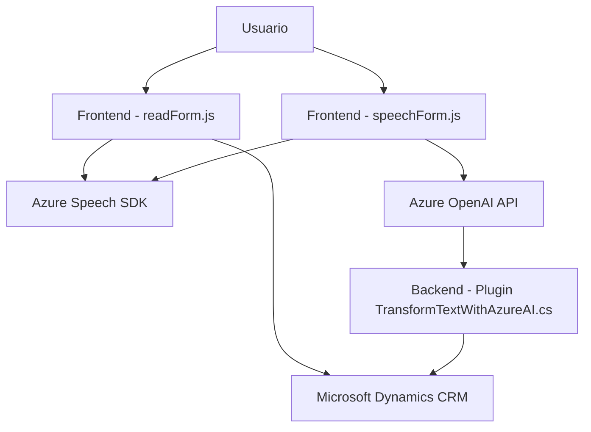

### Breve resumen técnico
Los archivos analizados son parte de un sistema que combina interacción por voz con procesamiento de datos desde formularios en el contexto de Microsoft Dynamics CRM. Se emplean servicios y API externas (Azure Speech y OpenAI) para síntesis de voz y transformación textual, manteniendo una arquitectura modular y altamente enfocada en integración.

### Descripción de arquitectura
La solución tiene una arquitectura orientada a capas, donde cada archivo cumple una función específica en el flujo de datos:
1. **Frontend**: Implementa funciones para interactuar con el usuario mediante formularios y voz (lectura dinámica y reconocimiento mediante Azure Speech SDK).
2. **Backend (Plugins)**: Extiende el entorno CRM con lógica específica (usando Dynamics CRM SDK y Azure OpenAI API).

Se utiliza el patrón **Cliente-Servidor**, pero con módulos desacoplados para tareas distribuidas. También se aprovechan patrones como **Event-driven** y adaptadores para integración con servicios de Azure.

### Tecnologías usadas
1. **Frontend**:
   - **JavaScript**: Funciones para interactuar con Azure Speech SDK y manipulación dinámica del DOM/formularios CRM.
   - **Azure Speech SDK**: Tecnología para síntesis y reconocimiento de voz.
2. **Backend**:
   - **Dynamics CRM SDK (IPlugin)**: Framework para extender funciones del CRM.
   - **Azure OpenAI API**: Procesamiento inteligente de texto usando IA.
   - **C# (.NET)**: Backend del plugin para comunicación y transformación textual.
3. **APIs del navegador**:
   - Manipulación de Microphone API y DOM para captura y lectura en formularios CRM.

### Diagrama Mermaid

### Conclusión final
El sistema implementa integración avanzada entre el frontend para interacción por voz y un backend que usa IA para transformar texto en datos estructurados. La arquitectura modular y orientada a capas con servicios externos como Azure Speech y OpenAI proporciona una solución eficiente para entornos CRM.