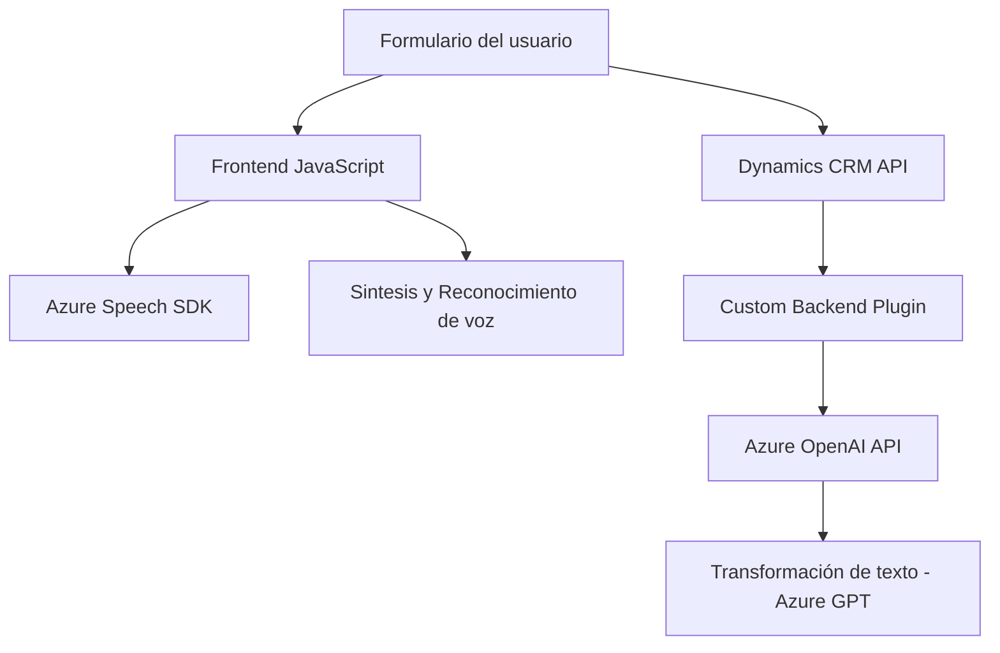

### Breve Resumen Técnico
El repositorio contiene un conjunto de archivos que integran funcionalidades de síntesis y reconocimiento de voz en el contexto de formularios de Dynamics CRM. Utiliza servicios externos como Azure Speech SDK y Azure OpenAI, junto con APIs personalizadas de CRM, para procesamiento automatizado mediante comando de voz y transformación de texto.

---

### Descripción de Arquitectura
La solución combina tres componentes principales:
1. **Frontend JavaScript**: Proporciona funcionalidades de cliente ligero para manipulación de formularios en el navegador, integrando APIs de voz.
2. **Backend Plugins (Custom API)**: Extensiones de Dynamics CRM que delegan lógica de transformación a servicios de GPT de Azure.
3. **Integración con servicios externos**: Dependencia directa de servicios Azure Speech SDK y OpenAI para voz y procesamiento de texto.  

La arquitectura evidentemente se basa en **n capas** porque separa claramente las responsabilidades entre la capa cliente (frontend), servicios API del backend (custom plugins y servicios), y dependencias externas (Azure).

---

### Tecnologías Usadas
1. **Frontend**:
   - JavaScript (Vanilla).
   - Azure Speech SDK.
2. **Backend / Plugins**:
   - C# para extensiones de Dynamics CRM.
   - Azure OpenAI API (GPT-4).
   - Newtonsoft.Json para manejo de JSON.
3. **Plataforma**:
   - Dynamics CRM (Microsoft).
   - .NET Framework (para plugins).

**Patrones de diseño**:
- **Plugin Pattern** (backend plugin en Dynamics).
- **Cargador dinámico** (dinámica de carga del SDK en el cliente).
- **SOA (Service-Oriented Architecture)**: Delegación a servicios externos para lógica avanzada.

---

### Diagrama Mermaid

---

### Conclusión Final
La solución integra una experiencia de usuario rica en formularios interactivos de Dynamics CRM mediante comandos de voz, procesando los datos en tiempo real gracias a tecnologías punteras como Azure Speech SDK y OpenAI GPT. La arquitectura es modular y extensible, destacando por la separación de capas y la externalización de servicios clave.