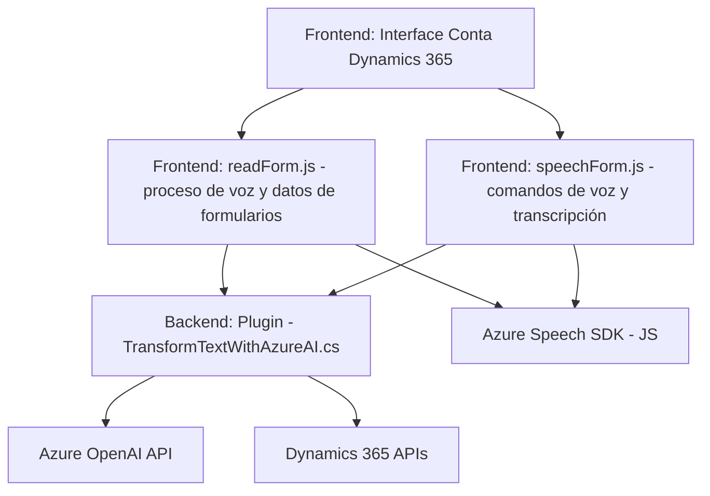

### Resumen técnico
El repositorio expuesto contiene tres piezas principales: dos archivos `.js` que forman parte de un frontend para formularios dinámicos en **Dynamics 365**, cuyo enfoque está en el manejo de voz y texto, y un archivo `.cs` que define un **plugin personalizado** de Dynamics 365. Estos archivos muestran un sistema de automatización para formularios mediante el reconocimiento de voz, síntesis de texto y un servicio de AI para transformación de texto.

---

### Descripción de arquitectura
La solución sigue una arquitectura híbrida con los siguientes componentes principales:
1. **Frontend basado en eventos**:
   - Los archivos `readForm.js` y `speechForm.js` actúan como una capa cliente orientada a capturar, procesar y enviar datos de entrada de voz a formularios de Dynamics 365. Utiliza el **Azure Speech SDK** para reconocimiento de voz y síntesis de texto.
   - Implica una arquitectura ligera de integración cliente-servidor con comunicación asincrónica basada en promises (como en `callCustomApi`).

2. **API externa y servicios en la nube**:
   - El servidor se apoya en **Microsoft Azure Speech SDK** y **Azure OpenAI API** para las funciones de IA.

3. **Plugin extendido del CRM Dynamics 365**:
   - El archivo C# implementa un plugin que interactúa directamente con el backend de Dynamics 365. Este plugin envía textos recibidos al servicio Azure OpenAI y reestructura los datos en JSON.

Aunque podría parecer más cercano a una arquitectura de microservicios dadas las integraciones, debido al diseño centralizado sobre Dynamics 365 y el uso de un plugin específico, la arquitectura se identifica como **monolítica extendida**.

---

### Tecnologías usadas
#### **Frontend**:
1. **JavaScript** (ES6+).
2. **Microsoft Azure Speech SDK (JavaScript Browser SDK)**.
3. **Promise-based Asynchronous Programming** (`async/await`).
4. **HTML DOM Manipulation**.
5. **Dynamics 365 Custom Plugins**:
   - Obtención y manipulación de un contexto de formulario basado en Dynamics.

#### **Backend/Plugin**:
1. **.NET Framework y C#**:
   - Uso de API de Dynamics 365.
2. **System.Net.Http**:
   - Comunicación con servicios externos.
3. **Azure OpenAI API**:
   - Inteligencia artificial para transformación de texto.
4. **Microsoft.Xrm.Sdk**:
   - Interacción con contextos y servicios del CRM.
5. **Newtonsoft.Json y System.Text.Json**:
   - Parsing y serialización de datos JSON.

#### **Patrones de diseño**:
1. **Event-driven**: Callbacks y asincronía para flujo de grabación y síntesis.
2. **Builder Pattern**: Creación de objetos SpeechConfig y AudioConfig.
3. **Factory Pattern**: Uso de `IOrganizationServiceFactory` para instanciar servicios.
4. **Service-oriented architecture (SOA)**: Integración con APIs y SDKs externos.
5. **Delegación**: Funciones que encapsulan acciones específicas, promoviendo modularidad.

---

### Diagrama **Mermaid**
El diagrama muestra la relación entre los componentes de frontend, backend, y las dependencias externas.

---

### Conclusión
Este repositorio muestra una solución cuidadosamente estructurada para habilitar automatización por voz en el ambiente de **Dynamics 365**, utilizando Microsoft Azure Services y arquitecturas orientadas a eventos y servicios. Aunque es altamente modular y extensible, la solución se clasifica como una **arquitectura monolítica extendida**, dado que todo depende del sistema centralizado de Dynamics 365 como núcleo único. La integración de tecnologías modernas como **Azure Speech SDK** y **OpenAI API** destaca una adopción vanguardista de herramientas de inteligencia artificial.