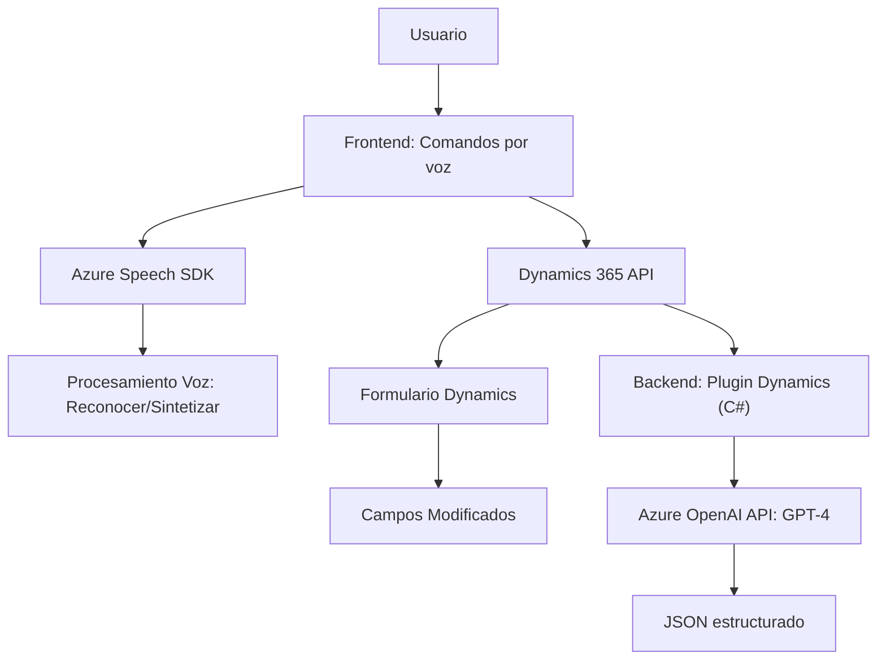

### Análisis Técnico

#### **Breve Resumen Técnico:**
Este repositorio contiene scripts de **frontend** para interactuar con formularios en Dynamics 365 utilizando el SDK de Azure Speech (para reconocimiento y síntesis de voz) y un plugin backend de Dynamics que integra servicios de IA de Azure OpenAI (GPT-4), estructurando texto y datos en formatos específicos. Está diseñado para facilitar la interacción por voz y la interpretación de texto dinámico con características avanzadas para entornos empresariales.

---

### **1. ¿Qué tipo de solución es?**
Es una solución híbrida que combina:
- **Frontend**: Scripts JavaScript que interactúan con formularios en Dynamics 365, llevando a cabo entrada y salida de datos por voz.
- **Backend Plugin**: Código en C# que extiende la funcionalidad del CRM mediante procesamiento de datos con Azure OpenAI.

### **2. Tecnologías, Frameworks y Patrones:**
#### **Tecnologías utilizadas:**
1. **Frontend**:
   - **Azure Speech SDK**: Reconocimiento y síntesis de voz.
   - **Dynamics 365 Web API**: Para operaciones como búsqueda y actualización de formularios.
   - **JavaScript**: Base principal de la lógica.
2. **Backend**:
   - **Azure OpenAI Service (GPT-4)**: Procesamiento avanzado de texto.
   - **Microsoft Dynamics SDK (`Microsoft.Xrm.Sdk`)**: Interacción con objetos de Dynamics CRM.
   - **Newtonsoft.Json** y **System.Text.Json**: Para parseo y estructuración de JSON.
   - **HTTP Clients**: Para solicitudes a servicios RESTful externos.

#### **Patrones identificados:**
1. **Lazy Loading** (en frontend): SDK de Azure Speech se carga dinámicamente solo cuando es necesario.
2. **Delegación** (en funciones de frontend): Cada función tiene una responsabilidad específica y delega subtareas.
3. **Plugin Pattern** (en backend): Plugin se ajusta a las reglas estándar de extensibilidad de Dynamics CRM.
4. **Microservicio**: Comunicación entre el backend y los servicios de Azure.
5. **Separación de Concerns**: Backend y frontend tienen roles definidos (procesamiento local, comunicación externa).

---

### **3. ¿Qué tipo de arquitectura tiene?**
La arquitectura combina:
- **Frontend con servicios distribuidos**: Scripts basados en eventos y acceso a SDKs en el navegador.
- **Backend como Plugin**: Extensible mediante el estándar de Dynamics CRM.
- **Microservicios**:
   - Azure Speech SDK (procesamiento en tiempo real de datos de voz).
   - Azure OpenAI (GPT-4 para procesamiento de texto).
- **N capas**: Dividido en frontend (presentación e interacción) y backend (procesamiento externo e integraciones), manteniendo una estructura modular.

---

### **4. Dependencias o Componentes Externos:**
1. **Frontend**:
   - Azure Speech SDK: Reconocimiento y síntesis de voz.
   - Dynamics CRM Web API (integración para formularios).
2. **Backend Plugin**:
   - Azure OpenAI (GPT-4): Para estructuración avanzada de texto.
   - Newtonsoft.Json y System.Text.Json: JSON parsing y manipulación.
   - Dynamics SDK (`Microsoft.Xrm.Sdk`) para extensibilidad del CRM.
3. **Infraestructura de Azure**: Claves API y servicios configurados con Azure lo que requiere gestión adecuada de acceso y seguridad.

---

### **5. Diagrama Mermaid**

---

### **Conclusión Final**
Este repositorio implementa una solución integral que conecta **Dynamics 365 CRM** con capacidades avanzadas de **reconocimiento y síntesis de voz** usando Azure Speech SDK en el frontend y procesamiento de texto estructurado mediante **GPT-4 de Azure OpenAI** en el backend. La arquitectura modular y distribuida asegura separación de responsabilidades, facilidad de extensión y escalabilidad mediante uso de servicios en la nube. Para entornos empresariales que requieren un alto nivel de automatización y accesibilidad (interacciones por voz e IA), esta solución cumple eficientemente con sus objetivos.