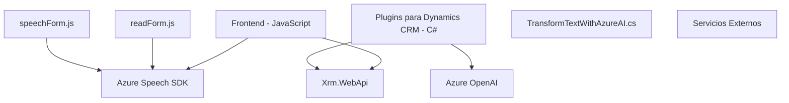

### Breve Resumen Técnico

El repositorio contiene módulos y archivos que integran funcionalidades interactivas y dinámicas para una solución empresarial basada en Microsoft Dynamics CRM. Se utiliza Azure Speech SDK para sintetizar voz, reconocer comandos hablados, y actualizar formularios, mientras que Azure OpenAI se emplea para transformar texto según reglas específicas.

---

### Descripción de Arquitectura

La arquitectura es modular y orientada a eventos, diseñada para integrar tecnologías externas (Azure Speech SDK y Azure OpenAI) con Microsoft Dynamics CRM. La estructura sigue una lógica de separación de responsabilidades, donde cada archivo define funcionalidades específicas (sintetizar voz, reconocimiento vocal, transformación de texto en JSON). Esto sugiere un esquema de arquitectura **n-capas**, donde:
1. **Frontend Javascript:** Permite la interacción y dinamismo en los formularios.
2. **Backend Plugins:** Integración personalizada con Dynamics CRM.
3. **Servicios externos:** Uso de APIs de Azure OpenAI y Azure Speech SDK para procesamiento avanzado.

---

### Tecnologías Usadas

1. **Azure Speech SDK:** Para síntesis y reconocimiento de voz, con funcionalidades de carga dinámica.
2. **Dynamics CRM SDK:** Herramientas internas (`Xrm.WebApi`) para interactuar con la capa de datos del CRM.
3. **Azure OpenAI Service:** Procesamiento de texto utilizando IA avanzada.
4. **Librerías para manejo de JSON:** `System.Text.Json` y `Newtonsoft.Json.Linq` para la manipulación de datos estructurados.
5. **Frontend - JS:** Funciones desarrolladas en Javascript para integrar la interacción entre el cliente y el servidor mediante Azure Speech SDK.

---

### Diagrama Mermaid

---

### Conclusión Final

El repositorio está diseñado para complementar Microsoft Dynamics CRM con funciones avanzadas de interacción de formularios y procesamiento de datos mediante IA y servicios externos como Azure Speech SDK y OpenAI. La implementación sigue patrones modernos como **n-capas**, con lógica modular y carga dinámica de dependencias. Esto permite una alta adaptabilidad y escalabilidad en escenarios empresariales interactivos.