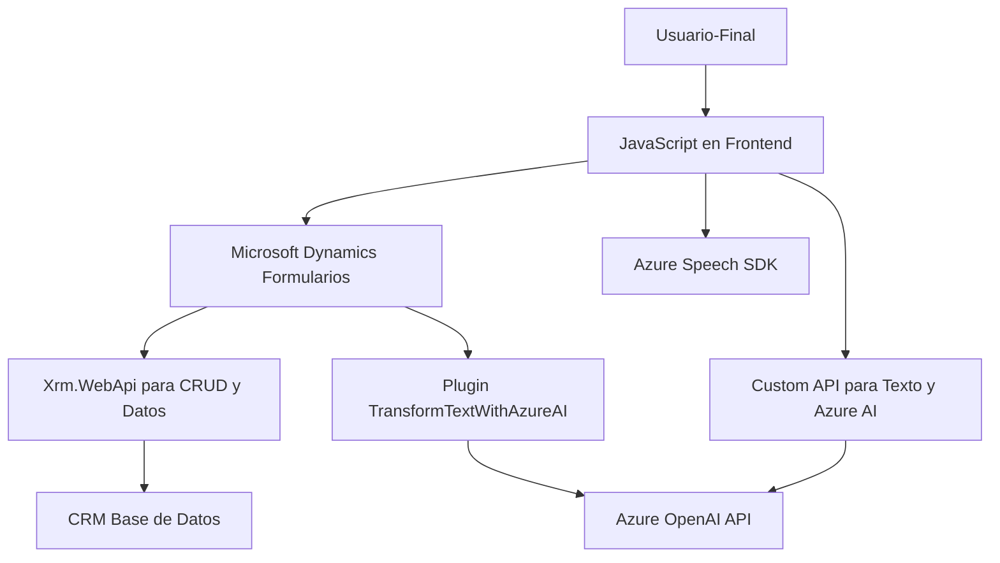

### Breve resumen técnico
El repositorio alberga una solución que combina frontend, backend y plugins para integrar capacidades de entrada/salida de voz, transcripción, síntesis de texto y procesamiento avanzado mediante Microsoft Azure AI en una plataforma centrada en Microsoft Dynamics CRM. Los archivos descritos incluyen lógica de interfaz de cliente (JavaScript) y un backend/plugin para interacción directa con servicios de Microsoft Azure OpenAI.

### Descripción de arquitectura
La solución sigue un **modelo de arquitectura de n capas**:
1. **Capa de presentación** en la que interactúan los usuarios mediante formularios y voz (JavaScript en frontend).
2. **Capa de integración** donde servicios externos (Azure Speech, Azure AI) procesan datos.
3. **Capa de lógica empresarial** implementada en Microsoft Dynamics (mediante plugins como `TransformTextWithAzureAI`).
4. **Capa de datos** que interactúa directamente con Dynamics CRM y APIs relacionadas.

Además de ser una arquitectura modular, se observa una implementación **dinámica centrada en cliente-servidor**, con una integración transparente entre el frontend y las capacidades del backend CRM.

### Tecnologías usadas
1. **Frontend (JavaScript)**:
   - Funcionalidades de manejo de formularios y entrada/salida de voz.
   - Integración con Azure Speech SDK.
   - Uso de métodos de la API de Dynamics (Xrm.WebApi).
   - Modularidad en funciones.

2. **Backend/Plugin**:
   - Desarrollo en C#, siguiendo patrones de diseño de Microsoft Dynamics CRM SDK (IPlugin).
   - Interacción con **Azure OpenAI** mediante `HttpClient`.
   - Parsing y generación de JSON estructurado utilizando `Newtonsoft.Json` y `System.Text.Json`.

3. **Servicios externos**:
   - **Azure Speech SDK:** Para síntesis y transcripción de voz. Utilizado en el frontend.
   - **Custom API:** Implementación adicional que usa servicios de Azure AI para transformar texto en formato JSON estructurado.

### Diagramas Mermaid para GitHub Markdown

### Conclusión final
El análisis del código y la arquitectura indica una solución eficiente, modular y dinámica que implementa capacidades de voz y texto usando Azure SDK (Speech y OpenAI) con Microsoft Dynamics CRM. Se observa una arquitectura de **n capas**, destacándose la capa de integración para servicios externos. El uso de patrones como modularidad, cliente-servidor y la arquitectura de plugins son clave para la solución, haciendo que sea extensible y adaptable a distintos entornos empresariales.