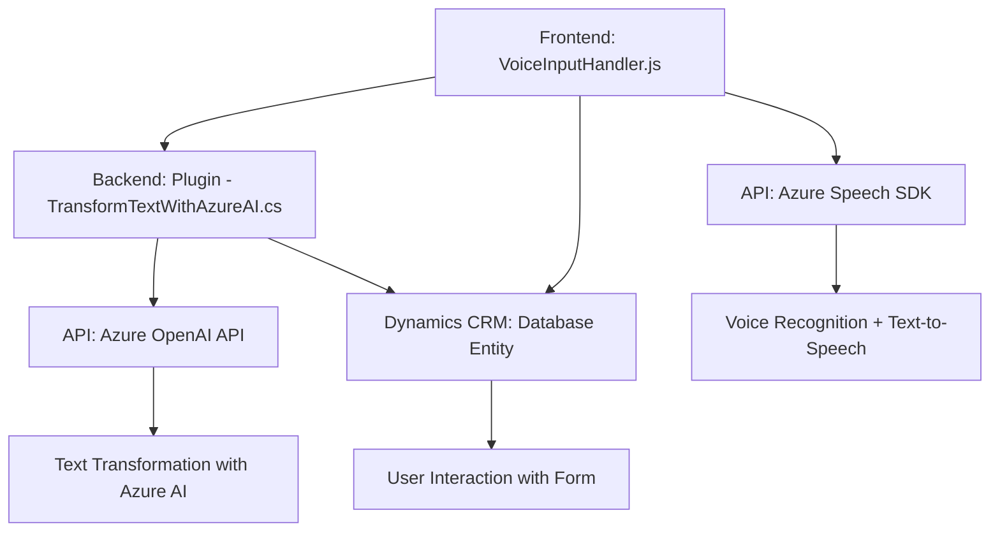

### Breve Resumen Técnico

Los archivos del repositorio están orientados a integraciones entre sistemas y manejo de datos mediante servicios externos. Específicamente, se trata de un conjunto de módulos para un entorno CRM (Dynamics 365), empleando el SDK de Azure Speech y la API de Azure OpenAI. Este sistema está enfocado en facilitar el reconocimiento de voz, la síntesis textual a audio, y el procesamiento dinámico de formularios.

---

### Descripción de la Arquitectura

La solución tiene una arquitectura **orientada a servicios**, con características de integración de sistemas externos:
1. **Frontend**:
   - Scripts **JavaScript** en módulos para manejar la síntesis y el reconocimiento de voz. Estos se integran dinámicamente con el SDK de Azure Speech y actualizan formularios en Dynamics 365.
   - Reconocimiento y síntesis se dividen en responsabilidades específicas (segregación de responsabilidades).
2. **Backend**:
   - Plugin en **C#**, diseñado como una extensión en Microsoft Dynamics CRM. La ejecución del plugin transforma texto aplicando reglas específicas mediante Azure OpenAI.
3. **Dependencias externas**:
   - Uso de SDKs y APIs externas como Azure Speech y OpenAI para procesamiento de voz y texto dinámico.

La arquitectura global podría considerarse una semidistribución orientada hacia un **patrón de integración API + CRM**.

---

### Tecnologías Usadas

#### Tecnologías y Frameworks:
1. **Frontend**:
   - **JavaScript**.
   - Azure Speech SDK (JavaScript library) para síntesis y reconocimiento de voz.
   - Integración con Dynamics 365.
2. **Backend**:
   - **C#** con el framework de extensibilidad de Microsoft Dynamics CRM.
   - HTTP Client para consumir APIs externas (Azure OpenAI).
3. **Dependencias Adicionales**:
   - Newtonsoft.JSON (.NET library) para manejar JSON.
   - Azure OpenAI API para transformación de texto.

#### Patrones de Diseño y Arquitectura
1. **Segregación de responsabilidades (SRP)**:
   - Cada función y clase tiene un propósito claro (leer datos, sintetizar voz, transformar texto).
2. **Eventos asíncronos**: El SDK asegura el control dinámico basado en eventos del navegador o del contexto de Dynamics.
3. **Integración de servicios externos**:
   - Uso de SDKs externos como dependencia principal de funcionalidad.
4. **Cliente-Servidor**:
   - Frontend maneja datos y operaciones simples, delegando la lógica avanzada al backend (plugin y Azure OpenAI).

---

### Diagrama Mermaid

---

### Conclusión Final

El repositorio forma parte de una solución **integrada** que conecta un CRM con sistemas de reconocimiento y síntesis de voz (Azure Speech SDK), así como con procesamiento avanzado de texto por medio de Azure OpenAI. Los archivos son modularizados para facilitar la actualización y escalabilidad. La arquitectura puede clasificarse como una **orientada a servicios**, con integraciones API externas y patrones bien definidos como SRP, validación condicional y manejo de eventos asincrónicos.