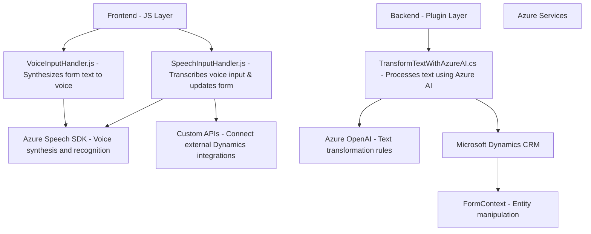

### Breve Resumen Técnico
El repositorio contiene componentes diseñados para trabajar con formularios en Dynamics CRM, integrándose con servicios externos como Azure Speech SDK y Azure OpenAI para proporcionar capacidades de síntesis de voz, transcripción y procesamiento de texto basado en IA.

---

### Descripción de arquitectura
La arquitectura general del proyecto parece estar orientada a **n capas** con integración de sistemas externos. Aquí se distribuyen responsabilidades de la siguiente manera:
1. **Frontend**: Componentes JavaScript responsables de la interacción con el usuario (entrada por voz, síntesis de voz). Existen múltiples funciones para manejar formularios, manipular datos y generar resultados interactivos.
2. **Backend / Plugins**: Componentes escritos en C# y diseñados como plugins para Dynamics CRM. Estos actúan como lógica de negocio para transformar los datos desde los formularios, integrando servicios como Azure OpenAI para transformar texto según esquemas específicos.
3. **Servicios Externos**: Uso extensivo de SDK como **Azure Speech SDK** y **Azure OpenAI** para funcionalidades avanzadas como síntesis de voz, transcripción y procesamiento de texto utilizando IA.

### Tecnologías utilizadas
1. **Frontend**:
   - JavaScript: Para la implementación de la lógica de interacción con formularios y la integración con Azure Speech SDK.
   - Azure Speech SDK (JavaScript): Sintetiza y transcribe voz utilizando servicios en la nube.  
   - Dynamics CRM: Integra y manipula datos en formularios dinámicos administrados mediante contenedores como `formContext`.
   
2. **Backend / Plugins**:
   - C#: Es utilizado para desarrollar plugins personalizados dentro del framework de Dynamics CRM.
   - Azure OpenAI APIs: Procesa texto y devuelve resultados personalizados siguiendo reglas definidas.
   - Libraries: `System.Text.Json` para la manipulación de JSON, `System.Net.Http` para peticiones HTTP al API de IA.

3. **Infraestructura**:
   - Microsoft Dynamics para la gestión de formularios y datos estructurados.
   - Azure Speech SDK: Para síntesis y transcripción de voz basada en texto.
   - Azure OpenAI: Para procesamiento avanzado de texto con IA.

---

### Diagrama Mermaid

---

### Conclusión final
El repositorio está diseñado para ser un puente entre formularios en Dynamics CRM y servicios avanzados de procesamiento de voz y texto de Azure. Utiliza una arquitectura de **n capas** con una clara división entre frontend para interacción del usuario, backend para lógica de negocio y APIs externas para capacidades extendidas. El uso de Azure Speech SDK y Azure OpenAI destaca como solución moderna, permitiendo la integración de funcionalidad avanzada sin sobrecargar el código local. Sin embargo, las múltiples dependencias externas (claves, regiones) podrían ser un reto para el despliegue en entornos diversos.