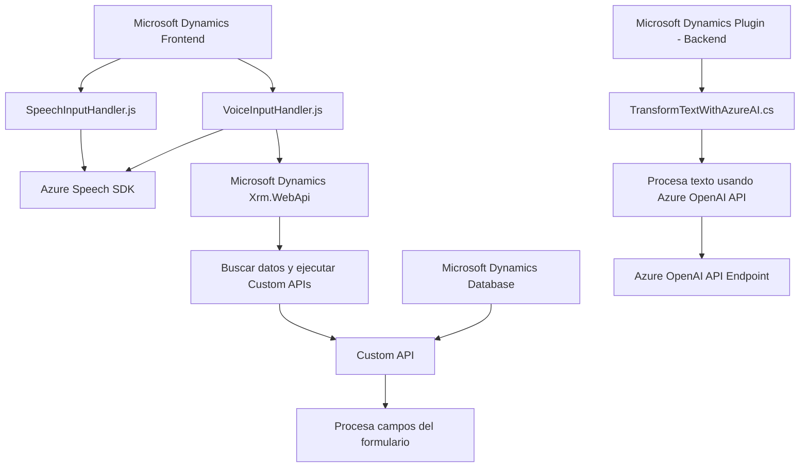

### Análisis técnico

#### **Breve resumen técnico**
El repositorio pertenece a una solución que implementa una **integración entre Microsoft Dynamics CRM y los servicios de Azure**. En particular, facilita la creación de funcionalidades de entrada y salida de voz usando el **Azure Speech SDK** y la síntesis de texto usando **Azure OpenAI API**. Está compuesto de tres módulos principales que corresponden a una solución de frontend en JavaScript y un backend basado en un plugin de Dynamics CRM desarrollado en .NET.

---

#### **Descripción de arquitectura**
La solución está diseñada como un ecosistema híbrido con los siguientes elementos clave:
1. **Frontend en JavaScript (SpeechInputHandler.js | VoiceInputHandler.js)**:
   - **Patrón de cohesión funcional**: Los archivos del frontend reorganizan funcionalidades asociadas al reconocimiento y síntesis de voz. Utilizan funciones modularizadas para dividir el proceso general en tareas como extracción de datos del formulario, conversión en texto, síntesis de voz y manejo del contexto de ejecución.
   - **Event-driven design (Callback)**: Utilizan eventos y callbacks para cargar dinámicamente servicios externos como Azure Speech SDK.

2. **Backend en .NET (Plugin - TransformTextWithAzureAI.cs)**:
   - **Plugin-Based Architecture**: Implementa un plugin específico orientado a Microsoft Dynamics CRM (interfaz IPlugin) para interceptar eventos y extender la funcionalidad del CRM.
   - **Integración con microservicios**: El backend utiliza servicios de Azure como Azure OpenAI para procesar texto de manera estructurada.

3. **Arquitectura general**:
   - Se puede interpretar como una arquitectura híbrida **n-capas**:
     - Capa Cliente (Frontend): JavaScript + Azure SDK manejando interacción de usuarios con formularios y voz.
     - Capa Servidor (Backend/Plugin): .NET integrando funcionalidades avanzadas mediante Azure API y ejecutándolas dentro del contexto CRM.
   - Monolito de Dynamics CRM con extensiones mediante plugin: Aunque aprovecha servicios externos como APIs de Azure, el plugin CRM mantiene una lógica centralizada. Esto refuerza la idea de un monolito extendido.

---

#### **Tecnologías usadas**
1. **Frontend (JavaScript)**:
   - Azure Speech SDK: Enfocado en la síntesis y el reconocimiento de voz desde formularios.
   - Event-driven y modular design: Uso de funcionalidad estructurada en funciones reutilizables y asincrónicas.
   
2. **Backend (.NET)**:
   - **Microsoft Dynamics CRM Plugin**:
     - Microsoft.Xrm.Sdk: Gestión de datos y contexto en Dynamics CRM.
     - Azure OpenAI API: Conversión de texto en formatos JSON utilizando IA.
     - Newtonsoft.Json y System.Text.Json: Para el manejo estructural de datos JSON.
     - System.Net.Http: Como medio de comunicación con APIs externas.

3. **Modelado general**:
   - Asincronía con uso intensivo de promesas y `async/await`.
   - Integración entre servicios (Azure Speech SDK y OpenAI) y plataformas empresariales (Microsoft Dynamics).

---

#### **Dependencias o componentes externos**
1. **Azure Speech SDK**: Proporciona capacidades de síntesis y reconocimiento de voz.
2. **Microsoft Dynamics CRM (Xrm.WebApi, IPlugin)**: Principales APIs de la plataforma CRM de Microsoft.
3. **Azure OpenAI API**: Convertir texto en JSON estructurado basado en IA.
4. **Bibliotecas para .NET**:
   - Newtonsoft.Json, System.Text.Json: Manejo de serialización/deserialización de datos JSON.
   - System.Net.Http: Realización de peticiones HTTP al API de Azure.

---

#### **Diagrama Mermaid**

---

### **Conclusión final**
Este repositorio corresponde a una solución empresarial basada en Microsoft Dynamics CRM con integración de los servicios de Azure (Speech SDK y OpenAI API). Está diseñado como un sistema híbrido que combina funcionalidades de frontend y backend para trabajar de forma integral con formularios y procesamiento de datos. Si bien la arquitectura es mayormente monolítica extendida, aprovecha principios modernos como asincronía, modularización, e integración con APIs externas que refuerzan la flexibilidad de la solución.