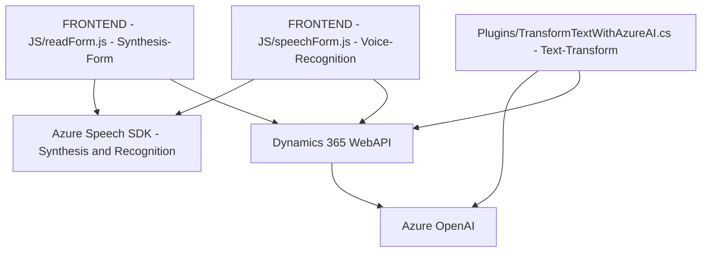

### Breve resumen técnico
El repositorio contiene tres componentes principales:
1. **Frontend/JS**: Implementaciones basadas en JavaScript con Azure SDK, diseñadas para interactuar con formularios en Dynamics 365 usando reconocimiento y síntesis de voz, junto con transformación avanzada basada en IA.
2. **Plugin**: Una solución en .NET que utiliza Azure OpenAI para procesar texto de manera compleja y devolver JSON estructurado, integrándose como un plugin en Dynamics CRM.

---

### Descripción de la arquitectura
La solución presenta una arquitectura **híbrida basada en servicios externos y extensiones locales**, combinando los siguientes niveles:
- **Frontend**: Implementaciones en JavaScript que actúan como cliente del SDK de Azure, interactuando directamente con Dynamics 365 (nivel de presentación).
- **Backend**: Plugins de Dynamics CRM en .NET, configurados para procesar operaciones avanzadas (nivel de lógica de negocio).
- **Servicio externo**: Integración con APIs de Azure (Speech y OpenAI) para las operaciones centrales de síntesis, transcripción y transformación de texto.

En términos de patrones, la solución utiliza:
- **Arquitectura de n capas**: Con separación de lógica en niveles (Frontend, API/presentación y Data/Service).
- **Design Pattern Plugin**: Para extender la funcionalidad de Dynamics CRM.
- **Integración con servicios cloud (Azure)**: Dependencia de servicios como el SDK de Speech y la API de OpenAI.

---

### Tecnologías utilizadas
1. **Frontend**:
   - **JavaScript**: Estructurado con funciones modulares.
   - **Azure Speech SDK**: Para todo lo relacionado con reconocimiento y síntesis de voz.
   - **Promises y Callbacks**: Para manejar asincronismo y ejecución secuencial.
   - **Dynamics 365 WebAPI**: Para interactuar con formularios y datos del CRM.
   
2. **Backend**:
   - **.NET Framework**: Generación de un plugin para Dynamics CRM.
   - **C#**: Lenguaje principal para la implementación del plugin.
   - **Azure OpenAI API**: Servicio para transformación avanzada de texto.
   - **JSON API**: Con manipulación de datos estructurados.

3. **Dependencias externas**:
   - **Azure Services**: SDK y API proporcionados por Microsoft Azure.
   - **Dynamics 365 CRM APIs**: Para todas las operaciones relacionadas con datos y formularios.
   - HTTP y Json/XML parsing con librerías .NET (`Newtonsoft.Json`).

---

### Diagrama Mermaid para GitHub

---

### Conclusión final
La solución tiene una arquitectura híbrida que combina interacción en el cliente con formulación dinámica a través de servicios de Azure Speech y procesamiento avanzado vía OpenAI. Está diseñada para maximizar la integración con Dynamics CRM mediante complementos de acciones en formularios y flujo de operaciones.

Aunque la implementación presenta características prometedoras y modernas, podría beneficiarse de mejoras en seguridad (auth token para servicios), y en modularidad (uso más controlado de configuraciones externas para facilitar escalabilidad).