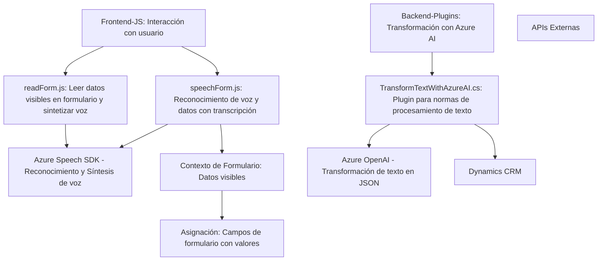

## Resumen Técnico del Repositorio
Este repositorio contiene funcionalidades relacionadas con el procesamiento de datos a través de voz y texto usando servicios externos como **Azure Speech SDK** y **Azure OpenAI**. La solución parece estar diseñada para integrarse con un sistema **CRM** como **Dynamics 365**, optimizando la interacción entre interfaces humanas (voz/texto) y los datos de la aplicación, mediante APIs y plugins. 

## Descripción de Arquitectura
La arquitectura se basa en un enfoque **n capas**, donde cada capa tiene responsabilidades específicas:
1. **Frontend/JS:** Interacción con el usuario (captura de datos de formularios, voz y texto). Usa librerías de JavaScript como el SDK de Azure Speech.
2. **Backend Plugins (C#):** Procesa datos usando Azure OpenAI, enviando resultados transformados a Dynamics CRM.
3. **Integración con APIs externas:** Los servicios de Azure se usan para síntesis/reconocimiento de voz y transformación de texto, operando como una capa externa.

Aunque la solución tiene componentes organizados de forma modular y utiliza servicios externos, no implementa una arquitectura distribuida de microservicios debido a la centralización y dependencia de Dynamics CRM.

## Tecnologías usadas
1. **Frontend (JavaScript):**
   - SDKs: Azure Speech SDK.
   - Frameworks posibles: No se menciona explícito, pero su uso podría variar según el cliente CRM (por ejemplo `Power Apps`).
   - APIs: Uso de `Xrm.WebApi.online.execute()` para comunicación con Dynamics CRM.

2. **Backend Plugins (C#):**
   - Dynamics CRM SDK.
   - Librerías de procesamiento de datos:
     - **Seralización:** `System.Text.Json`, `Newtonsoft.Json.Linq`.
     - **HTTP Client:** `System.Net.Http`.

3. **Servicios Externos:**
   - **Azure Speech SDK:** Reconocimiento y síntesis de voz.
   - **Azure OpenAI:** Generación de texto estructurado basado en GPT.

## Dependencias externas y componentes utilizados
1. **SDKs utilizados:**
   - Azure Speech SDK.
   - Dynamics CRM SDK.

2. **APIs externas:**
   - Azure Speech (`https://aka.ms/csspeech/jsbrowserpackageraw`).
   - Azure OpenAI API (modelo GPT para procesamiento de texto).

3. **Herramientas de comunicación:**
   - HTTP para consumir endpoints de Azure API.

## Diagrama Mermaid (estructurado según las reglas)

## Conclusión Final
Este repositorio implementa una solución diseñada para mejorar la experiencia de interacción de los usuarios dentro de un entorno **CRM** como Dynamics 365. Mediante el uso de **Azure Speech SDK** y **Azure OpenAI**, el sistema soporta funcionalidades de voz y procesamiento avanzado de texto. La arquitectura es **n capas**, con una clara separación entre frontend, backend plugins, APIs externas y el núcleo del sistema CRM. Esto demuestra un buen uso de tecnologías modernas orientadas a la interacción por voz y texto estándar en entornos empresariales.