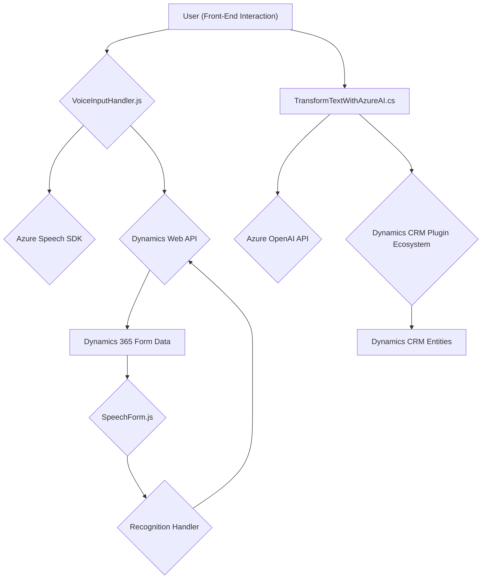

### Análisis Técnico y Arquitectónico

#### Breve Resumen Técnico
El repositorio contiene archivos enfocados en la integración y manipulación de tecnologías de Azure (Speech SDK y OpenAI API) dentro de aplicaciones de Dynamics 365 CRM. La solución incluye un **frontend JavaScript** y un **backend en C# para un plugin**, permitiendo procesar datos de formularios y realizar tareas de IA como síntesis de voz y transformación de texto.

---

### Descripción de Arquitectura
La arquitectura mezcla un **modelo de capas con integración de servicios externos**, donde cada componente tiene una responsabilidad específica:
1. **Frontend (archivo JavaScript)** utiliza servicios de Azure para síntesis de voz y reconocimiento de entrada de voz, integrándose con formularios de Dynamics.
2. **Backend (C# Plugin)** actúa como un servicio en Dynamics CRM para transformar textos con reglas predefinidas. Además, emplea APIs externas para obtener respuestas basadas en IA.

La implementación utiliza principios como **modularidad**, **promesas para asincronía**, **separación por capas** y **carga dinámica de SDKs**. Aunque los componentes son parte de un sistema acoplado al CRM, integran patrones que podrían facilitar su desacoplamiento en el futuro.

---

#### Tecnologías Utilizadas
1. **Frontend (JavaScript)**
   - `Azure Speech SDK`: Reconocimiento de voz y síntesis.
   - `Xrm.WebApi`: API de Dynamics para manipulación de datos.

2. **Backend (C# Plugin)**
   - `IPlugin` (Dynamics CRM SDK): Extensión personalizada de Dynamics.
   - `Azure OpenAI API`: Procesamiento de transformación de texto con IA.
   - `Newtonsoft.Json`, `System.Text.Json`: Manipulación de JSON.
   - `System.Net.Http`: Comunicación HTTP.

3. **Patrones de diseño**
   - **Modularidad**: Separación de funciones enfocadas en tareas específicas.
   - **Integración de servicios externos**: Acceso y uso condicional de SDKs y APIs externas.
   - **Capa de servicios externo**: Backend independiente que sigue el patrón de transformación y enriquecimiento de datos como servicio.

---

#### Dependencias o Componentes Externos
1. **Servicios de Azure**:
   - Azure Speech SDK para síntesis y reconocimiento de voz.
   - Azure OpenAI API para operaciones de procesamiento de texto con IA.
2. **Dynamics CRM**:
   - Objetos de formularios (`formContext.data.entity.attributes`).
   - Uso de clases y servicios como `Xrm.WebApi`.

---

### Diagrama **Mermaid** Compatible con GitHub Markdown

---

### Conclusión Final
La solución es un **client-server architecture** basada en los principios de **separación por capas**. Su principal objetivo es integrar funcionalidades orientadas a inteligencia artificial (AI) como síntesis de voz y procesamiento de texto generado por IA en aplicaciones de **Microsoft Dynamics CRM**. La modularidad y el uso de SDKs dinámicos ayudan a mantener la robustez del sistema, aunque su dependencia de servicios externos como Azure puede hacer que la solución sea menos portable fuera del ecosistema de Microsoft.