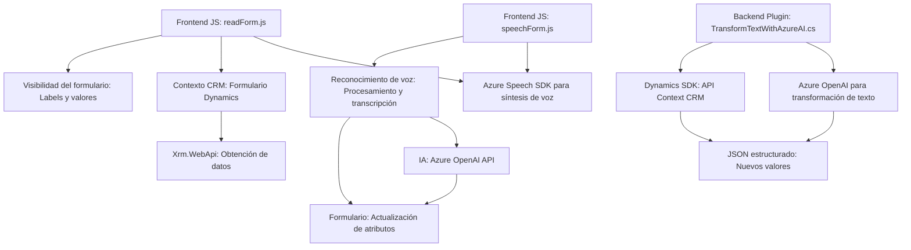

### Análisis técnico del repositorio

#### Breve resumen técnico:
Este repositorio contiene componentes enfocados en la integración y automatización de procesos en sistemas CRM (Dynamics 365) mediante funcionalidades de entrada basada en voz, detección y síntesis de datos, y transformación asistida por inteligencia artificial (Azure Speech SDK y OpenAI GPT-4). Los módulos parecen estar diseñados para complementar una solución híbrida CRM con extensiones específicas para captura, procesamiento y lectura/síntesis.

---

### Descripción de arquitectura:
La arquitectura se organiza en diferentes capas funcionales:

1. **Frontend scripts (JavaScript)**:
   - Ofrecen dinámicas de interacción con el CRM, como lectura de datos visibles del formulario y procesamiento de voz. Incorporan servicios externos, como Azure Speech SDK, para reconocimiento de voz y síntesis.
   - Modularidad: Los scripts están divididos por unidades funcionales independientes como reconocimiento de voz (`readForm.js`) y validación mediante IA (`speechForm.js`).

2. **Backend Dynamics Plugin (`TransformTextWithAzureAI.cs`)**:
   - Este componente actúa como un microservicio externo dentro del entorno CRM. Es un plugin diseñado para realizar la transformación de texto con Azure OpenAI y devolver resultados estructurados al cliente.

3. **Arquitectura general**:
   - **Multicapas**: Combina frontend interactivo, que funciona como controlador, con backend que encapsula solicitudes asíncronas hacia servicios externos (Dynamics API, Azure Speech SDK, OpenAI).
   - **Integración externa**: Se apoya extensivamente en servicios como Azure Speech SDK, Azure OpenAI y Dynamics 365 Online APIs para realizar funciones avanzadas.

---

### Tecnologías usadas:
1. **Frontend (JavaScript)**:
   - **Azure Speech SDK**: Integración para reconocimiento, síntesis y procesamiento de voz.
   - **Dynamics CRM JavaScript API (Xrm.WebApi)**: Interacción directa con formularios y entidades del CRM.
   - **Promesas / Async-Await**: Gestión de operaciones asíncronas, como llamadas a APIs remotas.

2. **Backend Plugin (.NET)**:
   - **Microsoft Dynamics SDK**: Extensiones plugin en el entorno Dynamics CRM.
   - **Azure OpenAI GPT-4 API**: Uso para transformaciones de texto.
   - **HTTP Client / JSON handling**: Envío de datos hacia endpoints de Azure OpenAI y manejo de respuestas JSON complejas.

---

### Dependencias o componentes externos potenciales:
- **Azure Speech SDK**: Carga dinámica del paquete desde `https://aka.ms/csspeech/jsbrowserpackageraw`.
- **Azure OpenAI API**: Para transformar texto en el plugin de backend.
- **Dynamics 365 APIs**: Contexto del CRM y operaciones sobre formularios (atributos, entidades, etc.).
- **Newtonsoft.Json y System.Text.Json** (backend): Para manejar y transformar estructuras de datos JSON.
- **Servicio de generación numérica** (frontend): Algoritmos auxiliares para convertir palabras numéricas en valores (`palabrasANumeros`).

---

### Diagrama Mermaid válido:

---

### Conclusión final:
Este repositorio presenta una arquitectura híbrida de múltiples capas diseñada para extender la funcionalidad de un sistema CRM utilizando tecnologías modernas como Azure Speech SDK y OpenAI GPT-4. Los scripts de frontend se comportan como controladores centrados en el cliente que procesan voz y datos visibles, mientras que el plugin backend actúa como un microservicio que ejecuta transformaciones de texto basadas en IA. La solución combina patrones de integración modular y servicios externos, logrando una arquitectura extensible y adaptable para automatización avanzada en entornos empresariales.