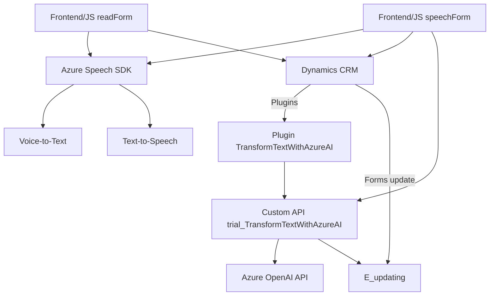

### Breve resumen técnico:

El repositorio alberga una solución orientada a la integración de Microsoft Dynamics CRM con servicios avanzados de inteligencia artificial proporcionados por Azure. La solución utiliza un enfoque de interacción dinámica con formularios, facilitando la lectura o llenado automático a través de entrada de voz (procesada por Azure Speech SDK) y enriquecimiento de texto mediante reglas específicas usando Azure OpenAI GPT.

---

### Descripción de arquitectura:

La arquitectura de esta solución se basa principalmente en **n-capas** con integración a servicios externos. Se puede categorizar como un **monolito expandido con integración vía APIs**:

1. **Capa de presentación/dispositivos (Frontend):**
   - Aplicaciones JavaScript que interactúan con APIs definidas en Dynamics CRM y con sistemas externos.
   - Frontend gestiona la entrada y salida del usuario (reconocimiento de voz y síntesis de voz).
   
2. **Capa intermedia/lógica (Plugins e implementaciones del lado servidor):**
   - Plugins como `TransformTextWithAzureAI.cs` corren dentro del Dynamics CRM para ejecutar lógica específica mediante el soporte de APIs externas, como Azure OpenAI API (GPT-4).
   
3. **Capa de integración con APIs y servicios externos:**
   - Integra con servicios de Azure como Speech SDK y Azure OpenAI para procesar datos.
   - Utiliza una API personalizada para enriquecer información.

La arquitectura exhibe principios de modularidad y acoplamiento bajo, al delegar tareas específicas (manejo de voz, manipulación de formularios, transformación de texto) a módulos independientes conectados por APIs. Sin embargo, no se presenta como una arquitectura de microservicios por no haber evidencia clara de múltiples componentes independientes que puedan desplegarse por separado.

---

### Tecnologías utilizadas:

1. **Para el frontend:**
   - **JavaScript ES6+** para definir funciones modulares como lectura, procesamiento y síntesis de voz.
   - **Microsoft Dynamics 365 API** para gestión y actualización del formulario del CRM.
   - **Azure Speech SDK** para habilitar el reconocimiento y síntesis de voz mediante Microsoft Azure.

2. **Para el backend/plugin:**
   - **C# / .NET Framework** para la implementación de Plugins en Microsoft Dynamics CRM.
   - **Azure OpenAI API (GPT)** para transformar texto mediante inteligencia artificial avanzada.

3. **Patrones arquitectónicos:**
   - Modularidad en funciones y métodos con responsabilidades específicas.
   - Event-driven programming (callbacks).
   - Integration design with SDKs and external APIs (Azure Speech and Azure OpenAI).
   - Plugin Pattern para extender la funcionalidad de Dynamics CRM.

---

### Diagrama Mermaid:

---

### Conclusión final:

La solución aborda la automatización y mejora de procesos administrativos mediante la integración de tecnologías modernas en un entorno empresarial. Es una solución híbrida, con una arquitectura **n-capas** que combina módulos frontend en JavaScript, plugins back-end para Dynamics CRM en C#, y diversas APIs de servicios externos proporcionados por Microsoft Azure (Azure Speech SDK y Azure OpenAI). Esta arquitectura permite la interacción por voz y el enriquecimiento de texto para mejorar la experiencia del usuario y optimizar su flujo de trabajo, con un enfoque en modularidad y reutilización.