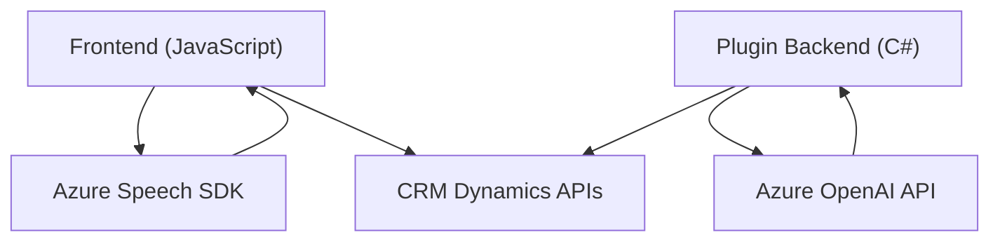

### Breve Resumen Técnico
El repositorio contiene archivos orientados principalmente a habilitar funcionalidades vinculadas con Microsoft Dynamics CRM, integrando servicios de Azure Speech SDK para procesamiento de voz (sintetización y reconocimiento) y Azure OpenAI para transformación de texto. Las funciones están desarrolladas para interactuar con formularios del CRM mediante APIs específicas de Dynamics. Está estructurado para complementar una solución empresarial que permite entrada/salida de datos basada en voz y texto.

---

### Descripción de Arquitectura
La solución utiliza una arquitectura **modular orientada a funciones** con integración de dependencias externas mediante SDKs y APIs. Tiene lógica en tres capas fundamentales:
1. **Frontend**: Manejo de eventos del usuario y entrada/salida de datos desde los formularios.
2. **API (plugin)**: Lógica del servidor en Dynamics CRM que utiliza Azure OpenAI para procesamiento avanzado de texto.
3. **Dependencias externas**: Carga dinámica y uso de servicios en la nube, como Azure Speech SDK y Azure OpenAI.

El diseño parece ser **n-capas**, donde las responsabilidades están segregadas entre frontend y backend, además de servicios externos que implementan funcionalidades específicas.

---

### Tecnologías Usadas
1. **Lenguajes**:
   - **JavaScript**: Para lógica del frontend en manejo de formularios y uso de Azure Speech SDK.
   - **C#**: Para la implementación de plugins extendiendo la funcionalidad del CRM Dynamics.
2. **Frameworks y SDKs**:
   - **Azure Speech SDK**: Para síntesis y reconocimiento de voz.
   - **Azure OpenAI**: Para transformación avanzada de texto.
3. **APIs Internas**:
   - **CRM Dynamics APIs** (`Xrm.WebApi`, `IPlugin`, `IOrganizationService`): Para manipulación de formularios y entidades.
4. **Librerías Auxiliares**:
   - **System.Text.Json** (C#): Para manejo de JSON en la integración con Azure APIs.

---

### Diagrama Mermaid (100% compatible con GitHub Markdown)

---

### Conclusión Final
La solución está diseñada para integrar profundamente con la infraestructura de Microsoft Dynamics CRM. El uso de Azure Speech SDK y los plugins de Dynamics CRM permite enriquecer aplicaciones empresariales con funcionalidad avanzada basada en voz y texto. La arquitectura modular permite mantener una separación clara de responsabilidades: entrada/salida de datos en el frontend y lógica avanzada en el backend con soporte en servicios externos en la nube. Esto combina una estructura n-capas con integración en tiempo real de APIs externas, lo que facilita su adaptabilidad y escalabilidad.