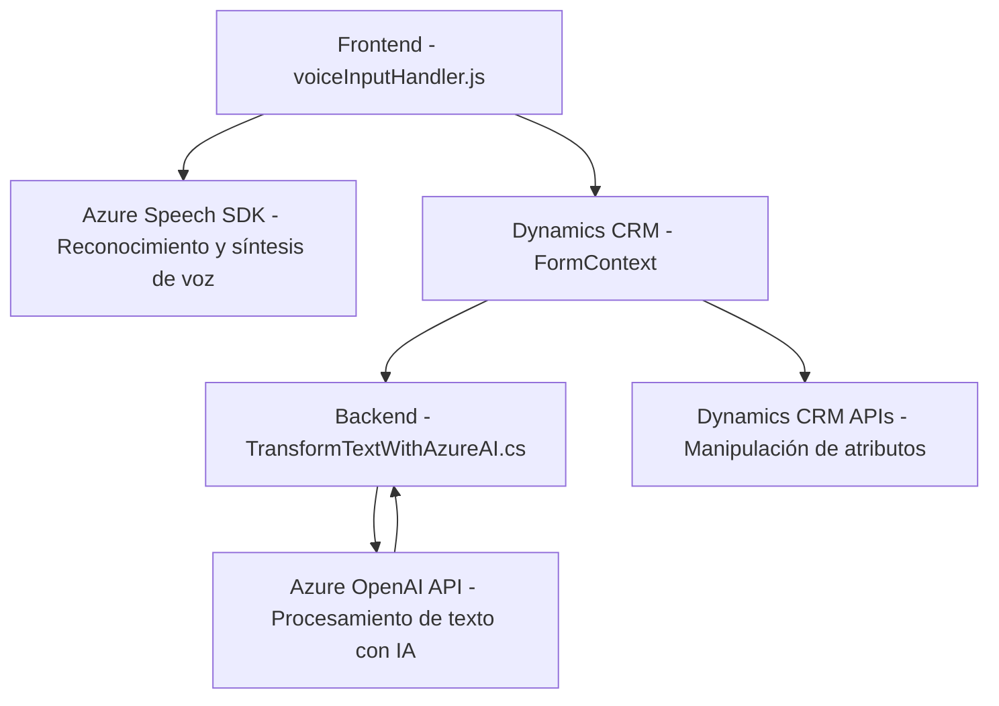

### **Breve resumen técnico**
El repositorio presenta una solución híbrida que incluye:
1. **Frontend (JavaScript)**: Manejo de datos de formularios, entrada y salida de voz mediante Azure Speech SDK.
2. **Backend (C#)**: Implementación de plugins de Dynamics CRM para integrar transformación de datos y servicios de Azure OpenAI.

Principalmente, la arquitectura se centra en la interacción con formularios de Dynamics CRM, servicios de reconocimiento y síntesis de voz (Azure Speech), y procesamiento avanzado de texto mediante inteligencia artificial (Azure OpenAI).

---

### **Descripción de arquitectura**
La solución sigue una arquitectura de **n capas**, organizando las responsabilidades en niveles distintos:
1. **Presentación**: Lograda mediante el manejo de formularios visuales en Dynamics CRM y la interacción del frontend.
2. **Servicio**: Integración directa con APIs externas de Microsoft Azure (Speech SDK y OpenAI).
3. **Lógica de negocio**: Implementada en el código de Dynamics CRM mediante plugins en C# (ejecutando transformaciones y manejando las reglas del negocio).
4. **Datos**: Representados por el uso dinámico de atributos, modelos de entidad (Dynamics CRM), y el consumo de JSON estructurados desde servicios externos.

Una posible extensión podría incluir modificaciones o adiciones al modelo para incorporar más datos procesados por los distintos servicios.

---

### **Tecnologías usadas**
1. **Frontend**:
   - **JavaScript**: Implementación de lógica en el navegador (manejo de eventos y datos del formulario).
   - **Azure Speech SDK**: Para el reconocimiento y síntesis de voz.
   - **Dynamics CRM Context**: Acceso a datos y atributos desde el entorno del formulario.

2. **Backend**:
   - **C#**, .NET Framework: Desarrollo de plugins para Dynamics CRM.
   - **Azure OpenAI API**: Transforma texto usando IA hospedada en Azure.
   - **JSON para comunicación**: Formato estructurado para transmitir y recibir datos entre el backend y APIs externas.
   - **HTTP Client**: Para realizar solicitudes REST hacia los servicios de Azure.

3. **Integración**:
   - **Dynamics CRM WebAPI**: Para manipular datos relacionados con entidades y formularios.
   - **Azure Services**: Speech SDK y OpenAI.

---

### **Diagrama Mermaid**
El siguiente diagrama visualiza los flujos principales de datos y dependencias en la arquitectura:

---

### **Conclusión final**
Esta solución utiliza una arquitectura orientada a **n capas** que organiza en niveles la lógica de negocio, presentación y servicios. La combinación del frontend en JavaScript con un backend basado en plugins de Dynamics CRM y la integración con servicios de Azure demuestra un diseño modular y extensible.

Es ideal para casos donde se requiera enriquecer la interacción basada en voz, integrar capacidades de IA en la manipulación de datos, y permitir la comunicación con formularios en sistemas empresariales como Dynamics CRM. Sin embargo, debe poner énfasis en la gestión de dependencias externas y posibles latencias de red debido al uso de servicios remotos.