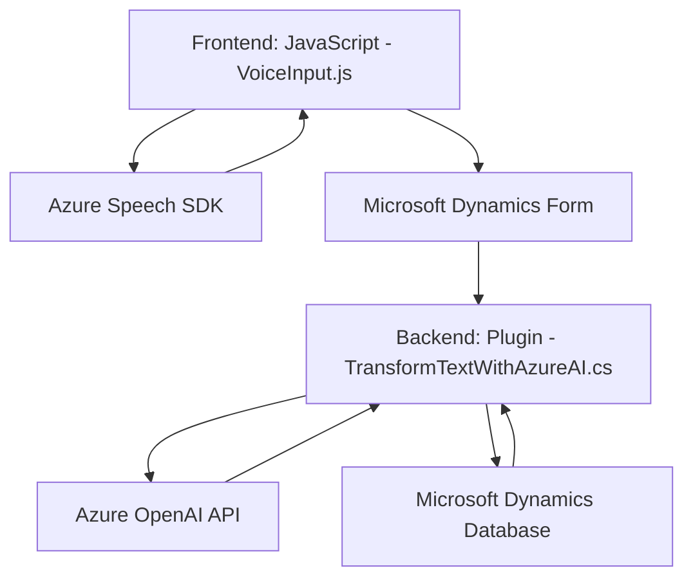

### Resumen técnico

El repositorio parece ser una solución híbrida que integra la funcionalidad tanto del lado frontend (JavaScript) como del backend (C#) para interactuar con Microsoft Dynamics CRM y servicios de Azure (Speech SDK y OpenAI). Este enfoque busca mejorar la interacción y entrada de datos del usuario mediante voz y transformaciones de texto avanzadas.

---

### Descripción de arquitectura

La arquitectura de este proyecto combina una **arquitectura de capas** con servicios externos. Las capas principales incluyen:
1. **Capa de presentación** (Frontend con JavaScript): Permite la interacción del usuario, configurando entradas por voz y actualización de formularios de Dynamics.
2. **Capa de aplicación** (Plugins en C#): Procesa y transforma datos utilizando inteligencia artificial (Azure OpenAI) y extensiones personalizadas que interactúan con el servicio de Dynamics.
3. **Capa de servicios externos**: Delegación de la síntesis y comprensión del lenguaje natural al Azure Speech SDK y al servicio Azure OpenAI.

Se encuentran patrones arquitectónicos como:
- **Patrón plugin**: Implementación directa integrada en Dynamics CRM para extensibilidad.
- **Patrón de integración externa**: Uso de SDKs y APIs de Azure para funcionalidad avanzada.
- **Patrón modular**: Separación de responsabilidades en funciones y métodos individuales tanto en frontend como en backend.

---

### Tecnologías usadas

1. **Frontend**:
   - **JavaScript** para lógica del lado cliente.
   - **Azure Speech SDK** para síntesis y reconocimiento de voz.
   - **Microsoft Dynamics Contexts** (`executionContext`, formularios y APIs).

2. **Backend**:
   - **C#** como lenguaje principal.
   - **Microsoft Dynamics SDK** (`IPlugin` y APIs relacionadas).
   - **Azure OpenAI Service** para transformaciones de texto.
   - **System.Net.Http** para solicitudes HTTP.
   - **Newtonsoft.Json** para procesamiento de JSON.

3. **Servicios de Azure**:
   - Azure Cognitive Services (Speech SDK y OpenAI).

---

### Diagrama Mermaid

---

### Conclusión final

El análisis del repositorio revela una solución sofisticada y bien estructurada, basada en una arquitectura de múltiples capas que apalanca servicios de Azure para inteligencia artificial y síntesis de voz. La solución combina la capacidad de entrada y salida por voz en frontend con un backend que aplica IA para transformar datos dinámicamente en Microsoft Dynamics CRM. Utiliza una arquitectura orientada a servicios para delegar tareas complejas a APIs externas, haciendo el diseño eficiente y flexible.