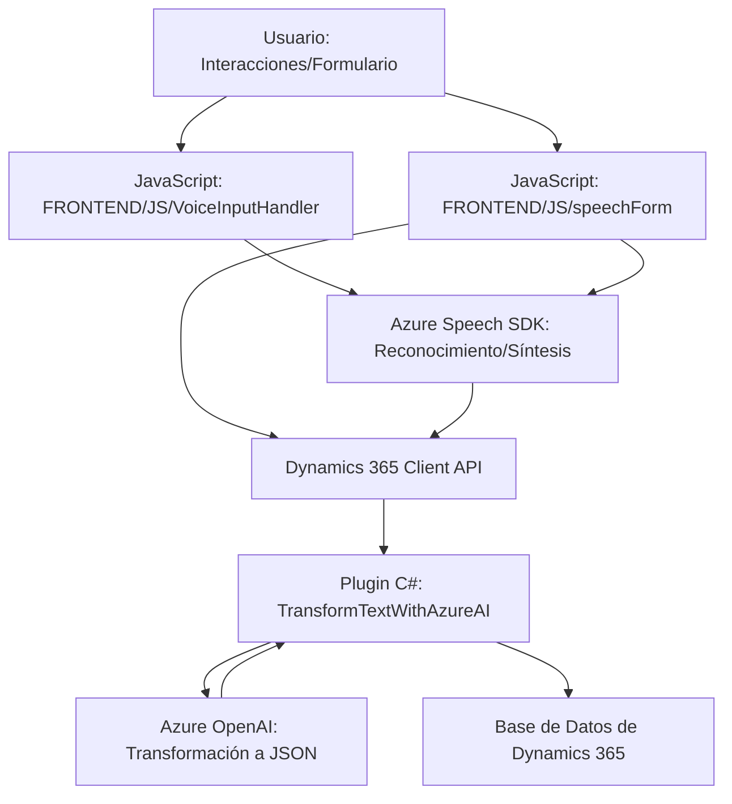

### Resumen Técnico

Este repositorio consiste en varios archivos que integran funcionalidades para la captura, procesamiento y síntesis de voz en interacción con **Dynamics 365**. Adicionalmente, utiliza **Azure Speech SDK** y **Azure OpenAI Service** para proporcionar capacidades avanzadas como reconocimiento de voz, síntesis de texto y transformaciones de datos JSON. El conjunto de archivos indica una solución de integración dinámica entre procesos de un front-end asociado a formularios y un back-end en Dynamics CRM, habilitando automatización basada en inteligencia artificial.

---

### Descripción de Arquitectura

La solución refleja una arquitectura híbrida combinación de **cliente-servidor dinámico** y principios de **SOA (Service-Oriented Architecture)**. Los componentes JavaScript son altamente dependientes de servicios externos (Azure Speech y APIs customizadas de Dynamics), mientras que el archivo **Plugin** sigue el modelo de arquitectura de Dynamics CRM utilizando una interfaz predefinida (`IPlugin`).

1. **Frontend (JavaScript):**
   - Modularidad: Cada archivo define funciones con responsabilidades claras, desde síntesis de texto hasta procesamiento de datos para formularios.
   - Dinámica: Utiliza carga dinámica de scripts y APIs para maximizar la flexibilidad en integración con servicios.
   - Integración de servicios externos: Hace uso directo de **Azure SDK** para funcionalidades de entrada/salida de voz.

2. **Backend (Plugin .NET):**
   - Plugin Architecture: Seguimiento de patrones de Dynamics para ejecutar procesos como validaciones y transformaciones de datos.
   - Conector hacia Azure OpenAI: La lógica encargada de convertir texto en JSON se delega completamente al servicio externo mediante una arquitectura orientada a servicios (SOA).

---

### Tecnologías Usadas
- **Frontend:**
  - **JavaScript** para manejar DOM y API de navegador.
  - **Azure Speech SDK** para reconocimiento de voz y síntesis de texto.
  - **Dynamics 365 Client APIs** (`Xrm.WebApi`).

- **Backend:**
  - **C# / .NET** para el desarrollo de plugins en Dynamics CRM.
  - **Azure OpenAI Service** para convertir texto al formato JSON mediante IA.
  - Librerías estándar: `System.Net.Http`, `System.Text.Json`, `Newtonsoft.Json`.

---

### Dependencias / Componentes Externos
1. **Azure Speech SDK**: Utilizado para reconocimiento y síntesis de voz desde el frontend.
2. **Azure OpenAI Service API**: Utilizado por el plugin en C# para transformar texto en JSON estructurado.
3. **Dynamics 365 SDK**: Dependencia fundamental para integración con procesos y formularios en el CRM.
4. **APIs del navegador**: Para manipulación del DOM y contexto del formulario en la interfaz.
5. **Configuración sólida de infraestructura**, como Azure Key Vault, podría ser necesaria para gestionar credenciales.

---

### Diagrama Mermaid

---

### Conclusión Final

La solución presentada es una herramienta avanzada de interacción entre usuarios, inteligencia artificial y sistemas CRM. La capacidad de usar reconocimiento de voz y APIs IA potencia la **automatización dinámica** y simplifica procesos en Dynamics 365.

Esta arquitectura híbrida demuestra una implementación sólida orientada a servicios, con integración directa de soluciones de Azure (Speech SDK y OpenAI). Sin embargo, para entornos de producción, será importante abordar cuestiones como seguridad de claves API y escalabilidad para garantizar su robustez en sistemas con alta concurrencia y uso extensivo.