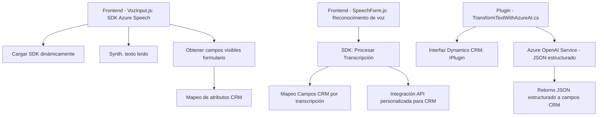

# Análisis Detallado

### Breve Resumen Técnico
El repositorio contiene componentes relativos a la integración de un sistema CRM (Dynamics 365) con capacidades basadas en Azure Speech SDK y Azure OpenAI Service. Los componentes principales son:

1. **Frontend**: Archivos en `JS` que gestionan síntesis y reconocimiento de voz.
2. **Backend/Plugin**: Código C# que amplía funcionalidades del CRM mediante integración con Azure APIs.

### Descripción de Arquitectura
La solución está parcialmente distribuida, con un fuerte enfoque en la modularidad. Parece ser una **arquitectura de n capas**:
1. **Capa de presentación/front-end**:
   - Archivos JavaScript integrados con Dynamics 365 utilizan el Azure Speech SDK para dar soporte a interacción vocal.
2. **Capa de servicio y negocio/back-end**:
   - Un plugin para Dynamics CRM expande la funcionalidad del sistema procesando el texto reconocido mediante Azure OpenAI.

**Patrones arquitectónicos** identificados:
- Modularidad: Funciones y métodos enfocados en cumplir tareas específicas (procesamiento de texto, síntesis de voz, mapeo de datos).
- Wrapper SDK: Describe la interacción con servicios externos (Speech SDK y OpenAI API) usando funciones internas.
- Delegado/CallBack: Cargar dependencias (\`SpeechSDK\`) y gestionar flujos asincrónicos.
- Plugin Pattern: Extiende funcionalidades CRM usando la interfaz \`IPlugin\`.

### Tecnologías Usadas
1. **Frontend**:
   - Lenguaje: JavaScript.
   - Framework: Dynamics CRM Web API.
   - Servicio Externo: Azure Speech SDK.
2. **Backend**:
   - Lenguaje: C# .NET.
   - Servicio Externo: Azure OpenAI Service.
   - Dependencias: Newtonsoft.Json.jObject para manejo de JSON.
   - Integración con Dynamics CRM (`Microsoft.Xrm.Sdk`).

### Dependencias o Componentes Externos
1. **Azure Speech SDK**: Para sintetizar y reconocer voz.
2. **Dynamics CRM Web API (`Xrm.WebApi`)**: Para interactuar con registros del sistema CRM.
3. **Azure OpenAI Service**: Transformación avanzada vía IA.
4. **Librerías de manejo de JSON en C#**: Newtonsoft.Json y System.Text.Json.

### Diagrama Mermaid (100 % compatible con GitHub Markdown)

### Conclusión Final
La solución implementa un sistema **modular de n capas**, interconectando lógica de negocio del frontend (voz) y extensiones del backend (IA) con Dynamics CRM. Utiliza servicios avanzados de Azure para la síntesis y reconocimiento de voz y transformaciones de IA, facilitando una interacción intuitiva y automatizada con formularios CRM. La arquitectura está bien estructurada, pero aspectos como manejo de credenciales y supervisión de API en tiempo real pueden ser optimizados.