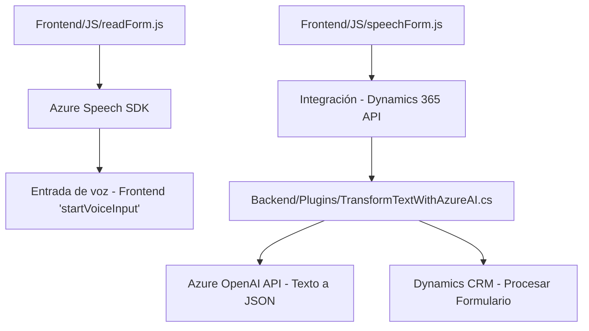

### Breve resumen técnico:
El repositorio contiene tres principales archivos: uno asociado a un frontend en JavaScript que utiliza el Azure Speech SDK para integración de voz, otro relacionado con la transcripción desde voz y actualización de formularios en Dynamics 365, y un tercero con un plugin en C# que utiliza el servicio Azure OpenAI para transformar texto en JSON estructurado. La solución combina funcionalidades de entrada y salida de voz, manipulación de formularios y procesamiento basado en inteligencia artificial (IA).

---

### Descripción de arquitectura:
La solución se organiza en tres capas básicas:
1. **Frontend en JavaScript**:
   - Integrado directamente con el navegador, incorpora el Azure Speech SDK para entrada y salida de voz.
   - Utiliza patrones de modularidad y programación funcional.
2. **Backend**:
   - Un plugin de Dynamics CRM en C# que emplea Azure OpenAI para transformación de texto, organizado en base a un patrón de microservicio.
3. **Integración**:
   - Los componentes se conectan mediante la API de Dynamics 365 para garantizar una comunicación fluida entre las distintas capas.

**Estilo arquitectónico predominante:**
- **n-capas**: La solución presenta separación entre frontend, backend, y servicios externos, aunque incluye microservicios para ciertas funcionalidades (como el plugin que se conecta a Azure OpenAI).
- **Modularidad funcional**: En los archivos de frontend se observa organización basada en funciones específicas (transformación de datos, uso de SDK).
- **Uso de servicios externos**: Se realiza integración tanto desde el frontend como desde el backend con servicios de Microsoft Azure (Speech SDK y OpenAI).

---

### Tecnologías y frameworks usados:
1. **Frontend**:
   - Lenguaje: JavaScript.
   - Integración: Azure Speech SDK para entrada/salida de voz.
   - Plataforma: Dynamics 365.
2. **Backend**:
   - Lenguaje: C#.
   - Framework: Microsoft Dynamics CRM SDK para plugins.
   - Servicio: Azure OpenAI (modelo GPT para transformación de texto).
3. **Dependencias generales**:
   - API externas: Azure Speech SDK, Azure OpenAI, Dynamics 365 Web API.

---

### Diagrama Mermaid:

---

### Conclusión final:
Esta solución es una integración de diversas tecnologías centradas en el ecosistema Microsoft Azure y Dynamics 365. Se trata de una arquitectura n-capas que aplica principios de separación de responsabilidades entre frontend (gestión de UI y voz) y backend (procesamiento de datos con inteligencia artificial). La dependencia en Azure Speech SDK y Azure OpenAI proporciona capacidades avanzadas pero también implica una dependencia fuerte respecto al ecosistema de Microsoft. Las funciones están bien estructuradas y siguen un patrón modular y orientado a eventos. Mejoras sugeridas incluyen la externalización de configuraciones sensibles (como claves API) y la refactorización del plugin para mayor separación de lógica.