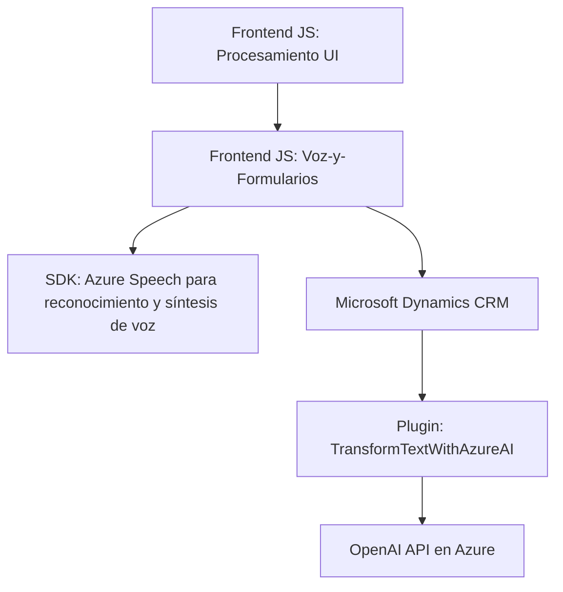

### Análisis técnico del repositorio

#### Breve resumen técnico:
El repositorio contiene la implementación de una solución que interactúa con un sistema CRM como Microsoft Dynamics 365, utilizando el **Azure Speech SDK** para realizar síntesis y reconocimiento de voz. Además, realiza transformaciones avanzadas de texto hacia objetos estructurados JSON mediante una API externa basada en **Azure OpenAI Service**. Se enfoca en mejorar la interacción con formularios dinámicos y ofrece capacidades de entrada de datos y procesamiento mediante comandos de voz y texto estructurado.

---

### Descripción de arquitectura:
La solución presenta una arquitectura híbrida de **n capas**, dividiendo las responsabilidades de frontend y backend. Cuenta con los siguientes componentes principales:
1. **Frontend**: Contiene archivos JavaScript para la integración con el SDK de Azure Speech (reconocimiento y síntesis de voz), extracción de datos de formularios, y procesamiento local antes de enviar comandos al backend.
2. **Backend**: Un plugin para Microsoft Dynamics 365 basado en el SDK de Dynamics y .NET, encargado del procesamiento avanzado de texto utilizando **APIs en Azure Cognitive Services** (OpenAI).

Los patrones que predominan incluyen:
- **Callback-based programming** y **promesas** en la gestión de SDKs externos en el frontend.
- **Plugin Pattern** para la lógica empresarial del backend.
- Delegación a APIs externas usando un enfoque **orientado a servicios** (SOA), encapsulando las funcionalidades complejas de reconocimiento de voz y procesamiento avanzado de texto.

---

### Tecnologías y dependencias usadas:
1. **Frontend**:
   - **JavaScript**: Lenguaje utilizado para implementar las funcionalidades del cliente.
   - **Azure Speech SDK**: Para síntesis y reconocimiento de voz.
   - **Xrm.WebAPI.online**: Para interactuar con el CRM de Microsoft Dynamics desde el navegador.

2. **Backend**:
   - **C# (.NET)**: Lenguaje y marco para el desarrollo del plugin.
   - **Microsoft Dynamics 365 SDK**: Para acceder al contexto del CRM y permitir integración directa.
   - **Rest API**: Para realizar las solicitudes HTTP a Azure OpenAI Cognitive Services desde el backend.
   - **Newtonsoft.Json**: Librería .NET para trabajar con datos JSON.
   - **Azure OpenAI Service**: Consume inteligencia artificial para transformar texto en datos JSON estructurados.

3. **Dependencias externas**:
   - Azure servicios cognitivos: Speech SDK y OpenAI (via APIs).
   - Dinámica de API basada en la infraestructura de Microsoft Dynamics como punto de interacción principal.

---

### Diagrama Mermaid válido para GitHub

---

### Conclusión final:
La solución es una integración avanzada entre frontend y backend, utilizando estructuras modulares y APIs externas para transformar texto y voz en datos estructurados orientados a formularios. La arquitectura es predominantemente de **n-capas con fuertes componentes de SOA**, aprovechando servicios específicos de Azure, integrados con un CRM moderno como Microsoft Dynamics. 

El diseño de la solución está bien estructurado, aunque podría mejorarse añadiendo inyección de dependencias para mayor flexibilidad y eliminando la implementación de claves API en el código, utilizando servicios seguros como Azure Key Vault para almacenamiento de credenciales.