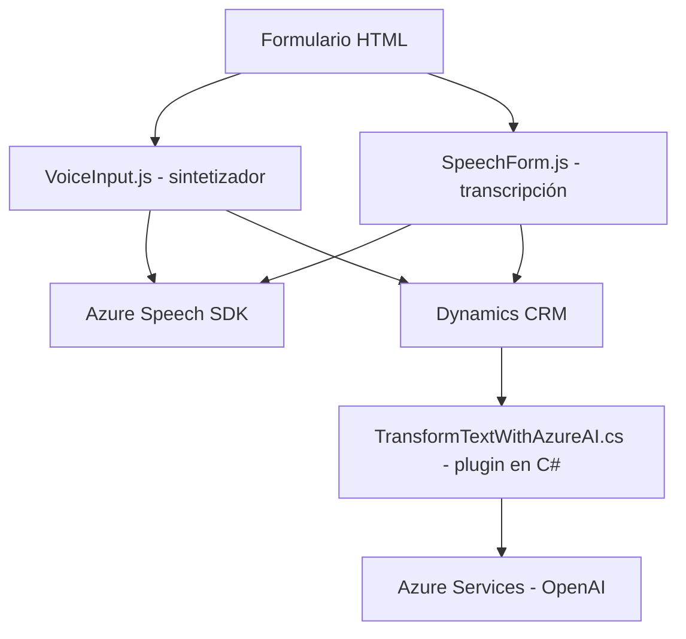

### Breve resumen técnico

El repositorio contiene tres archivos principales que implementan capacidades de reconocimiento de voz, síntesis de voz y transformación de texto con servicios externos (Azure SDK y Azure OpenAI). Estas funcionalidades están diseñadas para interactuar con formularios dinámicos en un sistema CRM (Dynamics 365), utilizando tecnologías tanto para frontend como para backend.

---

### Descripción de arquitectura

1. **Tipo de solución**:  
   - **Frontend**: Los archivos `VoiceInput.js` y `speechForm.js` implementan funciones relacionadas con reconocimiento de voz y síntesis de texto a voz en aplicaciones web, dirigidas a mejorar la interacción con formularios dinámicos.  
   - **Backend (plugin)**: El archivo `TransformTextWithAzureAI.cs` extiende la funcionalidad de Dynamics CRM con un plugin que procesa texto en base a normas predefinidas mediante Azure OpenAI.  

2. **Arquitectura general**:  
   El sistema se organiza como una solución **n-capas**:
   - Capa de **presentación**: Los archivos `VoiceInput.js` y `speechForm.js` definen la interacción del usuario con formulários dinámicos y servicios externos (Azure Speech SDK) mediante un navegador.
   - Capa de **servicio**: `TransformTextWithAzureAI.cs` actúa como middleware que extiende las capacidades de Dynamics CRM y consume servicios de terceros (Azure OpenAI).

3. **Patrones implementados**:
   - **Modularización funcional**: Estructura de funciones independientes para reconocimiento y síntesis de voz, haciendo el sistema más mantenible y reutilizable.
   - **Plugin design pattern**: Extensión de Dynamics mediante un plugin que responde a eventos en el contexto CRM.
   - **Service pattern**: Uso de servicios externos para realizar operaciones específicas como transformar texto o sintetizar voz.
   - **Carga dinámica**: `VoiceInput.js` utiliza una estrategia de carga dinámica para reducir la utilización de recursos.

---

### Tecnologías usadas

1. **Frontend**:  
   - **JavaScript ES6**: Para lógica funcional.  
   - **Azure Speech SDK**: Para reconocimiento y síntesis de voz.  
   - **Dynamic DOM manipulation**: Para implementar interacción en tiempo real con el navegador.  
   - **Dynamics 365 Web API (Xrm.WebApi)**: Para el consumo de servicios CRM.

2. **Backend**:  
   - **C#**: Para extender las funcionalidades de Dynamics CRM con un plugin.  
   - **Azure OpenAI**: Para transformación avanzada de texto utilizando GPT-based models.  
   - **Newtonsoft.Json y System.Text.Json**: Para manipular objetos JSON.  
   - **System.Net.Http**: Para realizar llamadas RESTful.

---

### Dependencias o componentes externos presentes

1. **Azure SDK**:
   - Speech SDK para reconocimiento y síntesis de voz.  
   - OpenAI SDK para procesamiento de texto avanzado.  

2. **API personalizadas**:
   - `callCustomApi`: Integración con servicios extendidos para procesamiento de datos con IA.

3. **Dynamics CRM SDK**:
   - Interfaces y servicios nativos de Dynamics para manipulación de formularios contextuales (e.g., `IPluginExecutionContext`).

---

### Diagrama Mermaid

---

### Conclusión final

La solución presentada define una arquitectura **n-capas** que interconecta funcionalidades de frontend y backend. Los archivos muestran un fuerte enfoque en modularización, interacción con APIs externas (Azure Speech SDK y OpenAI), y extensibilidad de sistemas CRM (Dynamics). Es adecuada para aplicaciones empresariales que requieren capacidades avanzadas de voz y procesamiento de AI, proporcionando una experiencia optimizada en la interacción usuario-formulario. Sin embargo, sería importante realizar pruebas de escalabilidad y latencia para asegurar que las integraciones con Azure escalen correctamente bajo alta demanda.